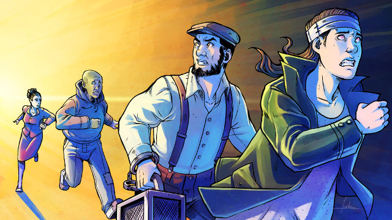
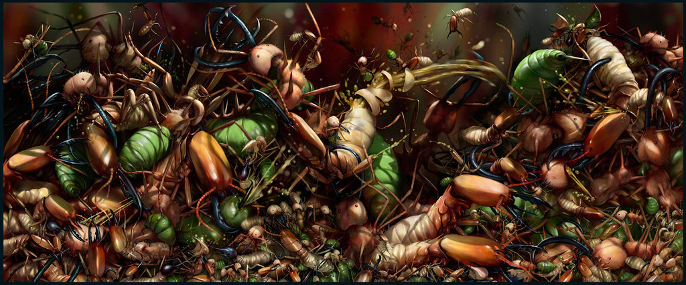
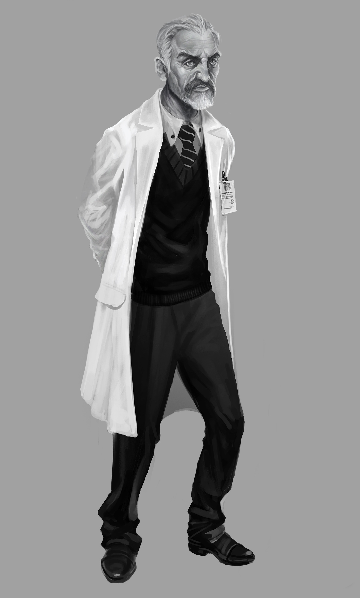
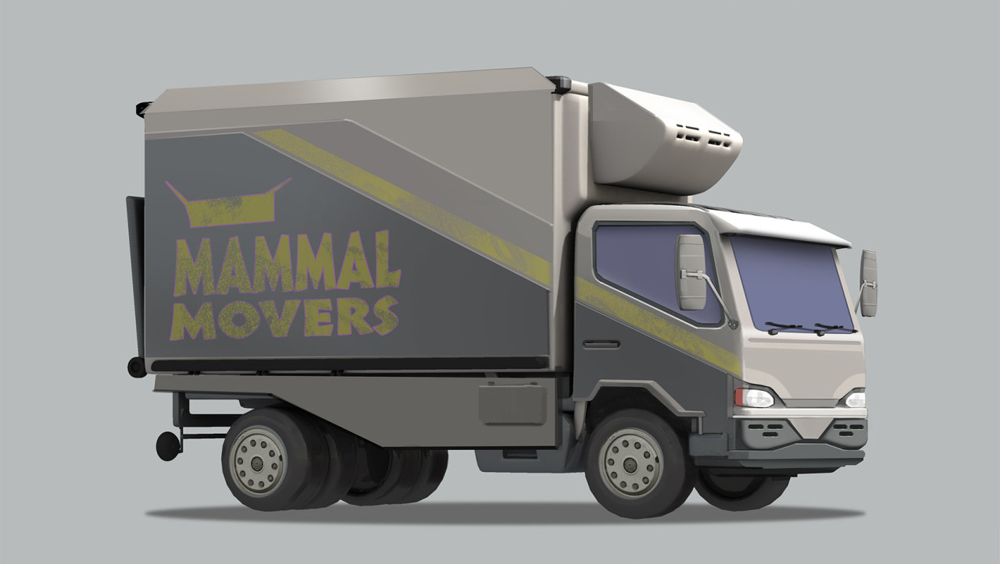
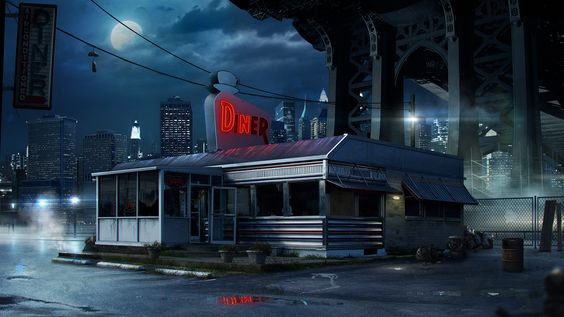
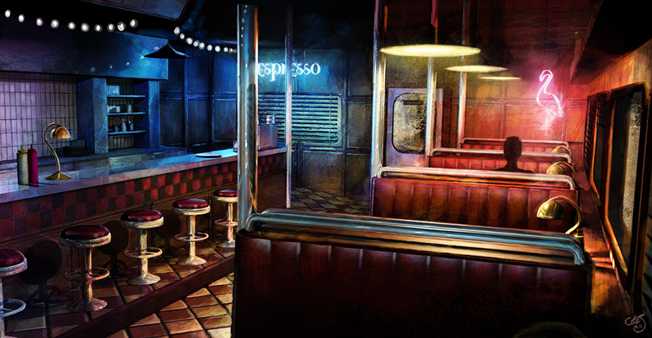
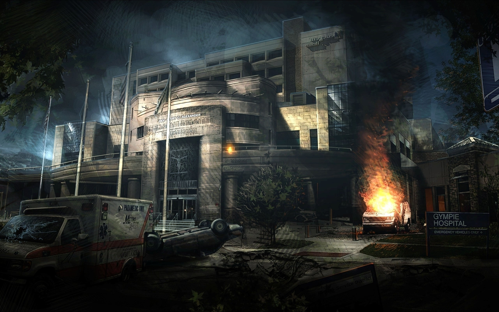
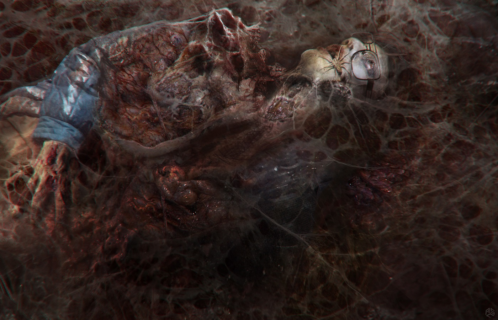
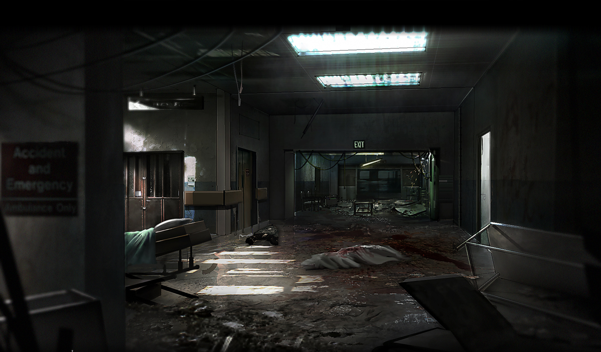
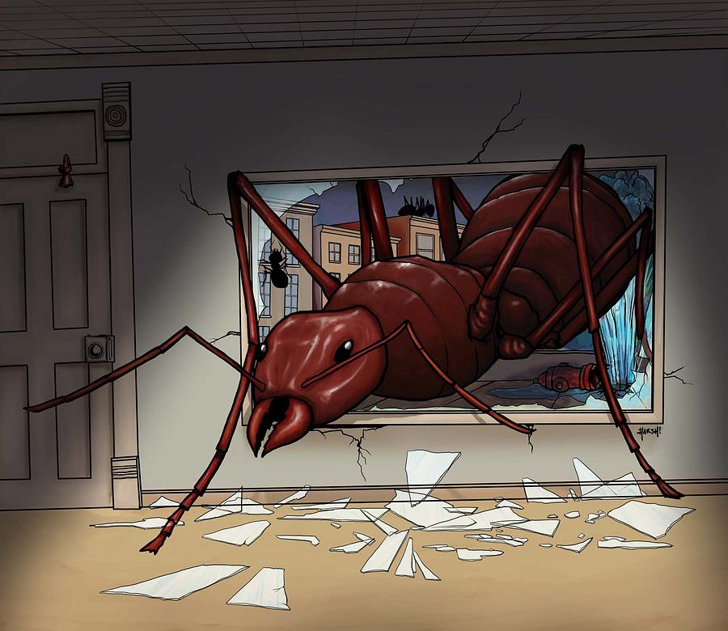

<figure>
  
  <figcaption>Couverture de <cite>PsiRun</cite> par <a href="http://arc-ange.deviantart.com/">Jade Qinton-Jacq</a></figcaption>
</figure>

Cette page contient un **résumé de partie** du jeu de rôle [Psi*Run](http://electric-goat.net/products/1), ainsi qu'un **avis personnel** détaillé sur ce jeu.

Il s'agit d'une partie de 5 heures, pause décomptée, avec 4 joueurs dont le meneur.
Ce résumé omet quelques détails, et comporte probablement des erreurs.

[[toc]]

# Résumé de partie

<figure>
  
  <figcaption>Extrait de l'artbook <a href="https://www.behance.net/gallery/2349816/Salsa-Invertebraxa-(A-Graphic-Novel)"><cite>Salsa Invertebraxa</cite></a> par Mozchops</figcaption>
</figure>

Les Fugitifs se réveillent en sursaut, dans un fracas de tôle pliée, alors que la pièce entière semble venir de basculer.
A demi attachés à des lits d'aluminium, ils reprennent conscience dans une pièce sombre aux murs métalliques.
Ils sont trois et aucun d'eux n'a de souvenir clair des dernières 48 heures :

- un dénommé [Khôlź](https://chezsoi.org/lucas/jdr/rpg-bonhomme/character-sheet.html?layout=PsiRun&name=Kh%C3%B4l%C5%BA), maigrichon et torse nu, avec de grandes traces de griffures dans le dos
- un homme sans nom, malingre et à l'air triste, bientôt baptisé [Mr. A](https://chezsoi.org/lucas/jdr/rpg-bonhomme/character-sheet.html?layout=PsiRun&name=Mr.%20A)
- [une jeune fille aux cheveux bleus](https://chezsoi.org/lucas/jdr/rpg-bonhomme/character-sheet.html?layout=PsiRun&name=Sylvia), grande et mince, à qui manque l'index de la main gauche

Le seule source de lumière est la lueur d'un chalumeau qui découpe lentement une paroi de la pièce...

Mr. A tente d'utiliser de ses facultés extra-sensorielles pour percevoir les intentions des personnes à l'extérieur de la pièce. Il perd le contrôle et on entend des cris et des coups de feu à l'extérieur.
<figure>
  
  <figcaption><cite>Prototype 2</cite> artwork</figcaption>
</figure>

Un quatrième homme se relève dans un coin dans la pièce. Habillé d'une blouse blanche, il se saisit d'un cathéter avec des gestes mécaniques et se jette sur la femme aux cheveux bleus pour la ligoter. Khôlz s'interpose et assomme l'homme en blouse avec un tube de métal qui jonchait le sol.
Pendant ce temps, une main déchire le pan de métal fraichement découpé et saisit la jeune la jeune fille, projetée contre cette paroi durant l'altercation, pour l'attirer à l'extérieur. Mr. A s'engouffre à sa suite.

Les 2 Fugitifs réalisent qu'ils viennent de s'extraire d'un wagon renversé, au milieu d'une toundra glacée. Deux vans blancs sont parqués autour, dont semble avoir émergé une demi-douzaine d'hommes en tenues paramilitaires. Certains d'entre eux gisent au sol, inertes, et ils en aperçoivent un autre au loin, courant très agité en tirant des coups de feu partout. Les autres wagons du train sont arrêtés bien plus loin sur les rails.

> "Sylvia ?!"

L'homme qui vient de plaquer la femme aux cheveux bleus à terre, un couteau à la main, s'arrête soudain, semblant la reconnaître. Celle-ci, la mémoire vide de tout souvenir, tente de bluffer et de faire mine de le reconnaître.
L'homme au couteau, un dénommé Ivan, semble néanmoins ne pas lui faire confiance. Il est là pour Mr. A, qui aurait la clef d'un coffre en sa possession. Ce dernier prétend que la clef est dans le wagon.

A l'intérieur de ce dernier, Khôlz ramasse une seringue sur le sol, puis fouille le corps de l'homme en blouse inconscient. Il y trouve un badge au nom d'un docteur Schmidt, et réalise avec stupeur qu'il a des fourmis dans la bouche. Il fouille ensuite le reste de la pièce, et découvre une pile de caisses dans un coin. En ouvrant l'une d'elles, une marée de fourmis s'en échappe.
Afin de leur échapper, Khôlz utilise sa capacité à se dématérialiser pour traverser la paroi du wagon opposée à l'ouverture. Dans la précipitation, son pouvoir psi surcharge et le corps inanimé au sol passe également à travers la paroi, mais reste bloqué à mi-chemin.

Pendant ce temps, Ivan s'est rapproché de l'ouverture du wagon pour l'examiner. Sans qu'il ne se rende compte tout d'abord, les fourmis fondent sur lui et escaladent se vêtements dans son dos. Lorsqu'il réalise se qu'il se passe, il est déjà trop tard. Les fourmis ont atteint son visage et rentrent dans sa bouche, ses oreilles, son nez. Ivan se met à hurler et à convulser par terre.

Tandis que les autres hommes armés sont focalisés sur ce qui arrive à leur chef, Mr. A & Sylvia en profitent pour se faufiler vers une camionnette sans chauffeur. Khôlz arrive sur ces entrefaites, et Ivan bondit soudain sur lui en criant, et le traîne avec lui, immobilisé par une clef de bras, vers l'orée de la forêt toute proche, en courant à une vitesse surhumaine.

Alors que Mr. A et Sylvia trouvent un moyen de démarrer leur camionnette en court-circuitant le contacteur, les hommes d'Ivan partent à sa poursuite avec l'autre camionnette.

<figure>
  
  <figcaption>Artwork pour <cite>Zootopia</cite> par Jim Martin</figcaption>
</figure>

Une course poursuite s'engage. Alors qu'ils atteignent la forêt, Khôlz réussit à se dégager de l'étreinte de son ravisseur suffisement pour lui planter sa seringue dans la gorge. Celui-ci s'arrête, vacille, et tombe au sol.

Dans leur camionnette, Sylvia utilise son don pour voir l'avenir. Leurs adversaires vont leur barrer brusquement la route, et Khôlz va bifurquer et piquer un sprint. Grâce à ces indications, ils sont capables d'anticiper et de contourner l'autre camionnette pour récupérer Khôlz dans un virage audacieux.

Le trio s'éloigne en camionnette, laissant dans leur rétroviseur les paramilitaires se faire attaquer à leur tour par les fourmis.

Une discussion s'engage pour décider où aller ensuite. Khôlz refuse énergiquement de se diriger vers la ville la plus proche, Balmtown. Il ne se souvient pas pourquoi mais quelque chose là bas le terrorise. En définitive, Mr. A l'assomme et ils se dirigent tout de même là-bas.

Le groupe, tiraillé par la faim, décide de s'arrêter à un dinner à l'entrée de la ville. Celle-ci est en effervescence : tout le monde semble pressé, des jeeps militaires circulent dans les rue et on entend même quelques coups de feu.

<figure>
  
  <figcaption><cite>Diner</cite> par <a href="http://snikola.deviantart.com">Snikola</a></figcaption>
</figure>

Alors qu'ils rentrent dans le dinner, le patron et la serveuse dévisagent avec suspicion Khôlz, toujours torse nu malgré le froid. Mr. A s'empresse de lui donner un blouson récupéré dans la camionnette.
Le trio s'installe à une table et commande à manger. Khôlz se dirige vers le téléphone dans un coin du restaurant, et appelle son frère Duran. Ils échangent quelques mots mais ce dernier ne peut rien apprendre à Khôlz sur ce qu'il s'est passé ces derniers jours, il était seulement inquiet de sa disparition. Duran accepte de venir le chercher en voiture au dinner.

Une fois réunis à table, Khôlz décide de subtiliser la fameuse clef que transporte Mr. A. Il réussit à s'en emparer à travers sa poche sans attirer l'attention grâce à son pouvoir. Un souvenir lui revient alors :

> Je suis gardien de zoo. Un ours parasité par des fourmis m'a attaqué et ses griffes m'ont déchiré le dos.

De son côté, Mr. A surveille du coin de l'oeil le patron, définitivement méfiant, sortir son téléphone et composer un numéro tout en les observant discrètement. Mr. A décide alors d'utiliser son talent psi pour le rassurer afin qu'il raccroche, mais tout dérappe : toutes les autres personnes dans la pièce font simultanément le mouvement de raccrocher un combiné téléphonique, puis se dévisagent mutuellement, incrédules face à ce qui vient se passer.

<figure>
  
  <figcaption><cite>Beer + Burger</cite> par <a href="http://m-delcambre.deviantart.com/art/Beer-Burger-193682338">Colej-uk</a></figcaption>
</figure>

Quelques minutes plus tard, Khôlz fait mine d'aller aux toilettes et sort dans la cour arrière du dinner, juste au moment où la voiture de son frère arrive.
A travers la grande vitre du dinner, les deux Fugitifs restant voient une ambulance s'arrêter devant leur camionnette garée à l'extérieur. Des infirmiers inexpressifs et à la démarche légèrement saccadée en sorte pour l'examiner. Les Fugitifs décident qu'il est grand temps de mettre les voiles et décident de filer par la sortie arrière du dinner à leur tour.

Comme Khôlz intime à son frère de démarrer sans les attendre, Mr. A utilise son pouvoir pour "convaincre" Duran de les attendre. Ils montent tous dans la voiture, et partent en trombe du dinner.
Après une rapide concertation, ils décident d'aller se planquer pour le moment dans un vieux hangar que Khôlz et Duran connaissent depuis l'enfance, près d'une casse de voitures à la lisière de la ville.

Une fois en sûreté là-bas, Duran apprend aux Fugitifs quelques informations sur l'actualité récente : une urgence sanitaire a été déclarée, et tout le monde est sommé de se rendre à l'hôpital. L'armée est également arrivée cette nuit, et la ville semble au bord de la guerre civile, bien que nul ne sache vraiment qui affronte qui. De plus, Duran explique que Khôlz a disparu sans dire un mot il y a quelques jours, le jour de l'incident au zoo où il travaillait. Des bêtes sauvages se seraient échappées et le zoo a fermé ses portes depuis.

Khôlz révèle son pouvoir aux autres, se doutant qu'ils possèdent également un don particulier et leur demandant de jouer cartes sur table. Son frère Duran ne veut pas y croire et croit à une blague. Mr. A tente de convaincre Khôlz de lui rendre sa clef en utilisant son talent particulier, sans succès, mais un souvenir lui revient :

> Avant de me retrouver harnaché à un lit médicalisé dans ce train, j'ai été un associé de Schmidt, le docteur du wagon, qui effectuait des expériences louches.

Alors que les Fugitifs sont en pleine discussion, une ambulance défonce la porte du hangar et finit sa course au milieu de la pièce. Des ambulanciers à la démarche robotique en sortent. Khôlz attrape ses compagnons par la main et leur crie :

> "Faites moi confiance et foncez !"

Puis il les pousse à travers le mur du hangar le plus proche, qu'ils traversent tous quatre en une fraction de seconde. Alors que tous le monde est encore éberlué par ce tour de passe-passe, le mur que les Fugitifs viennent de traverser tremble, sans doute fragilisé par ce qu'il vient de se passer, et s'effondre, entrainant avec lui tout le reste du bâtiment.

Une course poursuite à travers la casse de voitures s'ensuit. Une fois arrivés à l'entrée du lieu, les Fugitifs découvrent un petit parking adjacent à un petit bâtiment préfabriqué devant servir de bureau. Les lieux semblent vides, mais leurs Poursuivants se rapprochent. Mr. A utilise son pouvoir pour leur insuffler un sentiment de peur et ainsi les immobiliser quelques instants. Le quatuor en profite pour faire le mur et faire signe de s'arrêter à un bus à deux étages passant dans la rue.

Khôlz montre le badge de médecin récupéré dans le wagon et improvise un coup de bluff en brodant sur la situation d'urgence sanitaire et en intimant au chauffeur de conduire ce bus à l'hôpital illico. Ce dernier obtempère à regret.

<figure>
  
  <figcaption>Artwork pour Amy, un jeu video de Vector Cell</figcaption>
</figure>

Une fois arrivé à l'hôpital, les Fugitifs découvrent une situation chaotique. Une foule de gens est rassemblée à l'entrée, inquiète et impatiente d'y rentrer, tandis qu'une poignée d'infirmiers tente de les raisonner et d'éviter une cohue générale. Les Fugitifs aperçoivent également, sur un toit a proximité, une escouade de soldats, observant apparemment la situation et les abords de l'hôpital, radio et jumelles à la main.

Khôlz est repris d'une peur panique, comme si le lieu lui rappelait d'horribles souvenirs. Mr. A emploi son pouvoir pour le calmer, et profite qu'il soit un peu sonné pour récupérer à son insu sa clef. Le groupe décide de tenter de s'introduire dans l'hôpital par une porte de service.

A leur soulagement, le sésame magnétique du docteur Schmidt fonctionne, et ils s'avancent dans la cour intérieure de l'hôpital, calme et déserte. Plusieurs bâtiments éteinds se dressent devant eux. Ils s'avancent le long de l'un d'eux et y pénètrent par une porte vitrée entre-ouverte, à la recherche de vestiaires.

Par chance, ils en trouvent justement au bout du couloir dans lequel ils se sont engagés. Il n'y a personne dans la pièce, remplie de casiers métalliques. Une porte donne sur un placard à balais. Les Fugitifs ouvrent le casier du docteur Schmidt et y découvrent des dossiers de patients, une blouse ainsi qu'un doigt dans une boîte de pétri, qui se révèle être celui de Sylvia ! Parmis les dossiers, Khôlz identifie le sien, et la mémoire lui revient à sa lecture.

> Ces étranges ambulanciers m'ont traîné ici avec mon ours, Youki. Ces monstres ont effectués des expériences sur nous, et l'ont finalement tué !

Alors que les autres casiers sont examinées, le groupe fait une macabre découverte. Un des casiers contient un corps enveloppé d'un cocon, en partie dévorré.

<figure>
  
  <figcaption>Artwork de Barbs, un personnage de la série Stranger Things, par Aaron Sims</figcaption>
</figure>

Un étrange crissement se fait alors entendre. Les Fugitifs réalisent rapidement que cela vient d'un conduit d'aération, et ils anticipe l'arrivée de fourmis. Ils se saisissent d'un spray désinfectant dans un casier, et le combinent avec un briquet pour projeter une vague de feu sur les fourmis à leur sortie du conduit. Celles-ci sont décimées, carbonisées.

Le groupe se concerte, et détermine qu'il existe probablement une fourmi reine. Ils prennent la décision de la trouver et de l'éliminer. Khôlz décide de partir en éclaireur examiner les lieux, en utilisant sa capacité à traverser les murs. Malheureusement, son pouvoir dérape, et toute une portion sphérique du bâtiment est désintégrée alors qu'il traverse un mur du vestiaire. Duran y perd une jambe.

Les Fugitifs soignent Duran du mieux qu'ils peuvent. Celui-ci étant tombé inconscient, ils décident de le cacher à l'abri du placard avant de continuer leur exploration. Comme l'énorme trou de 5 mètre de diamètre qu'a formé Khôlz laisse entrevoir d'autres cocons à l'étage, ils décident de s'y rendre par l'escalier. Avant de quitter les lieux, ils se fabriquent des pieux rudimentaires et taillant des tiges de balais en pointe.

<figure>
  
  <figcaption>Concept art pour le jeu Deadlight de TequilaWorks par <a href="http://luistomas.deviantart.com/art/Hospital-Deadlight-287242211">Luis Thomas</a></figcaption>
</figure>

Là-haut, ils sont surpris par l'attaque simultanée d'une épaisse vague noire de fourmis descendant un couloir, ainsi que d'une fourmi volante géante traversant une fenêtre.

<figure>
  
  <figcaption>Illustration de <a href="http://www.artwanted.com/artist.cfm?artid=31815">Scott Harshbarger</a></figcaption>
</figure>

Cette dernière est repoussée à coups de pieux, tandis que les Fugitifs fuient la masse grouillante de fourmis. En chemin, ils découvrent que certains cocons semblent contenir des personnes encore vivantes. Ils décident d'en délivrer une, un infirmier noir englué dans de le soie contre un mur. Une fois ses esprits retrouvés, ce dernier leur indique une pièce contenant du gaz d'anesthésie inflammable, et se joint au groupe. Il se souvient également que les fourmis qui ont envahi l'hôpital semblait provenir du sous-sol de ce bâtiment.

Une fois les bonbonnes de gaz récupérées, les Fugitifs s'en servent pour brûler les fourmis à leurs trousses. Pour sortir d'ici, ils s'en remettent à l'infirmier et passent par une échelle de secours qui les mène à l'extérieur, au sol. Une autre fourmi volante géante tente d'attaquer Sylvia alors qu'elle descend l'échelle, mais Khôlz la perfore d'un lancer de pieu-javelot bien placé.

Plus loin dans l'hôpital, des silhouettes de fourmis volantes, des bruits d'hélicoptères et des coups de feu font comprendre aux Fugitifs que les militaires ont lancé une offensive contrôle les créatures occupant l'hôpital.

L'infirmier les mène vers une porte battante à quelques mètres, descendant vers le sous-sol et indiquant "morgue". Au premier coude du couloir blanc, le groupe découvre une salle obscure où repose la gigantesque reine fourmi, vénérée à genoux par un cercle d'humains parasités. En un éclair, Sylvia lance se grenade à Khôlz qui se précipite à travers la pièce jusqu'à la reine pour lui enfoncer la grenade à travers le corps avec son pouvoir. De son côté, Mr. A use de sa capacité de contrôle des émotions pour pétrifier les dizaines d'homme-fourmis dans la pièce. Ils ont juste le temps de s'enfuir en courant avant que tout n'explose derrière eux.

Les fourmis parasites sont vaincues !

## Epilogue

- Khôlz **(fait une découverte)** avec l'aide de son frère Duran et de l'infirmier, décide de monter un groupe de recherche pour étudier ces mystérieuses fourmis, comprendre d'où elles viennent et comment les éradiquer.
- Mr. A **(caché)** se rend enfin dans à la banque, ouvrir avec sa clef ce mystérieux coffre. Il y trouve des liasses de billets mais aussi un casque étrange, capable de démultiplier son pouvoir...
- Sylvia **(piégée)** est sommée par ses anciens partenaires de rendre des comptes, et doit finalement retourner à ses activitées de mercenaire

# La Piste

A la fin de la partie, la Piste était formée des post-its suivants:

- pièce en métal
- en dehors du wagon renversé
- orée de la forêt
- camionnette
- "Dinner"
- cour arrière du Dinner
- voiture de Duran
- vieux hangar à la lisière de la ville
- la casse de voitures
- l'entrée de la casse
- la rue devant la casse
- (le bus)
- l'entrée de service de l'hôpital
- vestiaire de l'hôpital
- l'étage de l'hôpital
- l'échelle de secours
- la morgue

# Retour d'expérience sur le système de jeu

Dans l'ensemble, j'ai adoré le système de jeu, et les autres joueurs également. L'intrigue avance mécaniquement et il n'y a aucun temps mort.

A chaque jet de dés, les Fugitifs font face à un dilemme: avancer dans la résolution de l'histoire en récupérant des souvenirs, ou bien éviter une issue tragique à une problématique immédiate: échec de l'action entreprise, blessure, surcharge de leur pouvoir ou encore progression des Poursuivants.

Peu à peu, l'histoire se déroule dans les 2 sens à partir du "crash" initial : vers l'avant via les actions des Fugitifs poursuivis, et vers l'arrière via les "flashbacks" de leurs réminiscences de souvenirs.

La Piste permet de visualiser concrètement les lieux de la course-poursuite, et la pression des Poursuivants sur les talons des Fugitifs.

Enfin, j'ai été épaté de la cohérence finale de l'histoire que nous avons construit collectivement.
Et, en tant que meneur de jeu, je n'ai pas été à l'origine de la moitié des rebondissements !
Que ce soit les lieux visités, le background des PNJs, les liens des Fugitifs entre eux ou la scène de conclusion, le scénario final est la somme des idées de tous les joueurs, et tous ces éléments se sont parfaitement imbriqués les uns dans les autres.

## Les points de règles obscurs

- "la partie s'arrête lorsqu'un Fugitif a répondu à toutes ces questions".
OK, mais apparemment un fugitif peut choisir de se rajouter des questions en cours de partie, sans que cela ne soit vraiment cadré par les règles.
Donc "toutes les questions" peut signifier 4, 5 ou 6 selon ce que décident les joueurs au début et en cours de partie ?
C'est en tout cas la version que nous avons retenu.

- plus gênant, un point du système de lancé de dés m'a paru peu clair: "Vous avez peut-être lancé six dés mais vous n'en avez besoin que de cinq".
OK: pour 4 ou 5 dés lancés, ils sont tous distribués entre les différents Risques.

Comme il assez avantageux de pouvoir écarter un dé sur six, le système encourage donc les joueurs à prendre les deux Risques _Blessure_ et _Pouvoir_ pour lancer 6 dés ?
Je ne vois pas trop l'intérêt de cette mécanique.

Dans la pratique, en début de partie, les jets des joueurs ont été assez calamiteux. Comme je trouvais cette règle assez floue, j'ai décidé que quel que soit le nombre de dés lancés (3, 4 ou 5), les joueurs auraient toujours un dé "joker" qu'ils pourraient écarter.
Par contre, lorsqu'un joueur tentait une action que j'estimais dangereuse, je lui imposais le Risque _Blessure_.

- comme le système invite à lancer des dés uniquement lors d'une "action significative", j'ai recouru à une astuce éprouvé de MJ pour toutes les autres situations aléatoires: est-ce que les clefs de la camionnette sont planqués dans la boîte à gants ? Lance un d6, sur un 1 tu les trouves. Sur qui se jette cette fourmi volante ? Chaque choisi 2 chiffres entre 1 et 6, et on lance un d6. Etc.

## Tous en piste

J'ai vraiment beaucoup aimé la mécanique de la Piste: je n'avais jamais testé de règle de ce type en jeu de rôle, et elle apporte vraiment à l'ambiance. La mécanique colle parfaitement avec le thème de la course-poursuite, et sert vraiment de moteur à la partie, incitant à progresser de nouveau lieu en nouveau lieu.

Nous avons néanmoins été confrontés à quelques cas particuliers :

- _quid_ des véhicules ? S'agit-il de lieux à part entière ?
J'ai estimé que oui, même si en fin de partie j'ai décidé de retirer un post-it "bus" de la Piste, car l'écart commençait vraiment à se creuser entre les Poursuivants et les Fugitifs, alors que ces derniers n'avaient au final passé que quelques minutes dedans.
De plus, il m'a semblé un peu tiré par les cheveux que les Poursuivants retrouvent la piste des fugitifs via ce bus.
Au contraire, un peu plus tôt, les Poursuivants avaient reconnu la camionnette emprunté par les Fugitifs, alors que ces derniers les observaient via la fenêtre du Dinner où ils s'étaient attablés. C'était une bonne scène, créant une tension et relançant la course poursuite, les Poursuivants étant sur leurs talons (sur le post-it précédant de la Piste).
Je pense néanmoins que pour une prochaine partie je ne compterai pas les véhicules comme lieux.

- en fin de partie, contrairement aux règles mais à des fins de tensions dramatique, j'ai choisi de faire intervenir des "méchants" alors que les Poursuivants étaient encore 2 cases plus loin sur la Piste.
Comme les Fugitifs avaient pris le parti de s'introduire dans le repaire des Poursuivants, puis de trouver le repaire de la reine fourmi, il m'était un peu difficile de retarder cette confrontation.
Avec le recul, je pense que l'idéal aurait été d'introduire une règle spéciale:

> Le MJ peut à loisir décider d'avancer les Poursuivants d'une ou plusieurs cases, pour les besoins du scénario, en échange de quoi les Fugitifs bénéficient d'une réserve d'autant de dés "joker", c'est-à-dire de dés qu'ils peuvent ne placer sur aucun Risque une fois le jet effectué.

- en milieu de partie, une joueuse souhaitait vivement se rappeler de ses souvenirs.
Hors le système permet de déclencher des flahbacks uniquement lors d'un jet de dés, donc lors d'une "action significative".

C'est le plus gros travers du système selon moi : "il faut que je trouve une excuse pour faire un jet pour récupérer des souvenirs pour faire en sorte de progresser vers la conclusion de l'histoire".
Cette situation apparaît typiquement lorsque les Fugitifs ont distancé les Poursuivants.

Durant cette partie, la joueuse a pris la décision de subtiliser un objet à un autre joueur, afin de déclencher un jet. Ce fut super pour créer un peu de tension entre les joueurs, mais c'est un peu dommage que le système pousse à ce type de décision très "méta-jeu".
Je vois deux pistes pour gérer ça:
  * encourager les joueurs à trouver des réponses à leurs questions sans attendre un flashback.
  * utiliser la règle alternative ci-dessus, pour faire progresser les Poursuivants si les Fugitifs stagnent

## Les éléments du système qui ont peu servi

Clairement, **la feuille de Poursuivants** a été très délaissée durant la partie.
Nous n'avons pris le temps qu'à une seule occasion d'y inscrire quelques notes.

Je pense que pour une partie en une séance, elle est dispensable.
Elle trouve certainement plus son intérêt pour des parties étalées sur plusieurs sessions.

Petit remarque également sur les **blessures**: une seule a été attribué à un joueur de toute la partie, et c'était durant l'une des dernières scènes.
Je ne peux donc pas vraiment juger de leur impact, mais comme d'habitude avec les systèmes de blessures qui imposent un malus aux jets,
j'ai complètement oublié de rappeler l'impact de cette blessure sur les jets du joueur durant la dernière demi-heure.

## Les petits soucis de la VF

Dans l'ensemble, la traduction est très réussie, la mise en en page et l'organisation du livre de règles bien fichue, les illustrations sympa et le marque-page qui l'accompagne super pratique.

Deux petits bémols cependant:

- le marque-page qui sert de _feuille des Risques_ n'indique pas **qui prend la parole** selon le résultat du dé associé à un risque. Dommage vraiment, ça aurait été une info bien utile.
- pour le risque **Capure**, le tableau de la _feuille de Risques_ dans le livre de règles (pages 11 et 74) n'est pas le même que celui du marque-page et du chapitre 9.
Nous avons opté pour cette dernière version.

## L'astuce pratique

Selon si un joueur est capturé, sur la case des poursuivants ou non, il doit utiliser une case parmi 3 possibles sur la _feuille des Risques_ lors d'un jet.
Pour s'en souvenir, nous avons simplement collé un post-it sur les _Risques_ inutiles du marque-page !

# Préparation de scénario

En tout et pour tout, j'avais notés les mots suivants sur une feuille avant de débuter la partie:

- neige, forêt
- plateforme offshore d'exploitation pétrolière
- train, wagon, transport de fond attaqué par des braqueurs
- hommes parasités par des fourmis
    * communiquent silencieusement via phéromones
    * peuvent se déplacer via animaux infestés: baleines, élans...
    * un animal infesté "embrasse" un humain pour le contaminer
- lac glacé
- dinner, casse de voitures, hôpital
- urgence sanitaire
- Fugitifs sauvent des militaires et s'allient avec
- un nom de ville: Balmtown
- quelques noms: Steven Binks, Andy Schmitt, Sylvia Douglas, Donna McGrimms, Amber Fingle

