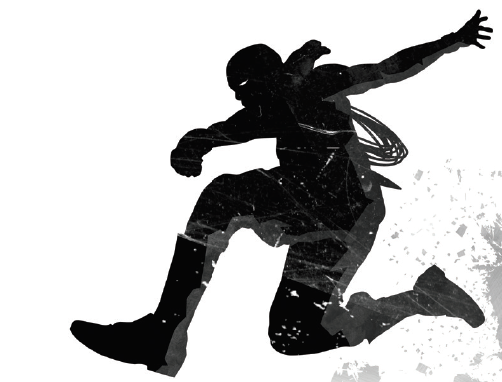

<figure>
  
  <figcaption>Illustration issue du livre Blades in the Dark</figcaption>
</figure>

Cette page contient un **résumé de partie** du jeu de rôle [Psi *Run](http://electric-goat.net/products/1) dans une ambiance inspirée du jeu de rôles [Blades In The Dark](https://www.evilhat.com/home/blades-in-the-dark/).
J'ai utilisé deux petites règles maison durant cette session, détaillées à la fin.

La partie a durée environ 9 heures, hors pauses, avec 3 joueurs et moi-même en MJ.

C'était la deuxième que j'organisais, la première est résumée [ici](https://chezsoi.org/lucas/jdr/psirun/CR_2016-12-18.html).
Et encore une fois, c'était génial !

[[toc]]

# La partie

## Les Fugitifs

- **Tom Lesper** :
  * La quarantaine bien tassée, buriné. Grande carrure. Bras à louer. **Tricorne**
  * **Pouvoir**: contrôle les esprits, avec son amulette
  * **Questions**:
    + D'où provient cette amulette exotique que j'ai en ma possession ?
    + Pourquoi l'amulette que j'ai au coup m'attire vers les docks ?
    + Comment suis-je entré en possession de la la clef de l'auberge de la Goule Fendue ?
    + Pourquoi au contact du plomb cette blessure à la hanche me relance ?
    + Quelle est cette ombre furtive que je vois derrière mon reflet depuis peu ?

- **Dominique** :
  * Homme d'âge moyen. Brun. Les yeux verts. 1m80. Fin. Pauvre d'allure. Porte une cape remplie d'outils.
  * **Pouvoir**: change d'apparence à volonté
  * **Questions**:
    + Quelle est ma vraie apparence ?
    + Qui sont Emile et Sophie ?
    + Pourquoi ai-je cette carte détaillé d'un bâtiment ?
    + Pourquoi ai-je deux doigts en moins ?
    + Pourquoi je sens le poisson et j'ai les bottes trempées ?

- **Georges** :
  * Cheveux noirs en bataille, petites lunettes rondes, teint blanchâtre, mal rasé
  * **Pouvoir**: fait vieillir les choses
  * **Questions**:
    + Pourquoi ai-je une gourmette au nom de Marcel ?
    + Pourquoi ai-je une photo déchirée avec un socle de statue visible et le numéro 18.21.12 écrit au dos ?
    + Pourquoi je n'entends que d'une oreille ?
    + Pourquoi je ne peux pas faire vieillir ma gourmette ?

## Résumé

Les Fugitifs se réveillent dans une cale humide d'un bateau.
Ils viennent d'être libéré des colliers de métal à leurs coups par une silhouette féminine.
L'un d'eux reste attaché par un bras à la paroi en bois.
Les barreaux de métal qui les enfermaient ont été arrachés, laissant un trou béant plus grand qu'un hommme.
Derrière, ils aperçoivent leurs affaires dans un coffre renversé.
Au dessus, sur le pont, ils entendent les coups et cris d'une bataille.
Et on entend le tonnerre d'une tempête.

<figure>
    
    <figcaption>Concept art pour Thief de <a href="http://conceptartworld.com/news/thief-concept-art-by-mathieu-latour-duhaime/">Mathieu Latour-Duhaime</a></figcaption>
</figure>

- Dominique ramasse un des barreaux arrachés et essaie d'aider Georges à se libérer
- un boulet de canon traverse la cale de part en part : il provient d'un bateau blindé à quelques encablures qu'ils aperçoivent par le trou formé
- Georges en profite pour arracher sa chaîne et les 3 Fugitifs montent sur le pont après avoir récupéré leurs affaires ainsi qu'une besace pleine de pièces
- une fois là-haut ils découvrent que la bataille se termine.
Des corps jonchent le pont: des matelots, d'autres prisonniers reconnaissables à leurs chaînes, et des soldats.
Sur le ponton avant, un duel au sabre faire rage entre une jeune femme et le capitaine arborant un tricorne.
Ils aperçoivent également un prisonnier descendre une échelle de corde vers une barque en contrebas.
- alors que les Fugitifs tentent de s'en approcher, un des mâts du bateau s'effondre devant eux
Sur le ponton, le capitaine invoque une créature constituée de débris de bois virevoltants, tandis que son adversaire lui lance des éclairs.
Un début d'incendie semble s'être déclaré plus bas dans le bateau.

<figure>
    
    <figcaption>Concept art pour Thief de <a href="http://conceptartworld.com/news/thief-concept-art-by-mathieu-latour-duhaime/">Mathieu Latour-Duhaime</a></figcaption>
</figure>

- tandis que la bretteuse sur le ponton reçoit un terrible coup de sabre au ventre, les Fugitifs détachent une chaloupe de sauvetage
et prennent la mer. Ils repêchent en chemin un naufragé inconscient:
l'homme qu'ils ont aperçus un instant plus tôt descendre l'échelle de corde semble s'être fait assommer par le mât.
- ils sont bientôt poursuivis par le bateau cuirassé.
Pour lui échapper, Tom utilise son amulette pour éviter les projecteurs qui les recherchent à la surface de l'eau.
Tandis que le navire les frôle sans les voir, Tom se rapelle qu'il a obtenu son amulette au cours d'un combat contre un capitaine squelette.
- la Fugitifs rament jusqu'au port de Doskvol, et s'engagent discrètement dans les canaux de la ville.
- ils descendent de chaloupe dans un quartier tranquille, et se dirigent vers une église en portant leur compagnon d'infortune inconscient.
Ils toquent à la porte de la sacristie et sont accueillis par le père Nick Mulherin.
Il questionne quelque peu les Fugitifs, qui prétendent avoir trouvé le pauvre homme par hasard.
Il le soigne néanmoins, avec l'aide de son jeune diacre, et propose aux Fugitifs de se réchauffer près du poêle.
Quelques instants plus tard, la sœur Kadera leur amène de la soupe. Pas très bonne.
- alors que les Fugitifs venaient d'identifier l'emplacement de l'auberge de la Goule Fendue et du bâtiment dont Dominique a un plan,
le diacre déboule tout excité en apprenant que la milice est à la porte de l'église et interroge père Mulherin.
- Dominique se faufile dans la nef pour écouter leur conversation.
La milice prétend être à la recherche de détenus évadés, et demande au prête d'en faire mention dans son sermon le lendemain.
Celui-ci ne pipe mot sur les Fugitifs.
- pendant ce temps, Georges profite de l'absence de la bonne sœur pour employer son pouvoir et tenter de soigner le noyé en résorbant sa grosse bosse à la tête.
L'opération réussit, mais le malheureux vieillit de 10 ans !
- il se réveille en sursaut, et reconnaît les Fugitifs. Il leur apprend son nom, Crelig Scott, et qu'ils étaient tous les quatre prisonniers ensemble,
dans un lieu lointain où ils ont été forcés à participer à d'étranges rituels. Ses souvenirs sont néanmoins également incomplets.

<figure>
    
    <figcaption>Crelig - Artwork: "Dargley" par <a href="https://athayar.deviantart.com/art/Pathfinder-Dargley-400349532">CavalierediSpade</a></figcaption>
</figure>

- le père Mulherin surgit alors et abasourdi de voir Crelig ainsi vieilli, demande se qu'il se passe ici.
Derrière lui crie "Tycherosi !"
- Dominique assomme le prêtre, et les Fugitifs s'enfuient à l'auberge de la Goule Fendue

<figure>
    
    <figcaption>Concept art pour Thief de <a href="https://matlatart.deviantart.com/art/Thief-Dr-Troy-s-Surgery-440101255">Mathieu Latour-Duhaime</a></figcaption>
</figure>

- une fois les Fugitifs attablés autour d'une pinte chacun, Tom demande au barman - qui l'a reconnu - si la chambre correspondant à sa clef est libre.
Celui-ci est étonné qu'il en ait un double, mais lui répond que oui elle est libre. Tom la loue pour la nuit, ainsi que 3 places en dortoir.
- Tom monte fouiller la chambre, très ordinaire, où il découvre seulement un papier plié avec un croquis de son amulette
Pendant ce temps les autres discutent avec le barman, et Dominique découvre que la demeure dont il a un plan est celle de la riche famille Walund.
Crelig leur apprend que la personne qui les a libéré dans le bateau s'appelle Sophie, et qu'elle était un contact d'un des Fugitifs.
Ceux-ci lui avait promis qu'elle viendrait les faire évader, mais il n'y croyait pas !
- tandis que Crelig va se coucher, Tom décide de tenter de contacter l'esprit de Sophie lors d'un rituel dans sa chambre,
sous l’œil attentif mais méfiant de Dominique & Georges.
- Tom réussit à rentrer en contact, et la voit allongée sur un banc en bois dans une cellule.
Mais le rituel tourne mal et Dominique se retrouve projeté hors de son corps.
- tandis que Tom tente de reprendre le contrôle, il demande à Georges de traîner la dépouille inanimé de Dominique jusque dans le couloir où est attirée son âme.
Dominique reprend possession de son corps, mais celui-ci a pris l'apparence de Sophie

<figure>
    
    <figcaption>Sophie - Illustration de <a href="http://www.jasonchanart.com">Jason Chan</a></figcaption>
</figure>

- malheureusement le rituel a rameuté leurs Poursuivants: une escouade de milicien fait irruption au rez-de-chaussé de l'auberge,
et un gros chien noir rompt son attache pour courir à leur poursuite dans l'escalier.
- les Fugitifs se barricadent dans la chambre et s'évadent par les toits

<figure>
    
    <figcaption>Concept art pour Thief de <a href="http://conceptartworld.com/news/thief-concept-art-by-mathieu-latour-duhaime/">Mathieu Latour-Duhaime</a></figcaption>
</figure>

- après quelques escapades de montes-en-l'air, les Fugitifs sèment la milice. Tom utilise son pouvoir pour diriger leurs chiens traqueurs d'esprits
vers le crématorium proche.
- Crelig leur propose alors de demande une planque pour la nuit à Ludius, un chef de gang local qui a été son capitaine lorsqu'il s'appelait encore Ironicus
- les Fugitifs acceptent et se rendent à leur repaire, un bateau en cale sèche.
Ludius s'avance pour les rencontrer, et accepte de leur fournir une planque pour le nuit, contre une belle somme.

- le lieutenant du gang du Harpon, Elorna, se charge de conduire les Fugitifs à la planque, mais Crelig reste discuter avec Ludius
- quelques rues plus loin, les Fugitifs découvrent au pieds de quelques marches et derrière une porte en bois,
un lieu inquiétant, carrelé de blanc, dont il est difficile de dire s'il a servit de bains-douches ou d'abattoir

<figure>
    
    <figcaption>Concept art pour Thief de <a href="https://www.artstation.com/matlat">Mathieu Latour-Duhaime</a></figcaption>
</figure>

- les Fugitifs se reposent quelques heures, puis Tom décide d'essayer de contacter les esprits des morts ayant coulé avec le bateau la nuit dernière,
afin de les questionner sur ce qu'il s'est passé sur ce navire.
Ils obstruent les soupiraux pour plonger la pièce dans le noir, puis Tom se concentre en tailleur devant la flamme d'une bougie.
- la pièce semble comme traversée d'une brume fantomatique, et se change progressivement jusqu'à ce que les Fugitifs se retrouvent à nouveau sur le ponton du fameux navire.
Autour d'eaux, les cadavres des matelots, soldats et prisonniers rejouent toute la scène qui a suivit la libération des prisonniers au ralentit, comme s'ils flottaient dans l'eau.
Ils découvrent le nom du capitaine, Drav Walund, et du compagnon de Sophie qui était dans la barque: Eirik
- les morts se révèlent plutôt vindicatifs et Tom manque de rester bloqué dans sa vision !
Il s'en sort finalement et se rappelle comment il a obtenu la clef de la chambre d'auberge:
il avait été engagé pour tuer Marcel Walund, le père de Drav, dans cette chambre
- les Fugitifs décident d'aller proposer à Ludius de s'associer pour organiser le casse de la demeure Walund, dont ils ont un plan détaillé,
afin d'obtenir des réponses, et pour lui l'occasion de dérober de précieux objets de valeur
Ils se donnent rendez-vous à minuit dans une cave à proximité de la demeure.
- Les fugitifs se rendent alors chez un antiquaire recommandé par Ludius pour s'y équiper en matériel de cambriolage.
Ils y trouvent leur bonheur, et Georges décide d'essayer son pouvoir sur des assiettes en argent pour déterminer ce qui rend sa gourmette si particulière.
Il se rappelle alors qu'elle est liée par un enchantement à un puissant esprit
- tandis que Dominique se rend à la taverne de l'Ours Gris, dans le quartier Skovlander, pour tenter de retrouver Eirik,
Tom & Georges retournent à la planque du gang du Harpon.
- à la taverne, la barmaid reconnaît Sophie en qui s'est déguisé Dominique. Elle a vu Eirik ce matin, mais ne sait pas où il est.
Dominique décide d'attendre à une table avec un verre que quelqu'un d'autre ne la reconnaisse.

<figure>
    
    <figcaption>Concept art pour Thief de <a href="https://www.artstation.com/artwork/Ewb0">Nicolas Ferrand</a></figcaption>
</figure>

- de leur côté, Georges aide Tom a organiser un autre rituel pour tenter de contacter Eirik.
Cela fonctionne, et ils le voient sans l'entendre, palabrer avec d'autres skovlanders dans un hangar à bateaux,
avec sur la table une carte de Dosklov. Celle-ci est en particulier annotée à l'emplacement de la demeure Walund.
- Tom tente de parler à Eirik, mais un autre Skovlander à ses côtés prend peur, et agite dans sa direction un chapelet en murmurant "Tycherosi !"
Le rituel est alors interrompu, et alors qu'ils entendent les chiens de la milice à la porte de la planque, l'amulette de Tom semble même ne plus fonctionner !
- tandis que Georges réussit à se glisser dans une cheminée d'aération dans le plafond,
Tom, trop large d'épaule, trouve in-extremis à se cacher dans le égouts en soulevant une grille au milieu de la pièce,
avant que la milice ne surgisse
- tous deux réussissent à s'enfuir de la planque. De son côté, Dominique réussit à apprendre d'un autre Skovlander qui l'a reconnu qu'Eirik doit être dans un hangar à bateaux.
- en sortant de la taverne, il est accosté par un inspecteur, Johan Stromberg, qui veut l'interroger sur le meurtre de Marcel Walund
- Dominique, sous son apparence de Sophie, accepte de le suivre, mais réussit à lui fausser compagnie en changeant de visage et son fondant dans la foule.
Néanmoins son pouvoir déraille, et trois personnes à ses côtés voient leurs visages fondre !
- cette fois grimée en vieille dame, Dominique retrouve enfin Eirik dans un hangar avec ses comparses.
En apprenant que la milice est toute proche, ils décident de se séparer et de déguerpir, mais Eirik fait monter avec lui Dominique dans une barque pour filer
- Dominique lui explique alors en quelques mots qui il est, et que Sophie est prisonnière du manoir Walund.
Eirik s'emporte alors : ce n'est pas possible, c'est Emile qui est retenu prisonnier !
Il donne un coup de couteau à Dominique, qui reprend sa véritable apparence, Sophie, mais tombe à l'eau.

- les 3 Fugitifs, Crelig et Ludius se retrouvent finalement au rendez-vous à minuit
- à l'heure prévue, ils grimpent sur les toits tandis qu'Elorna doit organiser une diversion
- les cambrioleurs traversent la rue jusqu'au manoir via un câble, et s'introduisent dans la demeure via les combles
- via les discussions des domestiques, ils entendent que la diversion d'Elorna a fonctionné, et que Drav est occupé à sermonné quelques rejetons de la famille Walund qui sont rentrés soûl au manoir
- après avoir assommé un garde, Dominique/Sophie en profite pour prendre son apparence et de revêtir un uniforme
- discrètement, ils descendent un étage après l'autre pour s'infiltrer jusqu'au bureau privé de Drav Walund, laissant Ludius et Crelig s'emparer des objets de valeur

<figure>
    
    <figcaption>Drav Walund - Concept art pour Thief de <a href="https://www.artstation.com/matlat">Mathieu Latour-Duhaime</a></figcaption>
</figure>

- une fois la porte crochetée, les Fugitifs allument une lampe pour examiner la pièce.
Elle comporte une cheminée, un secrétaire, un tableau représentant Marcel Walund, et un grand bureau trônant devant la fenêtre.
Et sur le côté, le buste de statue dont Georges a le socle en photo.

<figure>
    
    <figcaption>Portrait de Marcel Walund - Concept art pour Thief de <a href="https://davidmccartney.deviantart.com/art/Oldman-436959340">Arman Akopian</a></figcaption>
</figure>

- tandis que Georges entre la combinaison au dos de la statue, révélant un orifice contenant un mystérieux collier de dents,
Tom perçoit qu'un enchantement protège le bureau. L'esprit d'un léviathan semble y être attaché, prêt à dévorer le malheureux qui s'en approcherait.
- grâce à sa gourmette, Georges peut le fouiller sans danger, et découvre un papier listant leurs noms avec tous ceux des autres prisonniers du navire.
- soudain, Dominique/Sophie entend du bruit dans le couloir: Drav Walund se dirige vers le bureau !

<figure>
    
    <figcaption>Drav Walund - Artwork de <a href="https://www.artstation.com/crazybrush">Goran Bukvic</a></figcaption>
</figure>

- les Fugitifs se préparent à le capturer à son entrée dans le bureau, mais Drav découvre en mettant sa clef dans la porte que celle-ci a été ouverte...
- dans la panique, Georges saisit l'étrange collier de dents qui s'enroule autour de son poignet, et Tom invoque alors un esprit pour repousser Drav à travers la porte.
Les Fugitifs s’engouffrent alors dans les escaliers pour s'échapper du manoir par les toits... sauf Dominique/Sophie qui en profite pour descendre au sous-sol à la recherche de son frère Emile.
Son apparence lui permet de passer tous les gardes pour finalement se retrouver face à une porte en bois fermée à clef.
Il l'arrose d'huile et y met le feu, puis force la serrure avec son sabre.
- de leur côté, Tom, Georges, Crelig et Ludius s'échappent avec leur butin par les toits. Un dirigeable s'approche pour les capturer, mais Tom invoque une bourrasque pour le repousser.
En sécurité quelques toits plus loin, ils observent Eirik et se hommes passer à l'action eux aussi: ils attachent des chaînes aux grilles de la demeure, auxquelles est relié un bateau à aubes.
Afin d'éviter que l'escouade de la milice toute proche ne leur tombe dessus, Georges avec l'aide de Tom utilise son collier de dents pour les arrêter:
l'esprit du Leviathan traverse en trombe le manoir depuis le bureau pour exploser une fenêtre, tomber sur les miliciens et les dévorer !
Georges se rappelle alors pourquoi il avait cette gourmette: il était jeune inspecteur en charge de résoudre le meurtre de Marcel Walund !
- au sous-sol, Dominique/Sophie et Emile se retrouvent à travers les barreaux de sa geôle, tandis que derrière eux Drav et ses hommes arrivent.
Le Fugitif se rappelle alors pourquoi il lui manque deux doigts : comme elle partage le même pouvoir avec son frère, on les lui avait coupé il y a bien longtemps comme punition et pour pouvoir les distinguer tous deux.

## Epilogue

- **Tom Lesper** [en quête] : reprendra bientôt le large, son amulette l'attirant par delà les océans vers l'île mystérieuse de Tycheros...
- **Georges** [perdu] : deviendra fou, tourmenté d'avoir ainsi massacré ces hommes, lui un agent de la loi. Il s'exilera dans les terres désolées en-dehors de Doskvol, l'esprit du Léviathan toujours avec lui
- **Sophie Alguera** [piégée] : se défendra contre Drav et ses hommes jusqu'au bout, mais finira finalement enfermé dans une boule temporelle avec Emile, revivant la même histoire du point dans la peau d'Emile, tandis que celui-ci, amnésique, prend sa place comme Dominique

## La Piste à la fin

<figure>
  
  <figcaption>Généré avec <a href="http://ditaa.sourceforge.net">ditaa</a></figcaption>
</figure>

# Petits ajouts au système de jeu

A noter: cette fois nous avons ajouté des _post-its_ au marque-page afin d'indiquer qui a la parole pour chaque résultat de jet de dés.

Tout d'abord, une petite règle issue d'une précédente partie, mais qui n'a finalement pas servi dans celle-ci:

> Si les Fugitifs ont trop distancé leurs Poursuivants, le meneur de jeu peut les faire avancer d'un cran sur la Piste
en échange d'un jeton "joker", permettant aux Fugitifs de ne pas placer le résultat d'un d6 dans un Risque lors d'un jet.

Cette règle permet de conserver la mécanique du "en ayant pris de l'avance sur les Poursuivants, je peux me permettre de récupérer des Souvenirs",
tout en ajoutant de la tension dramatique et en forçant les Fugitifs au mouvement.

Et une autre règle optionnelle pour encourager la coopération des Fugitifs:

> Lorsque un Fugitif est aidé par un ou plusieurs autres personnages dans l'action qu'il entreprend, il peut lancer un d6 supplémentaire.

J'ai aussi été confronté au cas où les 3 Fugitifs tentent une action risquée (sauter par dessus le vide entre deux toits),
et où il me semblait inutile et laborieux de demander un jet de dés aux 3 joueurs.
Dans ce type de situation, je pense qu'il vaut mieux uniquement demander un jet au premier Fugitif qui prend le risque de sauter,
mais pas nécessairement aux deux autres.

