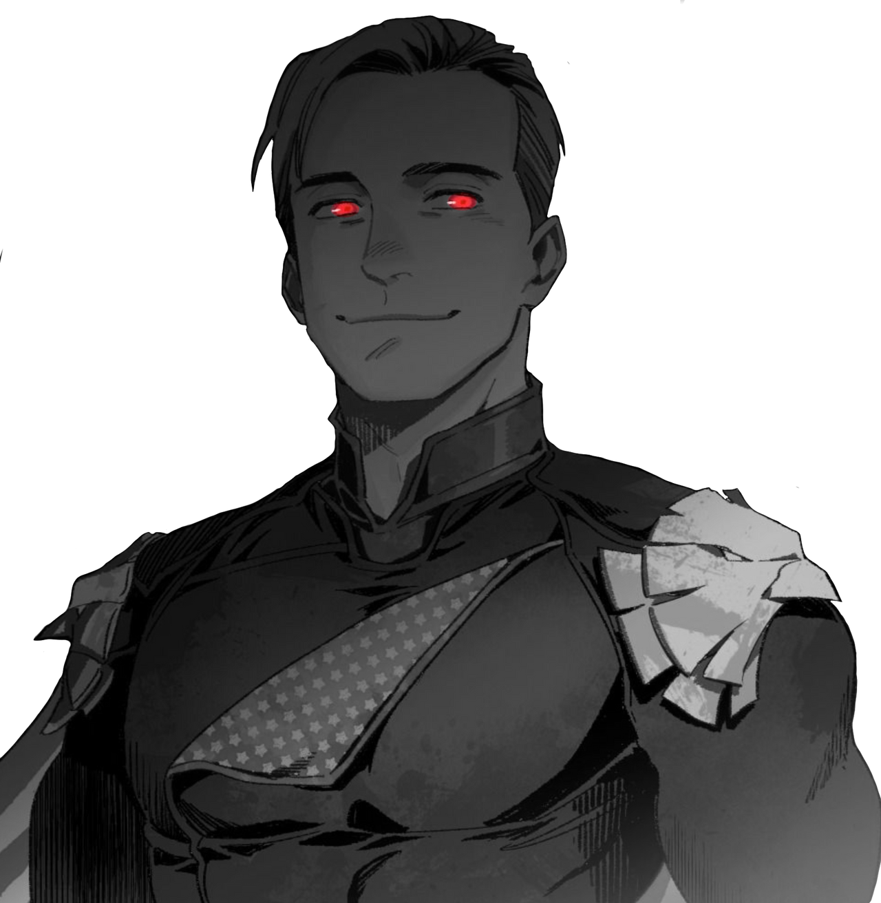

# Psi*Run  Implacables

Une situation de départ pour Psi*Run inspirée de _The Boys_.
 
_(mais ne mentionnez pas cette référence à vos joueurs !)_

## ce que Les fugitifs ne savent pas

Tous les Fugitifs étaient auparavant **des super-héros ultra puissants**, **extrêmement médiatiques**,
mais aussi secrètement d'**horribles ordures**, ayant commis les pires atrocités amorales.
Ils étaient connus comme **Les Implacables** et étaient soutenus par la méga-corporation **Vault Tech**.

Un petit groupe de psioniques s'est rassemblé en une organisation secrète nommée **Mankind Justice** pour mettre fin à leurs cruels agissements.

Aujourd'hui, ils ont ont tendu **un piège aux Implacabales**
dans un bateau cargo abandonné au port de la ville,
où ils avaient rassemblé **de quoi affaiblir leurs pouvoirs**.
Leur chef, **Mad Jack**, les a affronté mais, sentant la situation lui échapper,
s'est sacrifié en poussant au maximum son pouvoir psi,
rendant amnésiques les Implacabale et provoquant une explosion.

Amnésiques, les Fugitifs ne savent pas que les médias et Vault Tech sont de leurs côté.
Et comme leurs identités étaient secrètes, sans leurs costumes ils ne sont pas reconnus de leurs partisans.

## création des fugitifs
Tandis que les joueuses inventent leurs personnages,
essayez de répondre à ces questions,
en répartissant les réponses entre les Fugitifs :

* qui était **MegaScout**, héro de la ville, à la morale intégriste ?
* qui était **CyberDog**, le mystérieux justicier, tendance fasciste ?
* qui est à la tête de **Vault Tech** ?
* qui apparaît sur des **photos compromettantes** ? Que faisait-il ?
* qui a conservé une trace de son **apparence super-héroïque** ?

Vous répondrez ensemble durant la partie aux questions sans réponses.

## Situation initiaLe
New Seattle, 2048. Les Fugitifs reprennent conscience à l'intérieur d'un gigantesque cargo qui prend l'eau rapidement. Une explosion semble avoir percé la coque, et brûlé leurs vêtements. Certains Fugitifs sont entravés par de lourdes chaînes, des conteneurs de marchandise menacent de les écraser alors que le navire bascule, et un cadavre flotte à proximité, avec comme seul signe distinctif « MJ » tracé en rouge sur son t-shirt blanc...

L'un des Fugitifs découvre dans sa poche les clefs d'un coffre de banque.

## La Piste - Lieux potentieLs
::: columns
* sur le pont du cargo qui coule, attaqués par des nuées d'animaux
* le quai du port, avec BikerMan et Zooniper au sommet du phare
* une station de métro bondée; un journaliste les interpelle (Madison)
* la **Vault Bank**, ses employés obséquieux, et sa sécurité high-tech : serrure, scanner rétinien, scanner digital, et mot de passe...
* dans le coffre privé, une malette contient d'horribles photos tachées de sang, et le plan d'un ascenseur secret reliant...
* la **base secrète de CyberDog**, dans les égoûts, incluant dojo, armurerie, gigantesque écran panoptique de télésurveillance, cellules où des détenus agonisent...
* et le **penthouse de MegaScout**, avec salle de prière, playmates dans la piscine, chambre S&M...
* dans cet ascenseur ultra-secret
* dans un taxi où le chauffeur aura l'impression de les avoir déjà vu
* dans l'appartement d'un des Fugitifs, où ils pourront découvrir... ⚀: une collection dérangeante ⚁: des lettres de fans & de menaces ⚂: un super-gadget ⚃: un plan de la ville avec l'ancien tribunal entouré en rouge ⚄: la photo de Mad Jack au centre d'un jeu de fléchettes ⚅: le costume d'un Implacable.
* dans le QG de Mankind Justice, l'ancien tribunal désafecté
:::

<!-- Tmp: remove this line -->          

## Poursuivants - Mankind Justice
Ces psioniques hors-la-loi se relaient pour traquer les Fugitifs.
Face à eux, ils clameront leur soif de vengance pour Mad Jack / Mankind Justice,
et refuseront tout dialogue.

### &nbsp;&nbsp; Zooniper
Cette ancienne super-héroïne s'est vue torturée et défigurée par l'un des Implacables.
Sniper d'élite, elle a aussi la capacité de commander aux animaux.
Elle enverra sur les Fugitifs des hordes de mouettes, de requins, de rongeurs...
Vaincue, on trouvera sur elle un article _NS News_ de Jonah Madison où la mention du tribunal abandonné est surlignée...

### BikerMan
Capable de se regénérer à l'infini, BikerMan a servi de punching-ball
à l'un des Implacables durant des années.
Il a survécu, mais ses cordes vocales ne fonctionnent plus,
et il compte bien se venger.

### Shinobi
Ancien _sidekick_ d'un Implacable, il peut se dupliquer des dizaines de fois.
Il a été traumatisé de découvrir que son partenaire faisait parfois
subir des sévices à ses doubles éphémères.
Son identité civile est celle du reporter **Jonah Madison**.
Face aux Fugitifs, il se dédoublera en une véritable armée,
et les bombardera de shurikens.

 

### &nbsp;&nbsp;&nbsp;&nbsp;&nbsp;&nbsp; ThorgaL
Compagnon de Mad Jack dans la vie, Thorgal est une version ninja cybernétique de _Daredevil_
qui voue désormais une haine personnelle aux Fugitifs :
tant qu'il respire, il les traquera pour les éliminer.

## À La radio

Durant leur fuite, les Fugitifs entendront un peu partout à la radio
un chroniqueur de _NS News_ commenter l'actualité :
1. □ Étrange catastrophe au port, où un cargo a explosé puis coulé. Mais où sont les Implacables ?
1. □ Le cadavre de Mad Jack, _leader_ du groupe terroriste Mankind Justice, aurait été repêché aux abords du port... 
1. □ Des membres de Mankind Justice auraient été aperçus...
1. □ Les forces de l'ordre se déploient en ce moment à la Vault Bank. Notre reporter sur place, Jonah Madison, va tenter d'en savoir plus.
1. □ On aurait vu Shinobi, l'ancien partenaire de l'Implacable ________ ...
1. □ Thorgal, compagnon du défunt Mad Jack, aurait déclaré que ce dernier aurait emporté les Implacables avec lui dans la tombe. Et que s'il restait des rescapés, il leur réglerait leur compte lui-même.
1. □ Lors d'une conférence de presse exceptionnelle, Vault Tech s'est voulu rassurant concernant la disparition des Implacables. _« Il est déjà arrivé à nos vaillants héros d'intervenir dans l'espace, ou même dans dans d'autres dimensions, empêchant toute communication avec eux »_ a déclaré le porte-parole de l'entreprise. _« Notre PDG vous donnera bientôt des nouvelles d'eaux »_ a-t-il conclu. D'ailleurs où est-il celui-là ?
1. □ _Flash info_. Une source à la Maison Blanche nous informe que c'est la panique : en l'absence des Implacables pour protéger le pays, le risque d'une agression extérieure sur notre sol serait décuplé.

<footer>

Scénario conçu par [Lucas Cimon](https://chezsoi.org/lucas/blog/) - [CC BY-NC-SA](https://creativecommons.org/licenses/by-nc-sa/3.0/fr/). [Fichiers sources](https://github.com/Lucas-C/jdr/tree/master/psirun/Implacables).

Pour me soutenir, achetez mes créations sur [lucas-c.itch.io](https://lucas-c.itch.io).

Si vous testez ce scénario, faites-moi un retour sur [mon blog](https://chezsoi.org/lucas/blog/modules-de-secours.html).

Psi*Run est un jeu de Meguey Baker, édité en français par [ElectricGoat](https://electric-goat.net/products/1).

Illustrations : [AlexZebol](https://www.deviantart.com/alexzebol/art/Sketch-Older-Kenshi-782535896) - [CC BY-NC](https://creativecommons.org/licenses/by-nc/3.0/), [Fernand0FC](https://www.deviantart.com/fernand0fc/gallery) & [NewYa3502](https://www.deviantart.com/newya3502/art/Homelander-Render-2-957428403) - [CC BY](https://creativecommons.org/licenses/by/3.0/)

Polices : [KillTheNoise](https://www.fontspace.com/kill-the-noise-font-f17592), [RoadRage](https://youssef-habchi.com/fonts/road-rage) & [OutrunFuture](https://comicfontsby.tehandeh.com/fonts/outrun-future/)
</footer>
