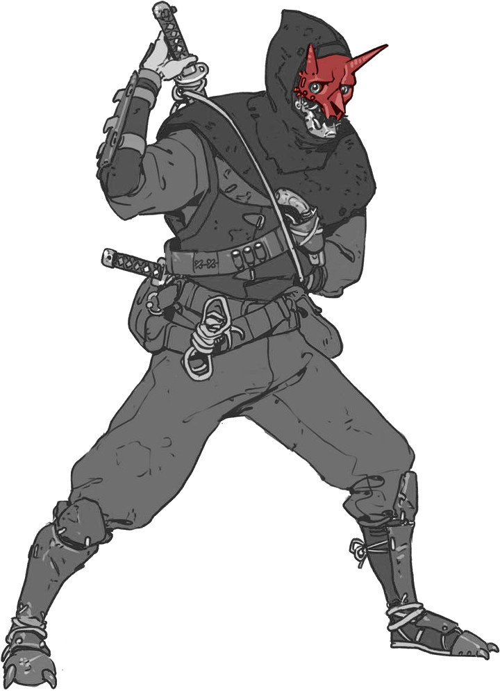

# Psi*Run  Implacables

Une situation de départ pour Psi*Run inspirée de _The Boys_.
 
_(mais ne le mentionnez pas à vos joueurs !)_

## ce que Les fugitifs ont oublié

Tous les Fugitifs étaient auparavant **des super-héros ultra puissants**, **extrêmement médiatiques**,
mais aussi secrètement d'**horribles ordures**, ayant commis les pires atrocités amorales.
Ils étaient connus comme **Les Implacables** et étaient soutenus par la méga-corporation **Vault Tech**.

Un petit groupe de psis s'est rassemblé en une organisation secrète nommée **Mankind Justice** pour mettre fin à leurs agissements cruels.

Aujourd'hui, ils ont ont tendu **un piège aux Implacables**
dans un cargo abandonné dans le port de la ville,
où ils avaient rassemblé **de quoi affaiblir leurs pouvoirs**.
Leur chef, **Mad Jack**, les a affronté mais, sentant la situation lui échapper,
s'est sacrifié en poussant au maximum sa capacité psi,
rendant amnésiques les Implacables et provoquant une explosion.

Amnésiques, les Fugitifs ont oublié qu'ils ont le support des médias et de Vault Tech;
et comme la plupart de leurs identités étaient secrètes,
sans leurs costumes ils ne sont pas reconnus par leurs partisans.

## création des fugitifs
Tandis que les joueuses inventent leurs personnages,
essayez de répondre à ces questions,
en répartissant les réponses entre les Fugitifs :

* quel Fugitif était à la tête de **Vault Tech** ?
* qui était **MegaScout**, héro de la ville, à la morale intégriste ?
* qui était **CyberDog**, le mystérieux justicier, tendance fasciste ?
* qui apparaît sur des **photos compromettantes** ? Que faisait-il ?
* qui a conservé une trace de son **apparence super-héroïque** ?

Vous répondrez ensemble durant la partie aux questions sans réponses.

## Situation initiaLe
New Seattle, 2048. Les Fugitifs reprennent conscience à l'intérieur d'un gigantesque cargo qui prend l'eau rapidement. Une explosion semble avoir percé la coque, et brûlé leurs vêtements. Certains Fugitifs sont entravés par de lourdes chaînes, des conteneurs de marchandise menacent de les écraser alors que le navire bascule, et un cadavre flotte à proximité, avec comme seul signe distinctif « MJ » tracé en rouge sur son t-shirt blanc...

Dans les poches des Fugitifs : les **clefs d'un coffre** de banque; un **plan des égouts** avec une croix; une **télécommande** activant le Dog-signal de la tour Vault; une **carte bancaire Vault** aux provisions infinies.

## La Piste - Lieux potentieLs

::: columns
* sur le pont du cargo qui coule, attaqués par des nuées d'animaux
* le quai du port, avec BikerMan et Zooniper au sommet du phare
* une station de métro bondée; des produits dérivés _Les Implacables_ dans tous les commerces; un journaliste les interpelle (Madison)
* la **Vault Bank**, ses employés obséquieux, et sa sécurité high-tech : serrure, scanner rétinien, scanner digital, et mot de passe...
* dans le coffre privé, une mallette contient d'horribles photos tachées de sang, et le plan d'un ascenseur secret reliant...
* la **base secrète de CyberDog** dans les égouts, avec dojo, armurerie, gigantesque écran panoptique de télésurveillance, Cyber-mobile, cellules où des détenus agonisent...
* et le **penthouse de MegaScout**, au sommet de l'immeuble Vault, avec salle de prière, playmates dans la piscine, chambre S&M...
* dans cet ascenseur ultra-secret
* dans l'**immeuble Vault Tech**, son showroom high-tech, son laboratoire de recherche, ses expérimentations sur des enfants...
* une course-poursuite à travers les sommets des gratte-ciels
* dans l'appartement d'un des Fugitifs, où ils pourront découvrir... ⚀: une collection dérangeante ⚁: des lettres de fans & de menaces ⚂: un super-gadget ⚃: un plan de la ville avec l'ancien tribunal entouré en rouge ⚄: la photo de Mad Jack au centre d'un jeu de fléchettes ⚅: le costume d'un Implacable.
* dans un taxi où le chauffeur aura l'impression de les avoir déjà vu
* dans le **QG de Mankind Justice**, l'ancien tribunal désaffecté jonché de preuves accablant les Fugitifs : photos aux murs de meurtres commis et de pots de vins reçus; enregistrement vidéo incriminant l'un des Implacables dans un assassinat politique; témoignage d'un employé de Vault révélant qu'ils ont conçu de fausses menaces, tels ces faux robots envahisseurs en soucoupe volante...

    
:::

## Poursuivants - Mankind Justice
Ces psis hors-la-loi se relaient pour traquer les Fugitifs.
Face à eux, ils clameront leur soif de vengeance pour Mad Jack / _Mankind Justice_,
et refuseront tout dialogue.

### &nbsp;&nbsp; Zooniper
Cette ancienne super-héroïne s'est vue torturée et défigurée par l'un des Implacables.
Sniper d'élite, elle a aussi la capacité de commander aux animaux.
Elle enverra sur les Fugitifs des hordes de mouettes, de requins, de rongeurs...
Vaincue, on trouvera sur elle un article _NS News_ de Jonah Madison où la mention du tribunal abandonné est surlignée...

### BikerMan
Capable de se régénérer à l'infini, BikerMan a servi de punching-ball
à l'un des Implacables durant des années.
Il a survécu, mais ses cordes vocales ne fonctionnent plus,
et il compte bien se venger.

### Shinobi
Ancien _sidekick_ d'un Implacable, il peut se dupliquer des dizaines de fois.
Il a été traumatisé de découvrir que son partenaire faisait parfois
subir des sévices à ses doubles éphémères.
Son identité civile est celle du reporter **Jonah Madison**.
Face aux Fugitifs, il se dédoublera en une véritable armée,
et les bombardera de shurikens.

### &nbsp;&nbsp;&nbsp;&nbsp;&nbsp;&nbsp; ThorgaL
Compagnon de Mad Jack dans la vie, Thorgal est une version ninja cybernétique de _Daredevil_
qui voue désormais une haine personnelle aux Fugitifs :
tant qu'il respire, il les traquera pour les éliminer.

## À La radio

Durant leur fuite, les Fugitifs entendront un peu partout à la radio
un chroniqueur de _NS News_ commenter l'actualité :
1. □ Étrange catastrophe au port : un cargo a explosé et coulé. On aurait aperçu le Dog-signal. Mais où sont les Implacables ?
1. □ Le cadavre de Mad Jack, _leader_ du groupe terroriste _Mankind Justice_, aurait été repêché aux abords du port...
1. □ Des membres de _Mankind Justice_ auraient été aperçus...
1. □ Les forces de l'ordre se déploient en ce moment à la Vault Bank. Notre reporter sur place, Jonah Madison, va tenter d'en savoir plus.
1. □ On aurait vu Shinobi, l'ancien partenaire de l'Implacable _\_\_\_\_\_\_\_\_\_ ...
1. □ Nous tenons à nous excuser et à nous désolidariser des propos tenus à l'instant par notre reporter Jonah Madison, pour son soutien obscène à _Mankind Justice_, et ces immondes ragots sur les Implacables...
1. □ Lors d'une conférence de presse, Vault Tech s'est voulu rassurant concernant les Implacables. _« Il est déjà arrivé à nos vaillants héros d'intervenir dans l'espace, empêchant toute communication avec eux »_ a déclaré le porte-parole. _« Notre PDG vous donnera bientôt des nouvelles de nos héros »_ a-t-il conclu.
1. □ Nous recevons à l'instant une déclaration de Thorgal, compagnon du terroriste Mad Jack : ce dernier aurait emporté les Implacables avec lui dans la tombe ! Et Thorgal pourchasserait les rescapés !
1. □ _Flash info_. Afin de permettre aux forces de l'ordre de retrouver et d'aider les Implacables, Vault Tech a décidé de révéler leurs identités !

::: punchline
Les Fugitifs renoueront ils avec leur passé, ou s'en affranchiront-ils ?
:::

Bande son : [Spider-Man](https://www.youtube.com/playlist?list=PLBO2h-GzDvIYafOO43ruOilWVmJssZHS5), [City of Heroes](https://www.youtube.com/watch?v=oRWYHWPJhoA), [Vampire TM: Bloodlines](https://www.youtube.com/playlist?list=PLfzW_wEeYxk6xZzzUQIJnunXj98WGFb07), [Persona](https://www.youtube.com/playlist?list=PLJmimp-uZX42T7ONp1FLXQDJrRxZ-_1Ct).
Inspirations : [Paranormal (Christensen)](https://www.bedetheque.com/serie-9891-BD-Paranormal.html), [Powers (Bendis & Deming)](https://en.wikipedia.org/wiki/Powers_(comics)), les comics de Paul Pope, Suicide Squad, [le _trope_ Beware the Superman](https://tvtropes.org/pmwiki/pmwiki.php/Main/BewareTheSuperman).

<footer>

Scénario conçu par [Lucas Cimon](https://chezsoi.org/lucas/blog/) - [CC BY-NC-SA](https://creativecommons.org/licenses/by-nc-sa/3.0/fr/). [Fichiers sources](https://github.com/Lucas-C/jdr/tree/master/psirun/Implacables).
Pour me soutenir, achetez mes créations sur [lucas-c.itch.io](https://lucas-c.itch.io).
Si vous testez ce scénario, faites-moi un retour sur [mon blog](https://chezsoi.org/lucas/blog/modules-de-secours.html) :D

Psi*Run est un jeu de Meguey Baker,
 édité en français par [ElectricGoat](https://electric-goat.net/products/1).

Illustrations : [AlexZebol](https://www.deviantart.com/alexzebol/art/Sketch-Older-Kenshi-782535896) - [CC BY-NC](https://creativecommons.org/licenses/by-nc/3.0/),
 [Fernand0FC](https://www.deviantart.com/fernand0fc/gallery) & [NewYa3502](https://www.deviantart.com/newya3502/art/Homelander-Render-2-957428403) - [CC BY](https://creativecommons.org/licenses/by/3.0/)

Polices : [KillTheNoise](https://www.fontspace.com/kill-the-noise-font-f17592), [RoadRage](https://youssef-habchi.com/fonts/road-rage) & [OutrunFuture](https://comicfontsby.tehandeh.com/fonts/outrun-future/)
</footer>
