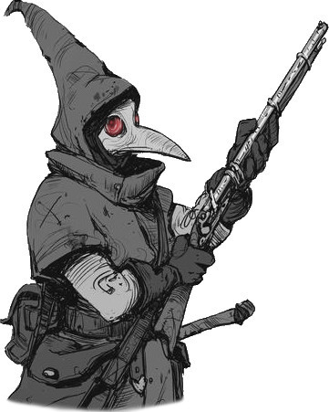
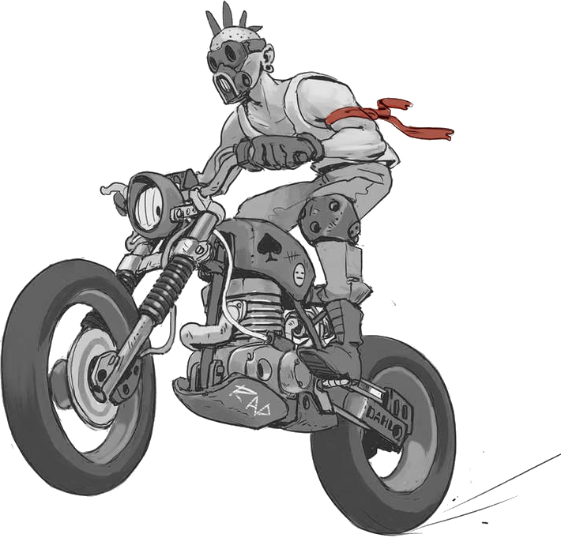
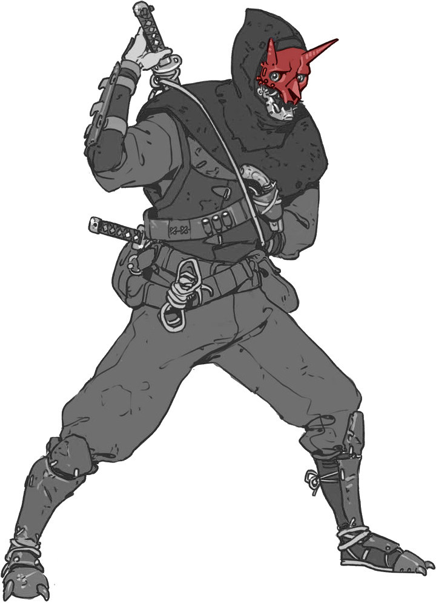
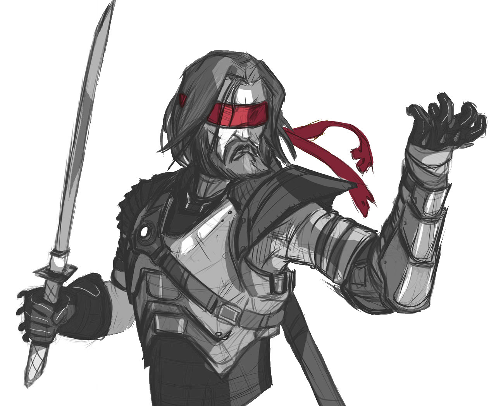
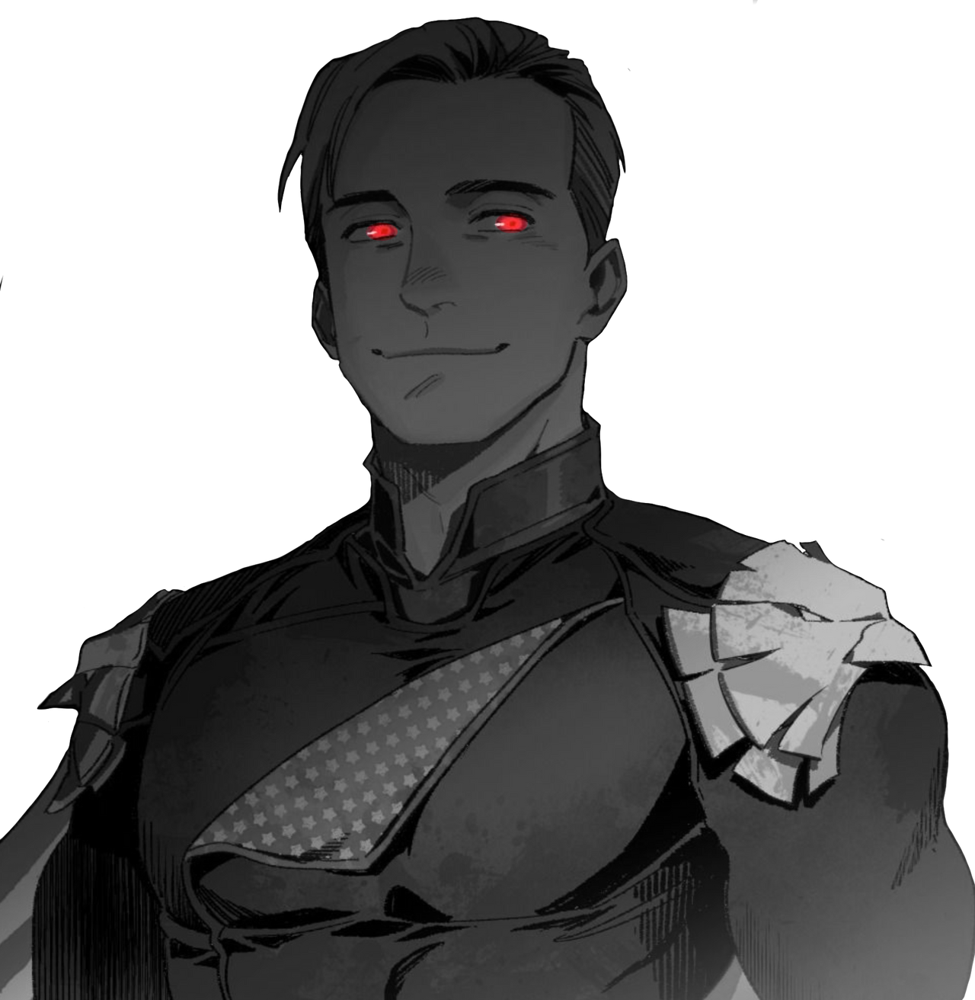

# Psi*Run  the restless

A setting for Psi*Run inspired by _The Boys_.
 
_(but don't tell your players!)_

::: web-only
PDF version: [The Restless (itch.io)](https://lucas-c.itch.io/psirun-the-restless)
:::

## what the runners forgot

Before their amnesia, the Runners were **ultra-powerful superheroes**, **extremely high-profile**,
but also secretly **horrible scum**, having committed the most amoral atrocities.
They were known as **The Restless** and were supported by the mega-corporation **Vault Tech**.

A small group of psi-wielders has formed a secret organization called the **Guild of Mentalists** to put an end to their cruel actions.

Earlier today, they set up **a trap for the Restless**
in an abandoned freighter in the city's port,
where they gathered **materials to weaken their powers**.

Their leader, **Gary Maniac**, confronted them but,
sensing the situation was getting out of hand,
sacrificed himself by pushing his psi-power to the limit,
erasing the memories of all the Restless and causing an explosion.

Amnesiac, the Runners don't know that they have the support of Vault Tech
and considerable media popularity.
And since most of their identities were secret,
without their costumes they are not recognized by their fans.

## creating the runners
While the players invent their characters,
secretly answer the following questions,
distributing the answers among the Runners:

* Which Runner was the head of **Vault Tech**?
* Who was **MegaScout**, the city's hero and a dubious fundamentalist?
* Who was **CyberDog**, the mysterious vigilante with fascist tendencies?
* Who appears in **compromising photos**? What did they do?
* Who retained a trace of their **superheroic appearance**?

You will answer the unanswered questions all together during the game.

## starting situation
**New Seattle, 2048**. The Runners regain consciousness inside a gigantic cargo ship that is rapidly taking on water. An explosion appears to have pierced the hull, burning their clothes. Some Runners are restrained by heavy chains, cargo containers threaten to crush them as the ship tilts, and a corpse floats nearby, its only distinguishing mark being "GM" written in red on its white t-shirt...

In the Runners' pockets: **the keys** to a bank vault; **a map of the sewers** with a cross; **a remote control** (activating the Vault Tower's dog signal); and **a Vault bank card** (with infinite supplies).

## the traiL - pLaces to run through
::: columns
* on the deck of the sinking freighter, attacked by swarms of animals
* the harbor pier, with BikerMan charging and Zooniper shooting at them from the lighthouse
* a crowded subway station; a big poster of _The Restless_; a journalist calls out to them (Madison)
* in a taxi where the driver feels like he's seen them before
* the **Vault Bank**, its obsequious employees, and its high-tech security: lock, retinal scanner, digital scanner, and password...
* in the private safe, a briefcase with horrific bloody photos, and the plan of a secret elevator connecting...
* **CyberDog's secret base** in the sewers, with a dojo, armory, gigantic panopticon surveillance screen, Cyber-mobile, cells where inmates are dying...
* and **MegaScout's penthouse**, at the top of the Vault building, with a prayer room, playmates in the pool, an S&M room...
* a chase through the tops of the skyscrapers
* in the **Vault Tech building**, its high-tech showroom & laboratory, its experiments on children...
* in the apartment of one of the Runners, where they can discover! fan letters & threats; some super-gadget; a city map with the old courthouse circled in red; Gary Maniac's photo in the center of a dartboard; a Relentless costume; a disturbing collection...
* in **the HQ of the Guild of Mentalists**, the abandoned old courthouse littered with evidence incriminating the Runners: photos on the walls of murders committed and bribes received; video recordings incriminating one of them in a political assassination; testimony from a Vault employee revealing that they devised fake threats, such as these fake flying saucer-shaped invading robots...

      
:::

::: frame
### speciaL ruLe
**Repel the Chasers**: If the Runners successfully confront and fight the Chasers in a location,
the Chasers move back one step on the Trail.
:::

## chasers - the guiLd of mentaLists
These outlaw psi-wielders take turns hunting down the Restless.
When confronted, they proclaim their thirst for revenge for Gary Maniac,
attack the Runners and refuse any discussion.

### &nbsp;&nbsp; Zooniper
This former superhero was tortured and disfigured by one of the Restless. An elite sniper, she also has the ability to command animals.
She will swarm the Runners with seagulls, sharks, rodents, and more.
Defeated, an NS News article by Jonah Madison can be found on her corpse, with a mention of the abandoned courthouse highlighted.

### BikerMan
Capable of infinite regeneration, BikerMan served as a punching bag
for one of the Restless for years. He survived, but his vocal cords no longer function,
and he intends revenge.

### Shinobi
A former sidekick of one of the Restless, he can duplicate himself dozens of times.
He was traumatized to discover that his partner sometimes abused his ephemeral counterparts.
His civilian identity is that of reporter **Jonah Madison**.
Faced with the Runners, he will split into a veritable army,
and bombard them with shurikens.

### &nbsp;&nbsp;&nbsp;&nbsp;&nbsp;&nbsp; ThorgaL
Gary Maniac's companion in life, Thorgal is a cybernetic ninja version of Daredevil who now harbors a personal hatred for the Runners:
as long as they breath, he will hunt them down and kill them one by one.

## On the radio

During their escape, the Runners will hear a columnist from _NS News_ commenting on the radio:
1. □ Strange disaster at the port: a cargo ship exploded and sank. The dog signal was sighted, but where are the Restless?
1. □ The body of Gary Maniac, leader of the terrorist group named "the Guild of Mentalists", was reportedly recovered from near the port...
1. □ Law enforcement is currently deployed to the Vault Bank. Our on-site reporter, Jonah Madison, will try to find out more.
1. □ Members of the Guild of Mentalists have reportedly been spotted in the city, including Shinobi, the former partner of _\_\_\_\_\_\_\_\_\_ ...
1. □ We would like to apologize and dissociate ourselves from the comments just made by our reporter Jonah Madison, for his obscene support for the Guild of Mentalists, and this filthy gossip about the Restless...
1. □ During a press conference, Vault Tech sought to reassure people about the Restless. _"Our valiant heroes are probably intervening in a place preventing all communication"_ declared the spokesperson. _"Our CEO will soon give you news of our city heroes"_ he concluded.
1. □ We have just received a statement from Thorgal, companion of the terrorist Gary Maniac: the latter allegedly took the Restless with him to the grave! And Thorgal would hunt down the survivors!
1. □ _News Flash_. To help law enforcement find and help the Restless, Vault Tech has decided to reveal their identities!

 

::: punchline
Will the Runners reconnect with their past, or will they free themselves from it?
:::

Soundtrack: [Spider-Man](https://www.youtube.com/playlist?list=PLBO2h-GzDvIYafOO43ruOilWVmJssZHS5), [City of Heroes](https://www.youtube.com/watch?v=oRWYHWPJhoA), [Vampire TM: Bloodlines](https://www.youtube.com/playlist?list=PLfzW_wEeYxk6xZzzUQIJnunXj98WGFb07), [Persona](https://www.youtube.com/playlist?list=PLJmimp-uZX42T7ONp1FLXQDJrRxZ-_1Ct).
Inspirations: the comics [Powers](https://en.wikipedia.org/wiki/Powers_(comics)), [the trope Beware the Superman](https://tvtropes.org/pmwiki/pmwiki.php/Main/BewareTheSuperman).
You can mention [the TV series Heroes](https://en.wikipedia.org/wiki/Heroes_(American_TV_series)) to the players without spoiling the surprise.

 

<footer>

Scenario created by [Lucas Cimon](https://chezsoi.org/lucas/blog/) - [CC BY-NC-SA](https://creativecommons.org/licenses/by-nc-sa/3.0/). Version: 1.0 - [Source files](https://github.com/Lucas-C/jdr/tree/master/psirun/Implacables).
To support my work, you can buy something on [lucas-c.itch.io](https://lucas-c.itch.io).
If you play that scenario, please give me some feedback on [my blog](https://chezsoi.org/lucas/blog/psirun-implacables-regles-additionnelles.html).

[Psi*Run is game by Meguey & Vincent Baker](https://lumpley.itch.io/psirun).

Illustrations: [AlexZebol](https://www.deviantart.com/alexzebol/art/Sketch-Older-Kenshi-782535896) - [CC BY-NC](https://creativecommons.org/licenses/by-nc/3.0/),
 [Fernand0FC](https://www.deviantart.com/fernand0fc/gallery) & [NewYa3502](https://www.deviantart.com/newya3502/art/Homelander-Render-2-957428403) - [CC BY](https://creativecommons.org/licenses/by/3.0/)

Fonts: [KillTheNoise](https://www.fontspace.com/kill-the-noise-font-f17592), [RoadRage](https://youssef-habchi.com/fonts/road-rage) & [OutrunFuture](https://comicfontsby.tehandeh.com/fonts/outrun-future/)

</footer>
