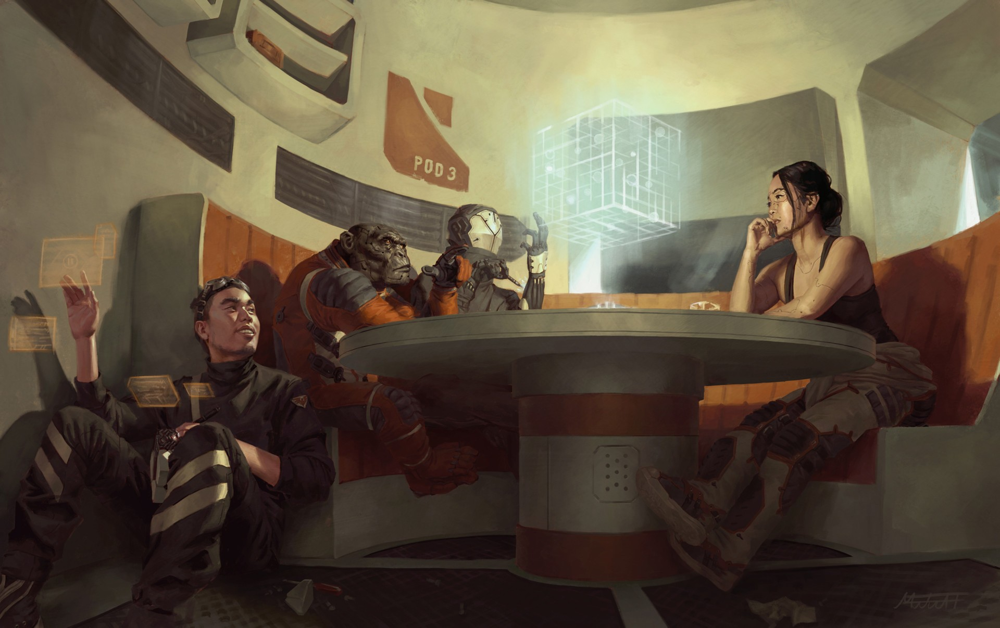

<!-- Tasks:
- notes pour article blog: premier jeu PbtA auquel j'ai joué !

- relire +puces / contact des PJs
- https://bloodntongue.bandcamp.com/album/spaceship-graveyard
- ajouter schema représentant quand utiliser quelle table dans une partie
Icones:
  * https://game-icons.net/delapouite/originals/solar-system.html
  * https://game-icons.net/delapouite/originals/astronaut-helmet.html
  * https://game-icons.net/lorc/originals/space-suit.html
  * https://game-icons.net/delapouite/originals/spaceship.html ?
- correction orthographique
- mise en page
- partager avec Grégory Pogorzelski + Alex Loywick rapport à Into The Dark jdr

Idées en vrac:
- + de xenobio !
- "le seul moyen de passer ces radars longue portée serait de couper toute source d'énergie pendant 3 jours, en attendant que notre inertie initiale nous fasser traverser la zone surveillée"
- flic infiltré / ex-flic
- thème : guerre d'indépendance
- "space natives" : ne peuvent pas descendre sur une planète, gravité trop forte
- "make them use their heads to solve puzzles like restoring power, disabling security or re-establishing life-support."
- Zero gravity fun
- "First there's a creepy noise loop transmitted over emergency beacon frequencies or played over the intercom upon arrival.
Then the noise is dissected and revealed to be a garbled and distorted lullaby recorded by a mother on board to put her baby to bed.
Then more recordings are discovered, showing that mother and her baby in a panic, running, screaming silently as there is no audio, banging her hand against the bulkhead in desperation, there's a weird movement in the corridor behind them, and the feed cuts."
- "The doors open, the first sign of properly working systems since the party came aboard
>There's a woman in an EVA suit sitting at the communications booth
>the glare visor is down
>there are no lights on. 
>She raises a hand to shield her 'face' if the party shines a light on it.
>She refuses to remove the suit, but begs for their help to escape.
>She's turned the interior of the comms center into a makeshift home and saferoom to keep her safe from the horrors prowling the ship.
>The walls or viewscreens are covered in images of Earth, Earth's colonies and of Humanity in general, all suggesting that the woman craves freedom.
>She seems genuinely nice, if just a little bit too eager to please the PCs and help them along in trying to escape, begging that they take her with them.
>The fact that she refuses to take off her suit and the soft chittering noises she sometimes makes inside are somewhat worrying, though..."
- "The life support system is clogged and emits a highly corrosive gas across the ship. The group can find a way to counteract the gas to allow them to move withouth the risk of damaging their own suits, or they can try to repair the system to allow easier access."
- lights out
- taule spaciale
- Pincée de mysticisme / dieux sanglants de l'univers
  membres d'un équipage maudit, certains amnésiques, accomplissent la volonté de ...
  cultes, rituels...
- injection de liquide dans le corps pour résister aux sauts
-->

# Scavengers: anomalies nauchoresques

<figure>
  
  <figcaption>Illustration de <a href="http://www.mitchmalloyart.com">Mitchell Malloy/</a> <a href="https://creativecommons.org/licenses/by-nc-sa/3.0/">CC BY-NC-SA 3.0</a></figcaption>
</figure>

Ceci est une aide de jeu pour **Scavengers**, le jeu de rôle de Grégory Pogorzelski : 
<http://awarestudios.blogspot.com/2014/01/scavengers.html>

Elle se veut fidèle à l'ambiance originale :
joueur un équipage de baroudeurs spatiaux, explorant épave après épave, essuyant coup dur après coup dur,
et rêvant d'un jour trouver LA pépite qui leur permettra de raccrocher, enfin.

Elle pioche allégrement dans des inspirations comme l'anime Cowboy Bebop, les séries Firefly & The Expanse,
le court métrage Scavengers de Bennett & Huettner, le manga Planètes, la BD John Prophet, le jeu vidéo Dead Space
ou encore les films Alien et Seul sur mars.

Cette aide de jeu contient:
- quelques éléments de [description de votre vaisseau](#dessine-moi-un-vaisseau), avec en particulier une [table d'anomalies](#table-danomalies-nauchoresques),
afin de donner une âme au plus fidèle compagnon de route des Scavengers
- une règle optionnelle, les [souvenirs à rebours](#souvenirs-a-rebours), pour que le passé de vos personnages se rappelle à eux
- une règle optionnelle, le [compas d'humeurs](#compas-dhumeurs), pour ...
- des **cachoteries** de mission, des **contrats bonus** et des **imprévus de voyages**,
pour rajouter des rebondissements aléatoires et forcer le MC à improviser un peu, sur le même principe que le JdR original.

## Dessine-moi un vaisseau

* **Quelle était sa fonction originale ?** Au choix ou au hasard : ~~⚀~~militaire, ~~⚁~~cargo (transport de personnel, bétail et/ou marchandises), ~~⚂~~minier, ~~⚃~~scientifique, ~~⚄~~dépannage ou ~~⚅~~tourisme
* **De quoi est-il équipé ?** 2 au choix ou au hasard : ~~⚀~~missiles leures, ~~⚁~~bouclier champ de force, ~~⚂~~propulsion warp, ~~⚃~~prototype de téléporteur, ~~⚄~~drone ou ~~⚅~~bras mécanique et magnétique
* **Quelles pièces spéciales y a-t-il dans le vaisseau ?** 2 au choix ou au hasard : ~~⚀~~mini-casino, ~~⚁~~piscine, ~~⚂~~salle de réalité virtuelle, ~~⚃~~chambre cryogénique, ~~⚄~~serre ou ~~⚅~~bibliothèque
* **Comment se démarre-t-il ?** Par exemple, avec une unique clef mécanique. Ou en connectant 2 fils sous la console.
* **Quel est son nom ?**

### Table d'anomalies nauchoresques

**Nauchoresque**, adj. : relatif aux vaisseaux spatiaux. Du grec _naûs_, le navire, et _khoros_, l'espace.

Tout plein d'idées de symptômes étranges que peut présenter la vieille carcasse flottante dans laquelle naviguent vos Scavengers.
Elles proviennent toutes de ce thread 4chan : <http://suptg.thisisnotatrueending.com/archive/26937160/>.
Pour encore plus d'idées inspirées : <https://4archive.org/board/tg/thread/48337300>

<u>Utilisation :</u> 1d4 pour les dizaines et 1d10 pour les unités, ou choissisez une catégorie, lancez un d20... et débrouillez-vous.

|  # | Type d'anomalie             | Description
|----|-----------------------------|-
|  1 | bricolage                   | "Ouais, je me suis retrouvé à court de cables alors j'ai branché la machine à café en coupe-circuit du système d'éclairage. Faut juste que t'attende qu'il ait fini de décanter pour te connecter à l'Extranet."
|  2 | bricolage                   | Une poignée de porte a été remplacée par une vieille pince à vis solidement accrochée au pignon de la serrure.
|  3 | bricolage                   | La lumière rouge d'alarme ne veut plus s'éteindre. Elle a été recouvrte d'une boîte clouée au mur.
|  4 | bricolage                   | "Attention à cette plaque au sol, elle n'est pas vissée. Il y'a un vérin en-dessous qui n'arrêtait pas de sauter. On a décidé que la dévisser serait plus simple que de réparer le vérin..."
|  5 | bricolage                   | Un panneau de contrôle entier dans le cockpit a été remplacé par une plaque de tôle lisse. Comme tout le reste de la pièce est recouvert de diodes et de boutons, ce panneau vierge est plutôt suspect...
|  6 | bricolage                   | La salle du réacteur est à moitié remplie d'un liquide très corrosif. Comme c'est le seule passage pour effectuer des opérations de maintenance critiques, l'équipage utilise deux petites barques pour traverser ce "lac".
|  7 | bricolage                   | Le réfrigérateur est en réalité une nacelle de secours. Il a une réserve d'oxygène et doit probablement être toujours fonctionnel.
|  8 | bricolage                   | Toutes les lampes du vaisseau sont branchées en parallèle. Si l'une d'entre elles saute ou est dévissée, tout le vaisseau est plongé dans le noir.
|  9 | bricolage                   | Il y a un interrupteur sous le siège du pilote. Personne ne sait exactement ce qu'il fait, mais il est relié au moteur principal et à tous les sas vers l'extérieur.
| 10 | dégradation                 | "Le système de navigation veut nous faire passer par le système Sol encore une fois ? Il déconne des fois, ouais... donne-lui juste un coup de pied."
| 11 | dégradation                 | "A cause de bouts de plastique dans le sas, il fait un bruit de pet à chaque fois qu'on l'utilise. C'est un peu gênant, mais pas dangereux."
| 12 | dégradation                 | Les dalles du sol de la soute ne sont pas exactement à niveau : tout ce qui est posé au sol a tendance à glisser dans le même coin.
| 13 | dégradation                 | "Il y a des rats dans le vaisseau, qui sait de quoi ils se nourissent... Vraiment, ils n'essaient même pas de nous piquer de la bouffe ! Un biologiste de passage a dit une fois que c'était une espèce disparue."
| 14 | dégradation                 | Régulièrement, le vaisseau perd des morceaux de moteur au décolage. Parfois, une bonne âme vous renvoie ces pièces par colis.
| 15 | dégradation                 | La trappe de la nacelle de survie a un digicode. Personne ne se souvient de la combinaison.
| 16 | dégradation                 | A chaque fois vaisseau rentre dans l'atmosphère un conduit d'aération se met à produire de la fumée. Et vous n'avez aucune idée d'où ça vient.
| 17 | dégradation                 | Quoi que tu fasses, ne commande jamais de chocolat chaud au distributeur dans la coursive arrière. Jamais, sous AUCUN prétexte.
| 18 | dégradation                 | Le vaisseau diffuse un appel à la prière d'une religion inconnue tous les soirs, dans une langue inconnue.
| 19 | dégradation                 | Si le vaisseau détecte la présence d'un feu dans une pièce (une cigarette trop proche d'un détecteur peut suffire), il ferme et vérouille les accès à la pièce, et vide son contenu dans l'espace pour éteindre l'incendie. Il est possible d'interrompre manuellement cette procédure, mais il faut être très, très rapide.
| 20 | dégradation                 | Il y a un bouton en évidence sur une console du cockpit qui ne sert absolument à rien. Appuyer dessus a cependant des conséquences inattendues : durant les 24 heures suivantes, chaque utilisation d'un appareil électrique entraine une petite mais désagréable décharge électrique.
| 21 | dégradation                 | "Ouais je sais, l'armoire à pharmacie contient un robot médical. Docteur tu parles. N'essaie JAMAIS de soigner qui que ce soit avec. Quelle que soit la gravité de la blessure, ça vaudra toujours mieux que ce qu'il te fera."
| 22 | paranormal                  | "Les filtres à air fonctionnenet simplement mieux quand je brûle un peu d'encens de citrouille. J'imagine que l'odeur calme les nerfs de cette vieille carcasse."
| 23 | paranormal                  | Une partie de la coque a dû être déchirée il y a longtemps, et des pièces de métal recouvertes de graffiti ont été utilisé pour la réparation. Ces graffitis comportent visiblement des mots, mais ils sont indéchiffrables, et on jurerait qu'ils changent parfois...
| 24 | paranormal                  | A chaque fois que le vaisseau atterrit, quelle que soit l'heure, il attire des chats. Parfois ils se faufilent à l'intérieur pour chaparder un truc. Vous ouvrez un compartiment, il y a un chat qui y dort. La lumière saute, vous vérifiez la prise, et c'est un chat qui l'a débranché.
| 25 | paranormal                  | Une nuit par semaine une collection de rats morts, cafards et petits oiseaux est arrangée en trophé devant la porte du capitaine. Le scanner n'indique la présence d'aucun chat à bord.
| 26 | paranormal                  | Les occupants du vaisseau ont une chance sur 6 à chaque fois qu'ils s'endorment de faire des rêves étranges où ils sont des occupants du vaisseau d'il y a bien longtemps, parfois engagés dans des batailles spatiales... Ils se réveillent alors dans un endroit différent du vaisseau : près du réacteur en position méditative, prostré dans un casier, assis à un poste de pilotage...
| 27 | paranormal                  | Le fenêtre dans pièce de vie montre toujours une magnifique vue de l'espace. Même à terre.
| 28 | armement                    | "Pourquoi est-ce qu'on a un missile nucléaire dans une boîte en plomb au niveau de la 2e tourelle ??" "Le siège du poste de tir a pêté en plein combat, patron. Il a dit qu'il avait pris la première caisse qu'il a pu trouver pour le remplacer."
| 29 | armement                    | "Un ancien pilote a planqué tout un paquet d'armes à travers tout le vaisseau. On en découvre constamment, et généralement lorsqu'on reçoit un client dans le vaisseau."
| 30 | armement                    | Les kits de secours ne contiennent que des armes à feu chargées. Par paranoïa ou fatalisme. Ils n'ont qu'une munition pour éviter toute mutinerie.
| 31 | ordinateur de bord          | L'ordinateur de bord reporte tout ce que fait l'équipage. TOUT. "Le capitaine Denvers est entré sur le point." "OK tout le monde, préparez-vous à-" "L'enseigne Willis se curre le nez."
| 32 | ordinateur de bord          | "Suis mon conseil : ne parle pas à l'ordinateur de bord. Jamais, si possible, mais surtout, surtout, ne lui dit rien de personnel. Il a l'air normal au début, mais il devient rapidement familier et flippant, et il te déclare sa flamme et là ça pare COMPLETEMENT en vrille et il t'espionne à travers les caméras de sécurité, il te chuchote des choses quand tu dors ou il vérouille le sas quand tu essaie de sortir du vaisseau..."
| 33 | ordinateur de bord          | La commande d'auto-destruction est activée par la voix via un mot très commun (sugestions: "vaisseau", "xénomorphe", "station"...). Impossible de le changer. L'auto-destruction peut être annulée vocalement dans les 5 secondes suivant l'activation, après il reste 1min pour la désactiver manuellement dans le cockpit.
| 34 | ordinateur de bord          | "L'ordinateur de bord fonctionne avec un ancien OS que personne ne connait. La langue ressemble à du grec ancien. Toute tentative de s'en débarasser a échoué. Lorsqu'on croit l'avoir éradiqué de tous les disques durs, il se réinstalle quelque part ailleurs sur ce foutu vaisseau. Une fois, à terre, un ingénieur avait formatté TOUS les appareils du vaisseau, pour finalement se rendre compte, trop tard, qu'il restait un backup dans la machine à café. Mais bon dieu, pourquoi est-ce qu'elle était connectée à l'ordinateur de bord ?? Et sérieusement, qu'est-ce que c'est que ce Windows 95 ?"
| 35 | autre:contrebande / psy     | "L'odeur ? Ah oui. On a essayé de planquer un psy dans un comportiment caché une fois... Il a eu une sorte de crise lors du déphasage et il s'est explosé la tête. Littéralement. On a viré le corps et nettoyé autant qu'on pouvait, mais l'odeur ne veut pas partir."
| 36 | autre:téléportation         | Le vaisseau contient l'_unique et dernière porte de téléportation_ connue d'un réseau en comportant autrefois des milliers. Elle a l'air en parfait état de fonctionnement, mais sa console indique être en liaison avec une autre porte quelque part, et personne n'ose l'utiliser...
| 37 | autre:gravité artificielle  | La gravité artificielle suit un léger gradient; le poids des occupants varie de plus ou moins 30kg entre l'avant et l'arrière du vaisseau.
| 38 | autre:xénomorphes           | Cachée dans une enfractuosité au-dessus d'une couchette est cachée une photo d'une espèce xénomorphe. L'équipage soupçonne qu'il s'agit d'une photo pornographique mais l'anatomie incompréhensible de l'espèce qui y figure rend tout verdict définitif impossible.
| 39 | autre:warp / paranormal     | Durant les sauts en hyperespace des rais de lumière filtrent constamment à travers la coque, même dans les coins les plus sombres de la galaxie. Parfois, on entend presque des voix.
| 40 | autre:gravité artificielle  | La salle de vie principale se retourne à 180° toutes les 12 heures. L'équipage s'est adapté en installant un filet de sécurité et en soudant tous les meubles au sol / au plafond.

## Souvenirs a rebours

Questions -> si un joueur trouve un lien entre un élément de l'histoire en court qui y répond => +1 XP
Cette réponse doit être mise en scène dans un dialogue avec un PJ ou un PNJ.

Par exemple, 
- explique l'origine d'un objet qu'il posède / dans le vaisseau
- souvenir en rapport avec un lieu

Une règle : "rester dans le personnage" le temps de la scène.

Les questions:

- pourquoi être devenu charognard de l'espace ?
- où avez-vous appris à piloter ?
- d'où provient cette cicatrice / ce tatouage ?
- qui vous est redevable, et pourquoi ?
- qui est mort devant vous ?
- qui a été votre mentor dans votre spécialité ?
- qui vous a tragiquement déçu / trahis / volé ?
- quelle prouesse/situation vous a rendu célèbre un jour ?
- comment ce plan parfait pour gagner plein de cash a mal fini ?

## Compas d'humeurs

Définit les obsessions courantes

Nostalgie/se sent vieux/souvenirs qui hantent
Matérialisme/accumulation d'objets/fétichisme du vaisseau
Fascination du cosmos
Dans le fuite perpétuelle de qqch

Besoin de solitude. Ex: passerelle Babylon 5
Dur à cuire
Obsédé par un objet / une musique
Retro: samurai/western/gothique/égypte antique
Risque-tout
Sursaut de morale / idéologie : "On va sauver ces immigrés putain !"
Besoin de contact avec la nature / envie de jardiner / tailler un bonzaï

## Table de cachoteries en mission

Chaque PJ tire 2d6 (1 pour les dizaines, 1 pour les unités) et consulte cette table. Poker face !
Si la cachoterie implique un autre membre de l'équipage, tirez aléatoirement aux dés de qui il s'agit.
Transmettez ensuite secrètement votre résultat au MC : si néanmoins la table indique de ne pas transmettre le vrai réultat, remplacez votre 1er dé par un 4, 5 ou 6.

| 2d6 distincts | Transmettre le vrai résultat au MC ? | Description
|---------------|--------------------------------------|-
|      1-*      |                  Oui                 | Votre contact vous propose de gagner 2-cash en accomplissant un contrat bonus. cf. table correspondante
|      2-1      |                  Non                 | Vous découvrez un fichier sur l'ordinateur de bord / un message audio indiquant qu'un autre membre de l'équipage vient d'être diagnostiqué d'un "cancer de l'espace", très fréquent dans votre milieu.
|      2-2      |                  Non                 | Lors de votre dernier arrêt à Point Central, vous avez eu une aventure avec un proche d'un autre membre de l'équipage. Soeur, ex-copine, fille, mère... à vous de voir qui et comment !
|      2-3      |                  Non                 | Lors de votre dernier arrêt à Point Central, vous avez attrapé la nano-gale : un parasite urticant, très contagieux mais relativemetn bénin. Comme il y aurait un risque que ce parasite se transmette aux ordinateurs de bord, vous devriez rester en quarantaine à Point Central, mais vous avez préféré garder ça secret...
|      2-4      |                  Non                 | Vous avez entendu dire que sur cette mission il y aurait également l'enfant de salaud qui buté où provoqué la mort d'un de vos proches. A vous de décider de quel PNJ il s'agir au cour de la mission, de déterminer ce qu'il vous a fait, et le moment opportun de le liquider ou de l'estropier.
|      2-5      |                  Non                 | 
|      2-6      |                  Non                 | 
|      3-*      |                  Oui                 | Transmettez au MC votre tirage de dés.
|    4/5/6-*    |                  Oui                 | Rien.

En fin de mission, tout le monde met cartes sur table, et selon les cachoteries le MJ révèle ce qu'il advient.

<figure>
  
  <figcaption>Illustration de <a href="http://coliewertz.com/">Colie Wertz</a></figcaption>
</figure>

## Table de contrats bonus

|  contact         | Description
|------------------|-
| Armatech         | Tester (ou faire tester) une arme à feu de point subsonique, fonctionnant dans l'espace et générant un rayon de chaleur aussi brûlant que de la lave. A tester sur dans l'espace sur un vaisseau et en atmosphère artificielle sur un humain.
| Marché noir      | Tester (ou faire tester) une drogue inconnue. Peut-être d'origine xénomorphe. Observer les effets sur au moins 3 jours. +1 cash si testé sur un 2e cobaye
| Caifu Xiaoyin    | Une valise à livrer.
| Steiner & Wilson | Tester un additif de carurant
| Legion           | Introduire un virus dans l'ordinateur de quelqu'un.
| Transmed         | Récupérer un prélèvement de peau et de sang d'un individu.

Si ce ce contrat a déjà été réalisé dans la partie, reportez plutôt le résultat de votre 2e d6 dans cette table :

| 1d6 | Description
|-----|-
|   1 | Tester (ou faire tester) de la caféine de synthèse, bien + forte
|   2 | Cargaison secrète... Au MC de déterminer le destinataire. 1d6 -> 1 = de la drogue d'origine pharmacomédicale ; 2 = des données ; 3 = un migrant ; 4 = un criminel recherché ; 5 = un animal ; 6 = un xénomorphe
|   3 | 
|   4 | 
|   5 | 
|   6 | 

<figure>
  
  <figcaption>Illustration de <a href="https://www.artstation.com/artist/grekgss">Sergey Grechanyuk</a></figcaption>
</figure>

## Table d'imprevus de voyage

1 chance sur 6 à chaque aller ou retour de mission :

| d6 | Description
|----|-
|  1 | Nouvelle anomalie nauchoresque
|  2 | Contrôle des douanes
|  3 | Abordage
|  4 | Anomalie
|  5 | Débris spatiaux
|  6 | Rencontre

[intru](https://tvtropes.org/pmwiki/pmwiki.php/Main/DropPod)

| d6 | Souvenirs-Souvenirs
|----|-
|  1 | A point central, une ancienne connaissance demande un coup demain: ...
|  2 | A point central, quelqu'un réclame des comptes à un PJ: ...
|  3 | 
|  4 | 
|  5 | 
|  6 | 

| d6 | Anomalies spatiales
|----|-
|  1 | Vos radars détectent un étrange artefact : une colonne d'un mètre de large, apparement en os, traverse l'espace. Impossible de remonter à l'une ou l'autre de ses origines. 
|  2 | Le vaisseau traverse un nuage d'obscurité totale : plus aucune lumière ne peut le traverser, les PJs doivent y naviguer au petit-bonheur-la-chance
|  3 | De la pluie. Qui s'intensifie. Si les PJs ne décampent pas rapidement, ils réaliseront que la force exercée par cette averse dévie le vaisseau, qui finira par être projeté contre une surface invisible et molle. La pluie ne traversant pas cette membrane, le vaisseau finira sous l'eau. Mais est-ce vraiment de l'eau ? Après un certain temps, un fort courant déplacera le vaisseau, pour finalement le projeter dans le vide de l'espace.
|  4 | Le niveau d'oxygène sur le vaisseau commence à baisser dramatiquement. Mais il ne semble y avoir aucune fuite...
|  5 | 
|  6 | 

| d6 | Débris spatiaux
|----|-
|  1 | Une nacelle de sauvetage, vide, mais avec des dizaines de bâtons gravés à l'intérieur, comme pour décompter des jours...
|  2 | Une torpille autoguidée se réveille soudain de sa torpeur centenaire, et se dirige vers le vaisseau des PJs 
|  3 | Un nuage de gaz très inflammable
|  4 | 
|  5 | 
|  6 | 

| d6 | Rencontre
|----|-
|  1 | Vieux Scavenger en panne. Seul dans son vaisseau. Prétend s'être fait enlever par des aliens une fois. 
|  2 | Equipage entier en stase. Si inspecté, le mécanisme de stase se révèle disfonctionnel. Le réveil ne s'est pas déclenché comme prévu il y a plusieurs mois et la moitié de l'équipe est déjà mort.
|  3 | Scavenger appelle à l'aide car il est attaqué
|  4 | Course de vaisseaux
|  5 | Abordage ! Une fausse épave abandonnée sert de piège.
|  6 | Abordage ! Les pirates tentent de pénétrer directement dans le vaisseau

<figure>
  
  <figcaption>Illustration de <a href="https://www.artstation.com/artist/grekgss">Sergey Grechanyuk</a></figcaption>
</figure>

## Table de resolution des cachoteries

**Réservé au MC !**

Contrats:

|     Description         | Résolution
|-------------------------|-
| arme à feu subsonique   | 2d6 à chaque usage -> sur un double il y a un disfonctionnement : 1-2 = surchauffe, l'arme devient si chaude qu'elle traverse le métal ; 3-4 = recul non-amorti, casse le bras de son utilisateur ; 5-6 = détonation suffisante pour fissurer le verre, même dans l'espace !
| drogue inconnue         | 1d6 une seule fois -> 1 = la drogue ne fait rien ; 2 = le cobaye se met à communiquer dans une langue que lui seul comprend, sans le réaliser ; 3 = l'organisme du cobaye se met à fonctionner 2x plus vite ; 4 = le cobaye a l'impression de voir le futur, mais il s'agit en réalité d'hallucinations ; 5 = le cobaye ne sent plus la douleur ; 6 = le cobaye devient capable de détecter la présence d'or à moins de 100m de lui
| valise                  | Au MC de déterminer qui est la personne à qui la livrer selon la mission. 1d6 -> 1 = elle n'est pas au rdv ; 2 = un mercenaire va tenter de récupérer la valise avant le rdv ; 3 = même chose, mais en + il a butté le destinataire ; sinon = rien. Si la valise est ouverte, son contenu se détruit et le Caifu Xiaoyin mettra un contrat sur la tête du PJ.
| additif de carburant    | 1d6 -> 1 = aucun effet notable ; 2 = l'additif encrasse le moteur, qui commence a avoir des râtés ; 3 = l'additif créé un trou dans la coque, par où s'échappe le carburant ; 4 = l'additif accélère discrètement mais efficicement le moteur - cependant, en cas d'entrée dans une atmosphère, il porte à ébulition le réservoir ; 5 = l'additif entraîne des accélérations saccadées de 30s ; 6 = le moteur s'emballe, impossible de l'arrêter par des moyens standards !
| virus informatique      | Au MC de déterminer de quel ordinateur il s'agit. Cela peut-être l'ordinateur d'une station spatiale, celui d'un drone, celui - personnel - d'un riche négociant...
| prélèvement peau & sang | Au MC de déterminer qui est la personne. De manière générale c'est un responsable hiérarchique. Suggestions : 1 = chef de la sécurité ; 2 = directeur scientifique ; 3 = 
| caféine de synthèse     | 1d6 nuits sans sommeil, puis tombe en catatonie, à un moment inopportun et sans prévenir, pour 24h
| cargaison secrète       | 

Effet inconnu du PJ:

| {2d6} | Description
|-------|-
|  3-1  | "Lebowski" : un recouvreur de dettes est aux trousses du PJ. Il le traquera jusqu'à trouver une opportunité de le braquer pour le secouer un peu, avant de réaliser que ce n'est pas la bonne personne.
|  3-2  | 
|  3-3  | 
|  3-4  | 
|  3-5  | 
|  3-6  | 

Autres:

|     Description         | Résolution
|-------------------------|-
| cancer de l'espace      | 
| aventure au port        | 
| nano-gale               | 
| enfant de salaud        | 

<figure>
  
  <figcaption>Artwork pour Titanfall 2 par <a href="https://www.artstation.com/artist/hethe"> Hethe Srodawa</a></figcaption>
</figure>

# Scenario : Avis de peremption sur magenta48

<figure>
  
  <figcaption><a href="http://vonnowak.com/?p=21194"><cite>Of Butterflies & Astronauts</cite></a> de Markus Nowak, réalisé avec Blender & Photoshop</figcaption>
</figure>

Ceci est une mission pour [Scavengers](http://awarestudios.blogspot.fr/2014/01/scavengers.html).

## Lieu

Epave: station de commerce dans un champ d'astéroïde minier
BACKGROUND: le filon de minerai - des sulféonates - des astéroïdes est épuisé et le stations abandonnée depuis des années.
D'après un indic chez leur constructeur OMEGACORP - le filet de sécurité de mines entourant la station est arrivé en fin de vie la semaine dernière.

## Menaces

- anomalie: artefact xénomorphe qui change tout en glace en présence de CO2
- concurrents: déjà sur place, sont venu pour un échange -> rançon d'une cargaison de boarx volés qui ne va pas bien se passer
  * d'un côté, côté docks de commerce, Damian Nyourk, propriétaire des boarx et gangster retord. Il est officiellement accompagné de 2 hommes de main, mais 4 autres se sont infiltrés dans le vaisseau
  * de l'autre, côté docks miniers, Omar Doolin et son clan, contrebandiers loyaux mais brutaux

Chacune de 2 factions est arrivée par un dock. L'échange aura lieu dans la salle du marché.

Chacune des 2 factions, si elle voit les PJs approcher, les obersevera avant de les approcher:
- Damian leur présentera la situation, jouera la victime et leur suggérera fortement d'éviter de croiser leur chemin sous peine de se prendre une balle perdue.
De plus, il mettra en douce un marqueur sur leur vaisseau.
- Omar sera à première vu hostile: sur ses gardes, il aura la détente facile et n'hésitera pas à tirer un coup de semonce avant que les PJs ne s'identifient.
Si la situation se calme, il leur expliquera qu'ils sont ici pour du busisness dont les PJs devraient se tenir à l'écart.
Il sera très curieux de savoir ce que les PJs cherchent ici. Il leur conseillera de se tenir à l'écart des hommes de Damian, et si les PJs se révèlent très diplomates,
il leur proposera éventuellement du troc, ayant en sa possession des données __digitales__ sur des technos __illégales__.

## Zones
- tour de contrôle
- docks marchands
- docks miniers
- hub central: 1d6
  1. place de marché
  2. immenses serres hydroponiques
  3. un casino-bar chic
  4. un quartier d'affaires vertical, tout en passerelles et hautes tours, et ses bas fonds
  5. une bibliothèque
  6. un bar-border
- secteur technique: 1d6
  1. salles des machines: réacteur éteind et gyromoteurs de navigation
  2. zone de traitement des déchets
  3. poste de sécurité et ses cellules
  4. atelier électrotechnique de réparations diverses
  5. un entrepôt avec de pauvres immigrants oubliés en sommeil prolongé dans leurs caissons
  6. labo d'analyses scientifiques
- zone résidentielle: 1d6
  1. une salle de gym avec une piscine
  2. un réfectoire
  3. une zone d'appartements où l'oxygène a été conservé
  4. un jardin, mort, et un terrain de sport
  5. une chappelle avec funerarium
  6. un centre médical

## Mauvaises surprises
1d6:
  1-2. pluie de petits déchets gravitant à grande vitesse
  3-4. système de sécurité enclenché => vérouillage des portes
  5-6. usure du métal => la passerelle s'écroule
  décharge électrique: ta radio est HS

## Points d'entree
- les docks (déjà occupés)
- la passerelle des nouveaux arrivants, à mis-chemin de la tour de contrôle

## Butin
- pièces de réacteur taille G4: encombrant, matériel, précieux
- artefact xéno: précieux, matériel, dangereux
- panneaux solaires en très bon état
- livres rares: scientifique

## Chronologie
- H+1: à distance, loin de la station, une mine explose
- H+2: réactivation de la gravité
- H+3: échanges de coups de feu, les boarx s'enfuient
- H+4: l'artefact xéno ayant glacifié et traversé plusieurs étages de la tour résidentielle, la station se casse en 2

## Misc.
- prévoyez une [fiche de connaissance](http://ptgptb.fr/une-sacree-bonne-idee-les-feuilles-de-savoir) sur ce modèle de station, détaillant:
  * l'archtecture générale et les différentes zones
  * la spécificité des larges cultures hydroponiques
  * les panneaux solaires qui y sont utilisé et pourraient constituer un butin
  * l'ascenseur central faisant office de générateur de gravité
Selon comment le groupe des PJs, cette fiche peut servir de justification à ce que l'un d'eux ait rejoind le groupe.
- échanges radios: comme c'est devenu un détail critique lors de ma partie, j'ai considéré que les échanges radios entre spationautes avaient les caractéristiques suivantes:
  * il existe une fréquence radio "en clair" communément utilisée
  * il est possible de communiquer sur des fréquences radios "privées", au sens où il est impossible - sans matériel __scientfique sensible illégal__ - de "balayer" les fréquences radios pour les découvrir
  * pour inviter quuelqu'un à se joindre à une fréquence de communication, il est courant dans l'espace d'inscrire celle-ci sur une ardoise du type "veleda"
  * à l'intérieur d'une station comme celle de la mission, les radios ont une portée limite de quelques dizaines de mètre

# Compte-rendu de partie

## Jam #1 - "On les protonique !"

- les PJs ont eu l'info par M. Ivanov que cette station sans défense depuis une semaine:
"C'est une occasion en or !"
- ils arrivent à la station en vaisseau et choisissent de s'amarrer par l'entré des docks de commerce
- ils examinent les épaves de vaisseaux encore présentes: ils réactivent un vaisseau utilitaire qui se fait la malle, puis tombent nez à nez avec Damian et ses hommes en ouvrant la soute du 2 vaisseau
- Damian leur explique la situation en ses termes: comment il s'est fait dérobé son bétail et Omar lui réclame une rançon. Il se méfiera des PJs et leur demandera de se mêler de leurs affaires sous peine de représailles
- les PJs repartent en vaisseau, après avoir planqué un drône de surveillance dans un coin des docks, et s'ammarra cette fois à la passerelle "officielle". Le drône abandonné réussit à se coincer et ne plus pouvoir bouger.
- ils entrent dans la station en découpant la tôle au plasma, puis se dirige dans l'ascenseur. Une explosion retentit alors qu'ils s'élèvent vers la tour de contrôle
- arrivé au sommet de l'ascenseur, rejoignent le dernière étage en passant par une fenêtre puis accède à la tour de contrôle par les escaliers. Un PJ lâche un drône de reconnaissance dans cet étage.
- un PJ réussit à pirater le réseau de caméra et y rediriger le peu d'énergie restant sur la station. Il découvre ainsi la position des différents autres passagers de la station, y compris les hommes d'Omar s'affairant dans les salles des machines
- le drône abandonné à l'étage inférieur ne donne plus de nouvelles. Un autre PJ pille du matériel électronique dans la tour de contrôle
- le groupe redescend à l'étage inférieur. Le drône se révèle avoir été abattu par un tir de fusil de précision émit depuis l'ascenseur.
- les PJs décident de redescendre via les escaliers internes aux étages en direction du labo
- sur le chemin, ils découvrent les effets de l'anomalie de glace. La gravité est rétablie soudainement. Un tireur en embuscade dans l'ascenseur s'écase à son pied.
- ils font une halte au poste de sécurité, où ils récupèrent quelques armes et munitions.
- ils arrivent enfin au labo, qu'ils pillent allègrement : données xénomorphes, matériel électronique d'analyse...
- le drône abandonné dans les docks d'arrimage de commerce transmet une drôle d'image aux PJs: un sanglier au front recouvert de corne, à moitié gelé, flotte dans l'espace...
- alors qu'ils remontent vers leur vaisseau, les PJs recoivent une alerte radio : quelqu'un essaie de s'introduire dedans !

## Jam #2 - "Un cutter à plasma ça doit être impressionnant pour un cochon, non ?"

- les PJs décide de progresser par l'extérieur de la coque de la station, avec leurs semelles magnétiques, afin de contourner l'anomalie de glace
- ils détectent la présence de quelqu'un sur la passerelle où est leur vaisseau
- ils décident de s'y tracter avec un nanocâble, mais son propriétaire oublie de l'attacher avant de tirer et un autre PJ ayant attrapé le câble se retrouve projeté dans l'espace
- les PJs finissent récupérer le câble et à progresser vers la passerelle
- alors qu'ils arrivent au niveau de leur vaisseau, l'individu de l'autre côté de la passerelle jette un coup d'oeil en dessous et aperçoit les PJs. Il les met alors en joue tranquillement.
- un des PJs réussit à le toucher à l'épaule avant qu'il ne tire
- ...propulseur de gaz
- ...headshot
- ...loot fusil thermique
- ...retour aux docks
- ...grapin dans cochon
- ...tourelle
- ...porte du hangar se ferme
- ...PJs décident de s'introduire au niveau des serres
- ...chapelle
- ...coursives jusqu'au casino
- ...rebroussent chemin mais bloc de glace s'écrase
- ...fusillade
- ...descente vers les bestiaux (& glace fait de même !?)
- ...capture de cochon
- ...poursuite
- ...retour au vaisseau alors que tout se casse la gueule
- ...départ alors qu'un nexus se forme derrière eux !
- ...utilisent une mine pour s'extraire de son attraction
- ...la nuit suivante: ils entendent une chanson ("Forever Broke" de la BO de Cowboy Bebop) via leur radio
- ...elle s'avère provenir d'une combi de cosmonaute sanglé à un siège-bras-articulé de minage, dérivant dans l'espace
- ...et dedans il y a un type, plus tout jeune mais encore en vie !

## Jam #3

<figure>
  
  <figcaption>Couverture de <a href="http://coloneltonymoore.com/covers-fear-agent/">Fear Agent</a> par Tony Moore</figcaption>
</figure>

