<!-- Tasks:
- relire +puces / contact des PJs
- ajouter license & noms relecteurs
- correction orthographique
- tutoiement / vouvoiement ?
- img alts
- demander autorisation artistes pour 4 illus Sergey Grechanyuk + 1 illus Markus Nowak
Icones:
  * https://game-icons.net/delapouite/originals/solar-system.html
  * https://game-icons.net/delapouite/originals/astronaut-helmet.html
  * https://game-icons.net/lorc/originals/space-suit.html
  * https://game-icons.net/delapouite/originals/spaceship.html ?
- partager avec Grégory Pogorzelski + Alex Loywick rapport à Into The Dark jdr
-->

# Scavengers: anomalies nauchoresques

## Pistes de scenarios & regles optionnelles

<figure>
  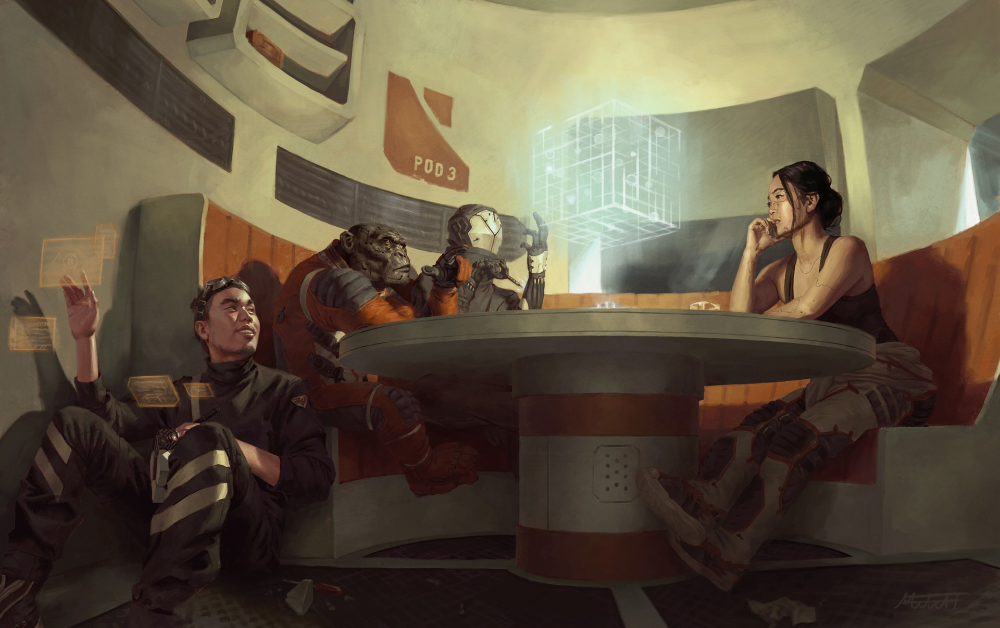
  <figcaption><a href="https://mitchmalloy.artstation.com/projects/rKbBO">Eclipse Phase - Unwinding</a> de Mitchell Malloy - <a href="https://creativecommons.org/licenses/by-nc-sa/3.0/">CC BY-NC-SA 3.0</a></figcaption>
</figure>

Ceci est une aide de jeu pour **Scavengers**, le jeu de rôle de Grégory Pogorzelski : 
<http://awarestudios.blogspot.com/2014/01/scavengers.html>

Elle se veut fidèle à l'ambiance originale :
jouer un équipage de baroudeurs spatiaux, explorant épave après épave, essuyant coup dur après coup dur,
et rêvant d'un jour trouver LA pépite qui leur permettra de raccrocher, enfin.

Comme elle contient surtout des tables aléatoires, elle peut sans doute également servir à d'autres jeux de rôles,
comme [Mothership](http://www.tuesdayknightgames.com/mothership/) de Sean McCoy ou [Into The Dark](http://livresdelours.blogspot.com/search/label/Into%20the%20Dark) d'Alexandre 'Kobayashi' Jeannette.

Cette aide de jeu contient:
- de quoi [décrire votre vaisseau](#dessine-moi-un-vaisseau), avec en particulier une [table d'anomalies](#anomalies-nauchoresques),
afin de donner une âme au plus fidèle compagnon de route des Scavengers
- des [_playbooks_ & TOCs](#playbooks-tocs) pour vos personnages
- une règle optionnelle, le [compas d'humeurs](#compas-dhumeurs), pour varier vos interprétations
- des [cachoteries](#cachoteries) de mission, incluant des [contrats bonus](#contrats-bonus)
- et enfin des [imprévus de voyages](#imprevus-de-voyage) listant des rebondissements aléatoires,
certains tendant vers l'[horreur cosmique](#horreur-cosmique)

Quelques oeuvres qui m'ont inspiré : l'anime Cowboy Bebop, les séries Firefly & The Expanse,
le court métrage Scavengers de Bennett & Huettner, le manga Planètes, la BD John Prophet, le jeu vidéo Dead Space
ou encore les films Alien et Seul sur mars.

Pour les anglophones interessés par toujours plus d'inspirations pour ce genre d'univers de jeu,
je vous recommande également chaudement les tables d10 créées par la communauté Discord Mothership [#hive-mind](https://chezsoi.org/lucas/blog/mothership-hive-mind.html).

## Dessine-moi un vaisseau

* **Quelle était sa fonction originale ?** Au choix ou au hasard : ~~⚀~~militaire, ~~⚁~~cargo (transport de personnel, bétail et/ou marchandises), ~~⚂~~minier, ~~⚃~~scientifique, ~~⚄~~dépannage ou ~~⚅~~tourisme
* **De quoi est-il équipé ?** 2 au choix ou au hasard : ~~⚀~~missiles leures, ~~⚁~~bouclier champ de force, ~~⚂~~propulsion warp, ~~⚃~~rayon tractant magnétique, ~~⚄~~drone d'exploration ou ~~⚅~~bras mécanique et foret minier
* **Quelles pièces spéciales y a-t-il dans le vaisseau ?** 2 au choix ou au hasard : ~~⚀~~mini-casino, ~~⚁~~piscine, ~~⚂~~salle de réalité virtuelle, ~~⚃~~chambre cryogénique, ~~⚄~~serre ou ~~⚅~~bibliothèque
* **Comment se démarre-t-il ?** Par exemple, avec une unique clef mécanique. Ou en connectant 2 fils sous la console.
* **Quel est son nom ?**

Pour peaufiner, quelques questions inspirées du [Vast & Starlit](https://dig1000holes.wordpress.com/vast-starlit/) d'Epidiah Ravachol:
- dans quelles situations votre vaisseau est-il un peu capricieux ?
- qu'est-ce qu'il lui manque et qui vous serait parfois utile ?

Pour chaque PJ, répondez à ces questions :
- en quoi te sens-tu à la maison dans ce vaisseau ?
- dans quelle endroit du vaisseau aimes-tu parfois t'isoler ?

### Anomalies nauchoresques

**Nauchoresque**, adj. : relatif aux vaisseaux spatiaux. Du grec _naûs_, le navire, et _khoros_, l'espace.

Tout plein d'idées de symptômes étranges que peut présenter la vieille carcasse flottante dans laquelle naviguent vos Scavengers.
Elles proviennent toutes de ce thread 4chan : <http://suptg.thisisnotatrueending.com/archive/26937160/>.
Pour encore plus d'idées inspirées : <https://4archive.org/board/tg/thread/48337300>

<figure>
  
  <figcaption><a href="https://www.deviantart.com/jimhatama/art/Imperial-cruiser-277999807">Imperial cruiser</a> de JimHatama - <a href="https://creativecommons.org/licenses/by-nc-sa/3.0/">CC BY-NC-SA 3.0</a></figcaption>
</figure>

<u>Utilisation :</u> 1d6 pour les dizaines et un autre pour les unités.
Ou choissisez une catégorie, et une anomalie dedans.

| d66| Type d'anomalie    | Description
|----|--------------------|-
| 11 | bricolage          | « Ouais, je me suis retrouvé à court de cables alors j'ai branché la machine à café en coupe-circuit du système d'éclairage. Faut juste que t'attendes qu'il ait fini de décanter pour te connecter à l'Hypernet. »
| 12 | bricolage          | Une poignée de porte a été remplacée par une vieille pince à vis solidement accrochée au pignon de la serrure.
| 13 | bricolage          | Un panneau de contrôle entier dans le cockpit a été remplacé par une plaque de tôle lisse. Comme tout le reste de la pièce est recouvert de diodes et de boutons, ce panneau vierge est plutôt suspect...
| 14 | bricolage          | Le réfrigérateur est en réalité une nacelle de secours. Il a une réserve d'oxygène et doit probablement être toujours fonctionnel.
| 15 | bricolage          | Toutes les lampes du vaisseau sont branchées en série. Si l'une d'entre elles saute ou est dévissée, tout le vaisseau est plongé dans le noir.
| 16 | bricolage          | Il y a un interrupteur sous le siège du pilote. Personne ne sait exactement ce qu'il fait, mais il est relié au moteur principal et à tous les sas vers l'extérieur.
| 21 | dégradation        | La lumière rouge d'alarme ne veut plus s'éteindre. Elle a été recouverte d'une boîte clouée au mur.
| 22 | dégradation        | La salle du réacteur est à moitié remplie d'un liquide très corrosif. Comme c'est le seul passage pour effectuer des opérations de maintenance critiques, l'équipage utilise deux petites barques pour traverser ce "lac".
| 23 | dégradation        | « Le système de navigation veut nous faire passer par le système Sol encore une fois ? Il déconne des fois, ouais... donne-lui juste un coup de pied. »
| 24 | dégradation        | « A cause de bouts de plastique dans le sas, il fait un bruit de pet à chaque fois qu'on l'utilise. C'est un peu gênant, mais pas dangereux. »
| 25 | dégradation        | Les dalles du sol de la soute ne sont pas exactement à niveau : tout ce qui est posé au sol a tendance à glisser dans le même coin.
| 26 | dégradation        | « Il y a des rats dans le vaisseau. Qui sait de quoi ils se nourissent... Vraiment, ils n'essaient même pas de nous piquer de la bouffe ! Un biologiste de passage a dit une fois que c'était une espèce disparue. »
| 31 | dégradation        | La trappe de la nacelle de survie a un digicode. Personne ne se souvient de la combinaison.
| 32 | dégradation        | À chaque fois que le vaisseau rentre dans l'atmosphère, un conduit d'aération se met à produire de la fumée. Et vous n'avez aucune idée d'où ça vient.
| 33 | dégradation        | Le vaisseau diffuse un appel à la prière d'une religion inconnue tous les soirs, dans une langue inconnue.
| 34 | dégradation        | Si le vaisseau détecte la présence d'un feu dans une pièce (une cigarette trop proche d'un détecteur peut suffire), il ferme et vérouille les accès à la pièce, et vide son contenu dans l'espace pour éteindre l'incendie. Il est possible d'interrompre manuellement cette procédure, mais il faut être très, très rapide.
| 35 | dégradation        | Il y a un bouton en évidence sur une console du cockpit qui ne sert absolument à rien. Appuyer dessus a cependant des conséquences inattendues : durant les 24 heures suivantes, chaque utilisation d'un appareil électrique entraine une petite mais désagréable décharge électrique.
| 36 | dégradation        | « Ouais je sais, l'armoire à pharmacie contient un robot médical. Docteur tu parles. N'essaie JAMAIS de soigner qui que ce soit avec. Quelle que soit la gravité de la blessure, ça vaudra toujours mieux que ce qu'il te fera. »
| 41 | paranormal         | « Les filtres à air fonctionnent simplement mieux quand je brûle un peu d'encens de citrouille. J'imagine que l'odeur calme les nerfs de cette vieille carcasse. »
| 42 | paranormal         | Une partie de la coque a dû être déchirée il y a longtemps, et des pièces de métal recouvertes de graffiti ont été utilisées pour la réparation. Ces graffitis comportent visiblement des mots, mais ils sont indéchiffrables, et on jurerait qu'ils changent parfois...
| 43 | paranormal         | A chaque fois que le vaisseau atterrit, quelle que soit l'heure, il attire des chats. Parfois ils se faufilent à l'intérieur pour chaparder un truc. Vous ouvrez un compartiment, il y a un chat qui y dort. La lumière saute, vous vérifiez la prise, et c'est un chat qui l'a débranché.
| 44 | paranormal         | Une nuit par semaine une collection de rats morts, cafards et petits oiseaux est arrangée en trophé devant la porte du capitaine. Le scanner n'indique la présence d'aucun chat à bord.
| 45 | paranormal         | Les occupants du vaisseau ont une chance sur 6 à chaque fois qu'ils s'endorment de faire des rêves étranges où ils sont les anciens occupants du vaisseau, il y a bien longtemps. Parfois ces rêves incluent des batailles spatiales. Ils se réveillent ensuite dans un endroit différent du vaisseau : près du réacteur en position méditative, prostré dans un casier, assis à un poste de pilotage...
| 46 | paranormal         | La fenêtre dans la pièce de vie montre toujours une magnifique vue de l'espace. Même à terre.
| 51 | armement           | « Pourquoi est-ce qu'on a un missile nucléaire dans une boîte en plomb au niveau de la 2e tourelle ?? » « Le siège du poste de tir a pêté en plein combat, patron. Il a dit qu'il avait pris la première caisse qu'il a pu trouver pour le remplacer. »
| 52 | armement           | « Un ancien pilote a planqué tout un paquet d'armes à travers tout le vaisseau. On en découvre constamment, et généralement lorsqu'on reçoit un client dans le vaisseau. »
| 53 | armement           | Les kits de secours ne contiennent que des armes à feu chargées. Par paranoïa ou fatalisme. Ils n'ont qu'une munition pour éviter toute mutinerie.
| 54 | ordinateur de bord | La commande d'auto-destruction est activée par la voix via un mot très commun (sugestions: "vaisseau", "xénomorphe", "station"...). Impossible de le changer. L'auto-destruction peut être annulée vocalement dans les 5 secondes suivant l'activation, après il reste 1min pour la désactiver manuellement dans le cockpit.
| 55 | ordinateur de bord | « L'ordinateur de bord fonctionne avec un ancien OS que personne ne connait. La langue ressemble à du grec ancien. Toute tentative de s'en débarasser a échoué. Lorsqu'on croit l'avoir éradiqué de tous les disques durs, il se réinstalle quelque part ailleurs sur ce foutu vaisseau. Une fois, à terre, un ingénieur avait formatté TOUS les appareils du vaisseau, pour finalement se rendre compte, trop tard, qu'il restait un backup dans la machine à café. Mais bon dieu, pourquoi est-ce qu'elle était connectée à l'ordinateur de bord ?? Et sérieusement, qu'est-ce que c'est que ce Windows 95 ? »
| 56 | autre              | Un arbre xeno a poussé le long du réacteur puis s'est développé à travers les parois d'une partie du vaisseau. Il ressemble à un chêne très clasique mais est capable de pousser sur du métal et en l'absence d'oxygène. Plusieurs de ses branches noueuses et son feuillage aux couleurs changeantes selon la saison sont visibles à l'extérieur de la coque.
| 61 | autre              | « L'odeur ? Ah oui. On a essayé de planquer un psi dans un comportiment caché une fois... Il a eu une sorte de crise lors du déphasage et il s'est explosé la tête. Littéralement. On a viré le corps et nettoyé autant qu'on pouvait, mais l'odeur ne veut pas partir. »
| 62 | autre              | Le vaisseau contient l'_unique et dernière porte de téléportation_ connue d'un réseau en comportant autrefois des milliers. Elle a l'air en parfait état de fonctionnement, mais sa console indique être en liaison avec une autre porte quelque part, et personne n'ose l'utiliser...
| 63 | autre              | La gravité artificielle suit un léger gradient; le poids des occupants varie de plus ou moins 30kg entre l'avant et l'arrière du vaisseau.
| 64 | autre              | Cachée dans une enfractuosité au-dessus d'une couchette est cachée une photo d'une espèce xénomorphe. L'équipage soupçonne qu'il s'agit d'une photo pornographique mais l'anatomie incompréhensible de l'espèce qui y figure rend tout verdict définitif impossible.
| 65 | autre              | Durant les sauts en hyperespace des rais de lumière filtrent constamment à travers la coque, même dans les coins les plus sombres de la galaxie. Parfois, on entend presque des voix.
| 66 | autre              | La salle de vie principale se retourne à 180° toutes les 12 heures. L'équipage s'est adapté en installant un filet de sécurité et en soudant tous les meubles au sol / au plafond.

## Playbooks & TOCs

Voici quelques _playbooks_ minimalistes fortement inspirés ce ceux d'_Apocalypse World_,
pour proposer aux joueurs quelques actions supplémentaires et plus d'opportunités de gagner de l'XP.

<!-- Design resources:
- lien PDF Apocalypse World VF: http://bah.editions.over-blog.com/pages/Apocalypse_World-6685272.html
VO: http://apocalypse-world.com/ApocalypseWorldBasicRefbook2ndEd.pdf
- https://buriedwithoutceremony.com/little-games/simple-world
- http://www.story-games.com/forums/discussion/18311/apocalypse-world-writing-playbooks
- https://nerdwerds.blogspot.com/2017/08/apocalypse-world-actual-playbooks.html
-->

Tous les joueurs qui le souhaitent peuvent tout d'abord tirer au hasard un TOC :

|  1d6  | Trouble Obsessionnel Compulsif
|-------|-
| ~~⚀~~ | **maniaque du rangement** : sait exactement où tout se situes sur son vaisseau, mais est très inconfortable (-1 aux jets) dès que quelque chose traine ou n'est pas placé au bon endroit.
| ~~⚁~~ | dans l'espace, est **constamment accroché par un cable de sécurité** à une paroi. Se déplace toujours comme sur une _via ferrata_, en basculant un par un ses mousquetons de rivets en crochets d'arrimage.
| ~~⚂~~ | **ne supporte pas le silence**, écoute de la musique partout, tout le temps.
| ~~⚃~~ | **ne supporte pas l'obscurité** et porte systématiquement des LEDs sur ses vêtements, ainsi que plusieurs lampes de poche sur elle / lui.
| ~~⚄~~ | **ne fait pas confiance aux systèmes informatiques** et prévoie donc toujours une solution "manuelle" pour activer toutes les fonctions du vaisseau. Et au passage se débrouille très mal avec les systèmes informatiques.
| ~~⚅~~ | a toujours **le visage caché** par un masque à oxygène, un casque, des lunettes de pilotes, etc. Prétend que c'est pour protéger ses yeux des rayons solaires et ses voies respiratoires des micro particules.

Les joueurs gagnent +1 XP par mission où ils ont utilisé leur TOC pour **mettre leur personnage en difficulté**.

Ensuite, si vous décidez d'utiliser les _playbooks_ ci-dessous, proposez à vos joueurs de choisir un de ces archétypes
à la création de leur personnage.

### VETERAN PACIFISTE

<figure>
  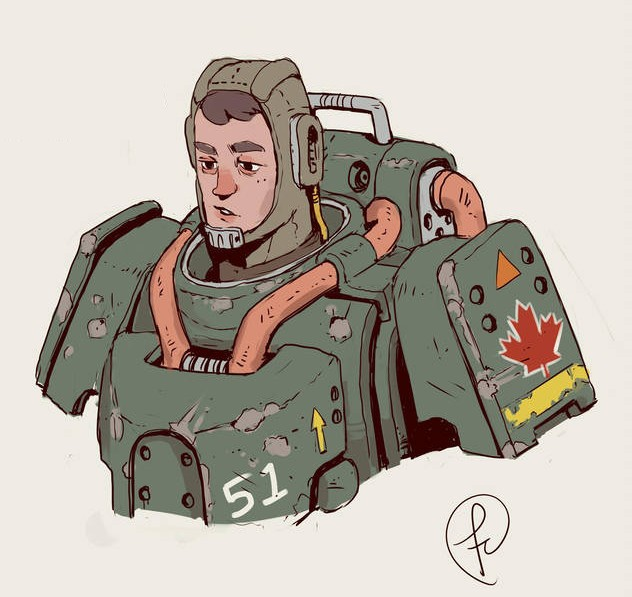
  <figcaption><a href="https://www.deviantart.com/fernand0fc/art/A-dude-with-power-armor-701502277">A dude with power armor</a> de Fernand0FC - <a href="https://creativecommons.org/licenses/by/3.0/">CC BY 3.0</a></figcaption>
</figure>

Tu as participé à une sale guerre. Peut-être que tu n'étais pas dans le camp des gagnants.
Peut-être as-tu réalisé que ton camp n'était pas le plus moralement éthique.
En tout cas tu as acquis un sacré sang froid, une tripotée de cauchemars récurrents et désormais les militaires te donnent de l'urticaire.

**Progression**: +1 XP à chaque fois que tu arranges pacifiquement une situation tendue avec des PNJs : concurrents, contacts, authorités, civils...
+2 XP si à la fin de la mission il/elle(s) te sont redevables.

**Actions**: Choisis-en 2 parmis celles décrites ci-dessous.
Remplir ta jauge d'expérience te permettra d'en acquérir une autre.

#### AS DU PILOTAGE
**Quand tu réalises une manoeuvre spatiale délicate avec ton vaisseau**,
ajoute **+1** à ton jet pour la _jouer en finesse_.
En cas de réussite, tu as ces options supplémentaires au choix, et tu peux en sélectionner une de plus :
- en conséquence, des vaisseaux adverses se percutent ou se tirent dessus
- si cette manoeuvre était préparatoire à une autre action, celle-ci bénéficie d'un bonus de **+2**

En cas d'échec, ton vaisseau subit une avarie handicapante.

Être un _as du pilotage_ permet également d'avoir un bonus de **+1** au jet en cas de _décollage urgent_.

#### CANARDER
**Quand tu te sers d'armes à feu** ou leurs équivalents spatiaux,
ajoute **+1** à ton jet pour _utiliser la manière forte_.
En cas de réussite, tu as ces options supplémentaires au choix, et tu peux en sélectionner une de plus :
- tu impressionnes, effrayes ou désarçonnes tes ennemis, qui reculent ou restent en retrait
- tu couvres quelqu'un (ce peut être toi-même), lui permettant de se déplacer sans risque d'être touché dans une fusillade
- tu touches un composant électronique ou un système de survie qui entraine une avarie de vaisseau ou une fuite d'air

#### FAIRE LE POINT
**Quand tu fais le point sur une situation tendue ou que tu évalues tes options**,
lance 2 dés + **Vif**. Sur un succès, tu peux poser des questions au MC.
Si tu agis en prenant la réponse du MC en considération, tu reçois **+1** au prochain jet.
Sur 10+, tu peux poser 3 questions. Sur 7-9, 1 seule :
- quelle est ma meilleure échappatoire / entrée / manière de le contourner ? 
- quel adversaire me semble le moins dangereux ? 
- quel adversaire est mon plus gros problème ? 
- à quoi devrais-je faire attention ? 
- où se trouve réellement mon adversaire ? 
- qui a l’avantage ici ? 

#### SELF-DEFENSE
**Quand quelqu'un te menace d'une arme, tente de te ligoter ou de t'attaquer au corps à corps**,
lance 2 dés + **Dur**. Sur 10+, au choix, tu l'immobilises ou tu le désarmes.
Sur 7-9, au choix, tu le désarmes mais il t'immobilise, ou bien tu évites juste son coup / son tir en esquivant / plongeant à couvert.
En cas d'échec, il te voit venir et est plus rapide : _risque ta santé_ ou prend une _Condition_.

#### SOINS D'URGENCE
**Quand tu tentes de stabiliser une blessure que vient de recevoir une personnage**,
lance 2 dés + **Fin**. Sur 7-9, choisis 1 option ci-dessous. Sur 10+, choisis-en 2 :
- le moniteur de santé du personnage s'améliore d'un cran
- le personnage reprend connaissance
- le personnage peut se déplacer ou être transporté sans risque

Ajoute **+1** à ton jet si tu disposes d'un kit de premiers soins.

En cas d'échec, la situation impose que tu restes à côté du personnage pendant plusieurs minutes,
pour compresser une plaie / lui faire un massage cardiaque / le maintenir éveillé même s'il délire.

### CONTREBANDIER ROUBLARD

<figure>
  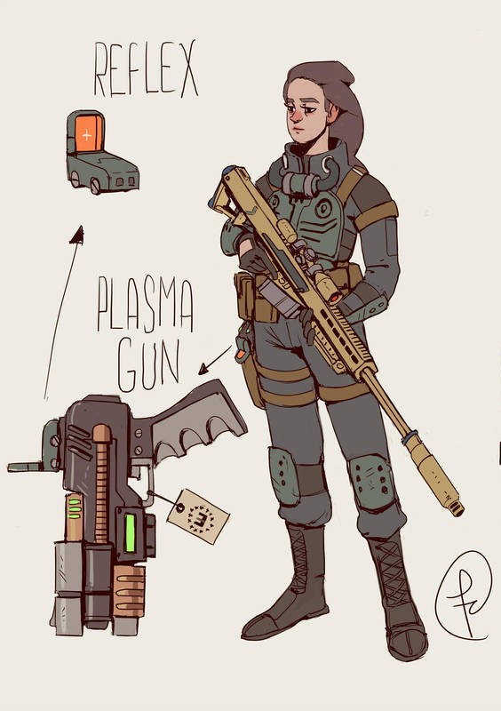
  <figcaption><a href="https://www.deviantart.com/fernand0fc/art/Anti-Materiel-699220956">Anti-Materiel</a> de Fernand0FC - <a href="https://creativecommons.org/licenses/by/3.0/">CC BY 3.0</a></figcaption>
</figure>

Le secret dans ce métier, c'est que les épaves que vous pillez n'ont pas de valeur intrinsèque.
Ce qui compte vraiment, c'est que ce que vous en ramenez intéresse vos acheteurs.
Et plus le butin **leur** paraît précieux, mieux c'est pour toi.
Tant mieux si c'est enjolivé. Parfait s'il y a de la compétition pour la marchandise, ça fait monter les prix.
Et tant pis si ton receleur réalise a posteriori qu'il s'est fait rouler, tant que ta réputation n'en souffre pas.

**Progression**: +1 XP à chaque fois que tu arnaques / pièges / ruses avec un PNJ : concurrents, contacts, authorités, civils...
+2 XP s'ils ne se rend même pas compte que tu es responsable.

**Actions**: Choisis-en 2 parmis celles décrites ci-dessous.
Remplir ta jauge d'expérience te permettra d'en acquérir une autre.

#### BARATINEUR
**Quand tu cherches à gagner du temps ou à embobiner quelqu'un**,
lance 2 dés + **Fin**. Sur 7-9, choisis 1 option ci-dessous. Sur 10+, choisis-en 2 :
- la personne n'est plus attentive à ce qui se passe autour d'elle
- la personne se sent redevable envers toi
- la personne crois sans réserves une chose au choix que tu lui racontes sur toi
- tu insuffles à la personne le sentiment que tu souhaites : amusé, inquiet, méfiant ou en colère cotre quelqu'un...

#### CERNER QUELQU’UN 
**Quand tu essaies de cerner quelqu’un lors d’une situation tendue**, 
lance 2 dés + **Fin**. Pendant que tu discutes avec lui, tu peux lui poser 3 questions (sur 10+) ou 1 seule (sur 7-9) :
- est-ce que ton personnage dit la vérité ?
- qu’est-ce que ton personnage ressent vraiment ? 
- qu’est-ce que ton personnage a l’intention de faire ? 
- qu’est-ce que ton personnage espère que je fasse ? 
- comment est-ce que je peux convaincre ton personnage de \_\_\_ ? 

#### CYBER-CB
**Quand tu demandes un conseil via ton holo-casque sur le forum #scavenge de l'Hypernet**,
demande à cette communauté de vieux baroudeurs ce qu’ils pensent être la meilleure chose à faire, et le MC te le dit.
Si tu suis le conseil, prends **+1** à tous les jets de dés que tu fais en le suivant.
Si tu suis les conseils mais que malgré tout tu n’atteins pas ton objectif, +1 XP.

**Quand tu souhaites te renseigner sur quelqu'un, un lieu ou une techno via le forum #scavenge de l'Hypernet**,
lance 2 dés + **Fin**. Sur un succès, tu peux poser des questions au MC. Sur 10+, 2 questions. Sur 7-9, 1 question :
- Est-ce/il/elle dangereux ? Si oui pourquoi ?
- Qu'est-ce qui se trame de louche à ce/son propos ?
- Est-ce que ça/il/elle peut me rapporter du cash ? Si oui comment ?
- Comment l'approcher ?

Sur un échec, demande toujours mais des personnes concernées sont informées de tes recherches...

#### LES YEUX SUR LA PORTE
Tu es toujours sur le qui-vive, et tu as toujours à l'esprit une solution pour prendre la poudre d'escampette.
**Quand tu souhaites disparaître en vitesse d'une situation tendue**, annonce ton échappatoire et lance 2 dés + **Vif**.
Sur 10+ tu es déjà parti. Sur 7-9 tu restes ou tu pars, mais si tu pars ça te coûte :
tu laisses quelque chose derrière toi ou tu prends quelque chose avec toi, et le MC te 
dit quoi. Sur un échec, tu es pris sur le fait, un pied dehors et un pied dedans.

#### REPUTATION
**Quand tu rencontres quelqu’un qui t’a l’air important**, tu peux, si tu veux, lancer 2 dés + nombre de contacts.
Sur une réussite, il a entendu parler de toi, et tu décides de ce qu’il a entendu : le MC le fera réagir en conséquences.
Sur 10+ tu prends un **+1** au prochain jet quand tu auras affaire à lui.
Sur un échec, il a entendu parler de toi, mais le MC décide de ce qu’il a entendu.

### EXPLORATEUR TECHNOPHILE

<figure>
  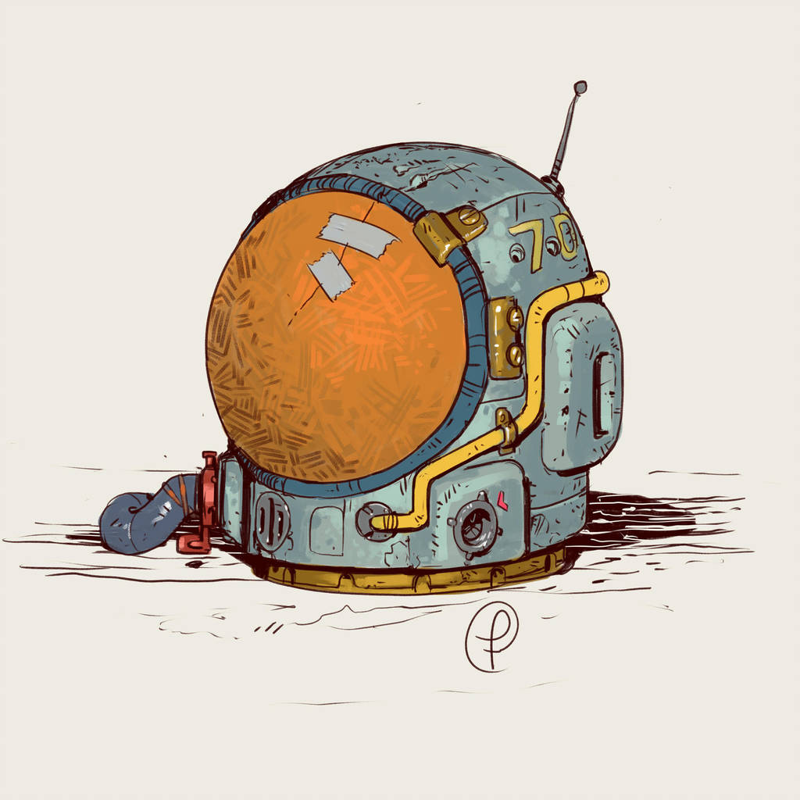
  <figcaption><a href="https://www.deviantart.com/fernand0fc/art/Moebius-retro-space-helmet-755422169">Moebius retro space helmet</a> de Fernand0FC - <a href="https://creativecommons.org/licenses/by/3.0/">CC BY 3.0</a></figcaption>
</figure>

Ton truc à toi, c'est les mécanismes.
Electriques, photoniques, fossiles, high tech, xénos...
Plus c'est étrange et ingénieux, plus tu prends ton pied.
Ta soif de découvertes te pousse à accepter des contrats toujours plus louches et plus risqués aux limites de l'univers connu.

**Progression**: +1 XP à chaque fois que tu découvres un lieu / artefact / alien inconnu.
+2 XP si tu ramènes des preuves de cette découverte à Point Central. Et pas juste des photos, personne n'y fait plus confiance.

**Actions**: Choisis-en 2 parmis celles décrites ci-dessous. Remplir ta jauge d'expérience te permettra d'en acquérir une autre.

#### AFFINITE XENO
**Quand tu entres en contact avec un alien ou que tu manipules un artefact xeno**,
lance 2 dés + **Fin**. Sur un succès, tu peux poser des questions au MC. Sur 10+, 2 questions. Sur 7-9, 1 question : 
- comment ça fonctionne, dans les grandes lignes ?
- est-ce dangereux ? Si oui pourquoi ?
- y en a-t-il d'autres ?

Sur un échec, le MC te fait un sale coup.

#### BRICOLAGE DE FORTUNE
**Quand tu cherches à rafistoler ou désactiver un objet ou un système**,
ajoute **+1** à ton jet pour la _jouer en finesse_.
En cas de réussite, tu as ces options supplémentaires au choix, et tu peux en sélectionner une de plus :
- ton bricolage tiendra au moins une heure
- ton bricolage fonctionnera sans mauvaise suprise de dysfonctionnement

Ajoute **+1** si tu as avec toi ta trousse à outil antigrav massive.

#### PAS DE VELOURS
**Quand tu cherches à te déplacer discrètement, sans attirer l'attention de quelqu'un ou quelque chose**,
lance 2 dés + **Vif**. Sur 10+, rien ni personne ne te remarque. Sur 7-9, en continuant tu risques de te faire repérer :
fais demi-tour maintenant sans être detecté, ou continue en espérant avoir assez de réflexe pour réagir quand tu seras découvert.
Sur un échec, l'alerte est donnée.

#### MECANO
**Quand tu te retranches dans ton atelier et que tu te consacres à bricoler quelque chose ou à étudier un truc quelconque**,
décide quoi et dis le au MC. Le MC te répondra « d’accord, pas de problème, mais... » puis entre 1 à 4 de ces trucs ci-dessous : 
- ça va prendre des heures / des jours / des semaines / des mois de boulot 
- tu vas devoir choper / construire / réparer / comprendre \_\_\_ avant
- tu vas avoir besoin de \_\_\_ pour te filer un coup de main 
- ça va te coûter une tétrachiée de pièces détachées 
- le mieux que tu puisses faire c’est une version merdique, faiblarde et bancale 
- ça veut dire prendre de gros risques pour ton vaisseau, ton équpage et toi-même 
- tu vas devoir ajouter \_\_\_ à ton atelier avant 
- tu vas devoir tenter le coup plusieurs / des douzaines / des centaines de fois
- tu vas devoir démonter et récupérer les pièces de \_\_\_ pour le faire

Le MC peut les articuler avec un «et» ou se sentir magnanime et ajouter un «ou».

#### NATIF DE L'ESPACE
Tu as vécu toute ta vie dans un vaisseau, et tu connais tous leurs recoins, tous leurs caprices de fonctionnement.
Ton sens de l'orientation en trois dimensions est imparable, et tu sais toujours parfaitement te situer et retrouver ta direction dans un vaisseau.
Au besoin tu trouveras toujours une planque dans une coursive, dissmulé derrière un panneau de métal que personne ne pensait amovible.
De l'intérieur, tu es capable de provoquer des pannes qui prendront des heures à être diagnostiquées pour permettre au vaisseau de repartir.
Enfin, tu as un bonus de **+1** à tous tes jets de **Dur** pour résister aux pénuries spatiales : de nourriture, de chaleur, d'oxygène, de gravité...

## Compas d'humeurs

Cette règle optionnelle vous suggère des **contraintes créatives pour interprêter vos personnages** différement.

Le but est de bousculer vos habitudes de jeu : et si durant cette séance vous expérimentiez un rôle qui vous est peu familier ?
Inspirez-vous de ces acteurs de théatre ou de cinéma, capables de joueur des personnages aux antipodes les uns des autres.
Et si vous vous mettiez dans la peau d'un personnage altruisite, ou au contraire agressif pour une fois ?

Il ne s'agit pas de fixer de manière définitive le caractère de votre personnage - rien à voir par exemple avec l'alignement de D&D -
mais de **définir aléatoirement son humeur le temps d'une session** de jeu.

Et puis vivre dans une boîte de conserve au milieu du vide spatial 24h/24, 7j/7, forcément ça a tendance a provoquer des sautes d'humeur.

<figure>
  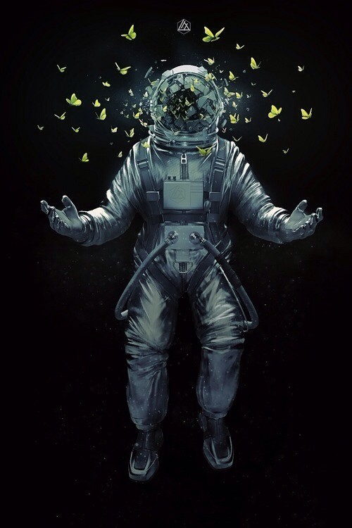
  <figcaption><a href="http://vonnowak.com/?p=21194"><cite>Of Butterflies & Astronauts</cite></a> de Markus Nowak</figcaption>
</figure>

**La règle:** en début de séance, les joueurs qui le souhaitent peuvent lancer 1d6 dans la table suivante.
Vous pouvez :

- soit utiliser le même résultat dans les deux tables. Elles sont "alignées" pour correspondre assez naturellement.
- soit lancer un second dé pour l'autre table. Il vous faudra alors faire preuve d'un peu plus d'imagination et de gymnastique mentale
pour que les deux coïncident, mais c'est le défi sera d'autant plus intéressant !

Vous êtes complètement libres de relancer un jet qui ne vous inspire pas,
de vous lasser de cette variante en cours de partie et de décider de ne plus en tenir compte,
ou encore de refaire un jet plus tard dans la session, par exemple lorsque vous hésitez sur la conduite à adopter.

Une occasion idéale pour consulter cette table en partie est lorsqu'un **deuil** survient,
suite au décès d'un PJ ou d'un PNJ.

::: float-right
|  1d6  | Votre attitude en conséquence
|-------|-
| ~~⚀~~ | Fuir en avant, être évasif, couper court aux discussions
| ~~⚁~~ | Être en colère, agressif, chercher un coupable et lui faire payer
| ~~⚂~~ | Se persuader et persuader les autres que vous êtes un dur à cuire, solide comme un roc
| ~~⚃~~ | Faire de l'humour, être piquant ou sarcastique
| ~~⚄~~ | Être obsédé par une mélodie ou fétichiste d'un objet, se trouver une nouvelle passion exotique (japon féodal / western / Égypte...)
| ~~⚅~~ | Prendre des risques absurdes, tout mettre en jeu dans la balance
:::

|  1d6  | Ce besoin insatisfait qui vous démange
|-------|-
| ~~⚀~~ | Explorer de nouveaux lieux, découvrir de mystérieux artefacts et des créatures aliens
| ~~⚁~~ | Exercer votre liberté, braver les interdits, refuser l'authorité
| ~~⚂~~ | Être altruiste, transmettre l'espoir, s'assurer qu'il y a une justice
| ~~⚃~~ | Se détendre, se reposer, prendre du bon temps, profiter avec un peu de légereté
| ~~⚄~~ | Être nostalgique, revenir sur son passé et clôturer certaines histoires
| ~~⚅~~ | Être en contact avec la nature, jardiner, être faciné par le cosmos, philosopher

> Au mieu de la partie, le personnage de Tom, un vieux cosmonaute russe nommé Yuri,
> se retrouve confronté à un dilemne moral : l'équipage vient de réaliser que l'énorme cargaison
> qu'ils viennent d'intercepter était destinée à un vaisseau de réfugiés, dérivant actuellement vers une ceinture astéroïdes.

> Il joue d'ordinaire son personnage de manière assez cynique, mais décide de lancer un dé dans la table ci-dessus
> pour voir ce qui en retourne cete fois. Il obtient un 3, et décide d'avoir un sursaut d'empathie : « On va sauver ces réfugiés putain ! »

Côté MC, prennez bonne note de ces besoins insatisfaits pour pouvoir tendre des perches aux joueurs durant la partie !

Enfin, si vous souhaitez des idées d'éléments de votre passé qui reviennent vous hanter :

|  1d6  | Souvenirs, souvenirs
|-------|-
| ~~⚀~~ | Qui t'as appris les ficelles du métier ? Ou à piloter ? Ou à te battre ?
| ~~⚁~~ | Qui t'es redevable, et pourquoi ? Ou bien est-ce l'inverse ?
| ~~⚂~~ | Quelle prouesse / situation t'as rendu célèbre un jour ?
| ~~⚃~~ | Qui t'as tragiquement déçu / trahis / volé ?
| ~~⚄~~ | Comment ce plan parfait pour gagner plein de cash a mal fini ?
| ~~⚅~~ | Qui est mort sous tes yeux ?

## Cachoteries

Cette règle optionnelle fournit une table aléatoire d'objectifs individuels secrets pour les PJs,
certains connus du MC et d'autres non.

Entre chaque mision, lorsque les PJs sont à Point Central, chaque joueur tire 2d6 de couleurs différentes, un pour les dizaines et un pour les unités, puis consulte la table ci-dessous.
Surtout, restez impassible ! Ne laissez rien transparaître dans vos réactions.

<figure>
  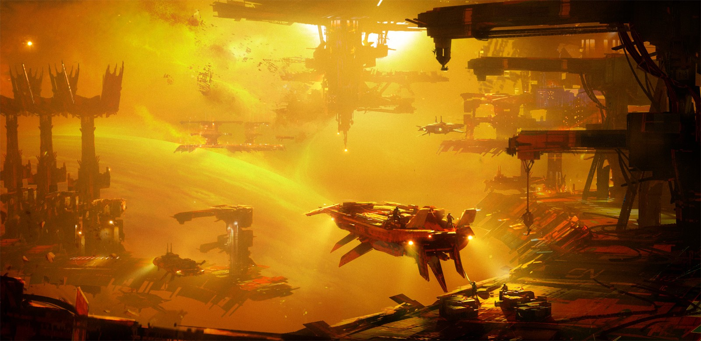
  <figcaption><a href="https://www.artstation.com/artwork/L6Yrl">Smugglers Harbor</a> de Sergey Grechanyuk</figcaption>
</figure>

Si la cachoterie implique un autre membre de l'équipage, déterminez aléatoirement avec 1d6 de qui il s'agit.
Transmettez ensuite secrètement votre résultat au MC, **sauf** si la table indique de ne pas le faire dans la 2e colonne.
Dans ce cas, dites au MC que vous avez obtenu un 5 ou un 6.

|  d66          | Transmettre le vrai résultat au MC ? | Description
|---------------|--------------------------------------|-
| ~~⚀~~-*       |                  Oui                 | Votre contact vous propose de gagner 2-cash en accomplissant un contrat bonus. Le MC vous donnera le détail de l'offre en se reportant à la section suivante.
| ~~⚁~~-~~⚀~~   |                  Non                 | Vous avez appris que durant cette mission votre frère (ou soeur) sera de la partie. Vous ne vous parlez plus beaucoup, mais la famille c'est sacré pour vous. À vous de décider de quel PNJ il s'agit au cours de la partie, et de l'aider du mieux que vous pouvez. Même si ça ça doit se faire au détriment de votre équipage...
| ~~⚁~~-~~⚁~~   |                  Non                 | Lors de votre dernier arrêt à Point Central, _quelque chose_ est rentré en vous. À vous de définir quoi exactement et comment, mais vous allez devoir trouver un xénobiologiste très vite, sans affoler vos coéquipiers...
| ~~⚁~~-~~⚂~~   |                  Non                 | Vous découvrez un fichier audio d'un médecin sur l'ordinateur de bord, indiquant qu'un autre membre de l'équipage vient d'être diagnostiqué d'un "cancer de l'espace". À vous de définir qui, et de trouver un moment pour aborder le sujet avec elle ou lui durant la partie. Délicat, surtout qu'il n'a pas encore eu le message...
| ~~⚁~~-~~⚃~~   |                  Non                 | Lors de votre dernier arrêt à Point Central, vous avez échappé par miracle à une mort atroce, grâce à un inconnu qui vous a sauvé en y laissant sa vie. Vous vous êtes juré de rendre la pareille bientôt, pour équilibrer la balance karmique... sans nécesseraiement y laisser la vie. La prochaine fois que quelqu'un est sur le point de mourir, et qu'il ne le mérite pas selon vous, vous donnerez tout ce que vous avez pour le sauver.
| ~~⚁~~-~~⚄~~   |                  Non                 | Vous avez appris que durant cette mission vous pourriez croiser l'enfant de salaud qui a buté où provoqué la mort d'un de vos proches. À vous de décider de quel PNJ il s'agit au cour de la partie, de déterminer ce qu'il vous a fait, et le moment opportun de le liquider ou de lui faire payer. Pas d'hésitation !
| ~~⚁~~-~~⚅~~   |                  Non                 | Lors de votre dernier arrêt à Point Central, un de vos contacts vous a appris que vous vous étiez fait voler 1d6-cash... par un de vos coéquipiers ! À vous de décider qui et comment il s'y est pris, mais il ne sait pas que vous avez découvert le pot aux roses. Confrontez-le durant la partie, idéalement lorsque sa vie sera entre vos mains...
| ~~⚂~~/~~⚃~~-* |                  Oui                 | Vous ne saurez pas ce qui se trame ! Transmettez au MC votre résultat aux dés.
| ~~⚄~~/~~⚅~~-* |                  Oui                 | Rien. Pas de cachoteries pour vous cette fois-ci ! Comme il faut que vous ayez l'air de lire quelque chose en étant concentré pendant quelques minutes, histoire de semer le doute autour de la table, voici une énigme: le pape en a un mais ne l’utilise pas; ton père en a un et ta mère l’emploi; les nones n’en ont pas besoin; le mari de ton amie en a un aussi et ton amie l’a adopté. Qui suis-je ?

**MC** : assurez-vous de prendre systématiquement au moins une personne en apparté à cette phase, pour semer le doute.

En fin de mission, tout le monde met cartes sur table, et révèle quelle cachoterie il avait éventuellement tiré.

<figure>
  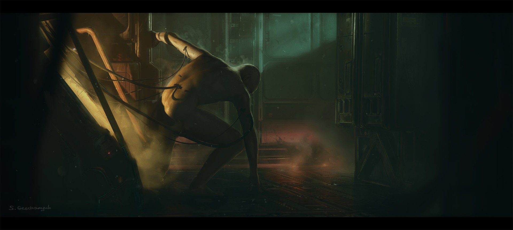
  <figcaption><a href="https://www.artstation.com/artwork/L89Gw">Rise and shine</a> de Sergey Grechanyuk</figcaption>
</figure>

### Contrats bonus

|  Contact         | Description
|------------------|-
| Armatech         | Tester (ou faire tester) une arme à feu de point subsonique, fonctionnant dans l'espace et générant un rayon de chaleur aussi brûlant que de la lave. A tester dans l'espace sur un vaisseau et en atmosphère artificielle sur un humain.
| Marché noir      | Tester (ou faire tester) une drogue inconnue. Peut-être d'origine xénomorphe. Observer les effets sur au moins 3 jours. +1 cash si testé sur un second cobaye
| Steiner & Wilson | Tester un additif de carburant, un prototype tout juste stable, et raporter vos observations après au moins une semaine.
| Caifu Xiaoyin    | Une cargaison confidentielle à livrer. Le MC vous indique où et comment.
| Transmed         | Récupérer un prélèvement de peau et de sang d'un individu. Le MC vous indique qui.
| Legion           | Introduire une clef informatique dans un ordinateur, et ramener la clef. Le MC vous indique où.

Si le PJ a déjà rempli le contrat bonus de son contact :
une femme avec un symbiote xéno, visiblement en détresse / mourante, confie au PJ un mystérieux artefact, en lui demandant de le ramener d'où il vient.

<figure>
  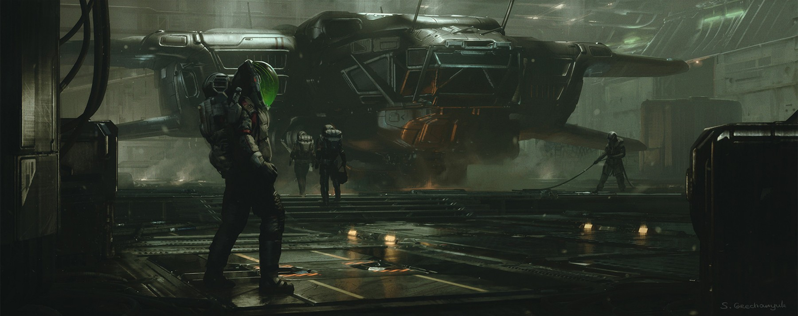
  <figcaption><a href="https://www.artstation.com/artwork/g5NDx">Kepler</a> de Sergey Grechanyuk</figcaption>
</figure>

### MC : resolution des cachoteries

**Section réservée au MC !**

Cachoterie inconnue du PJ : si le premier dé transmis par le joueur est un 4, faites monter la sauce mais aucune mauvaise surprise ne couve.
Si c'est un 3, reportez la valeur du second dé dans cette table :

|  1d6  | Description
|-------|-
| ~~⚀~~ | "Lebowski" : un recouvreur de dettes est aux trousses du PJ. Il le traquera jusqu'à trouver une opportunité de le braquer pour le secouer un peu... avant de réaliser que ce n'est pas la bonne personne.
| ~~⚁~~ | "Ein" : le PJ va rencontrer un chien, abandonné sur une épave ou en détresse, qui va se montrer extrèmement affectueux envers lui. Et bien plus intelligent que la moyenne.
| ~~⚂~~ | "Kovacs" : Le PJ est victime d'un vol d'identité. Le prochain scanner / contrôle risque de mal se passer. Va-t-il essayer de retrouver le voleur, ou bien tenter d'obtenir de faux papiers ?
| ~~⚃~~ | "Mimic" : un parasite xénomorphe tente de prendre la place du PJ. Au milieu d'une mission, lorsque le PJ est seul avec un autre PJ, prennez-en le contrôle pour qu'il attaque ce dernier. L'autre PJ réalise alors que ce n'est pas une créature humaine, et le vrai PJ pourra être retrouvé prisonnier dans un cocon dans sa cabine.
| ~~⚄~~ | "Pschit" : lors de sa prochaine sortie en combinaison spatiale, un trou va se former dans son dos. Oui, juste là où il ne peut l'atteindre. "Opération panique" donc, pour que les PJs trouvent une solution d'urgence !
| ~~⚅~~ | "Skynet" : pour une raison inconnue, l'IA basique du vaisseau a classifié le PJ comme "présence hostile". À la moindre opportunité, elle va tenter de l'éliminer : ~~⚀~~ ouverture de sas alors que la combinaison du PJ est ouverte ; ~~⚁~~ fermeture brutale de porte anti-incendie sur son passage ; ~~⚂~~ le verre d'eau servi à la machine est en fait... de l'acide, puis lorsqu'il/elle le remarque, la gravité artificielle se coupe ; ~~⚃~~ le harnais / ceinture de sécurité du PJ refuse de s'enclencher ; ~~⚅~~ la gravité s'incline alors que le PJ est dans une très longue coursive ; ~~⚄~~ une alarme réveille le PJ dans son sommeil - et seulement lui - pour le conduire en salle des machines dans une section où la radioactivité est très importante, sans qu'il n'y ait le moindre incident technique réel.

<figure>
  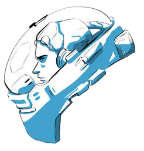
  <figcaption><a href="https://www.deviantart.com/akol3850/art/Helmet-concepts-540178128">Helmet concepts</a> de akol3850 - <a href="https://creativecommons.org/licenses/by-nc/3.0/">CC BY-NC 3.0</a></figcaption>
</figure>

| Contrat bonus           | Détails & mauvaises surprises
|-------------------------|-
| Arme à feu subsonique   | 2d6 à chaque usage, sur un double il y a un disfonctionnement : ~~⚀~~ / ~~⚁~~ → surchauffe, l'arme devient si chaude qu'elle traverse le métal ; ~~⚂~~ / ~~⚃~~ → recul non-amorti, casse le bras de son utilisateur ; ~~⚄~~ / ~~⚅~~ → détonation suffisante pour fissurer le verre, même dans l'espace !
| Drogue inconnue         | 1d6 une seule fois : ~~⚀~~ la drogue ne fait rien ; ~~⚁~~ le cobaye se met à communiquer dans une langue que lui seul comprend, sans le réaliser ; ~~⚂~~ l'organisme du cobaye se met à fonctionner deux fois plus vite ; ~~⚃~~ le cobaye a l'impression de voir le futur, mais il s'agit en réalité d'hallucinations ; ~~⚄~~ le cobaye ne sent plus la douleur ; ~~⚅~~ le cobaye devient capable de détecter les formes de vie humaines & xénos à moins de 100m de lui
| Additif de carburant    | 1d6 à chaque long voyage ou prise de vitesse : ~~⚀~~ aucun effet notable ; ~~⚁~~ l'additif encrasse le moteur, qui commence a avoir des râtés ; ~~⚂~~ l'additif créé un trou dans la coque, par où s'échappe le carburant ; ~~⚃~~ l'additif accélère discrètement mais efficacement le moteur - cependant, en cas d'entrée dans une atmosphère, il porte à ébulition le réservoir ; ~~⚄~~ l'additif entraîne des accélérations saccadées de 30s ; ~~⚅~~ le moteur s'emballe, impossible de l'arrêter par des moyens standards !
| Cargaison secrète       | 1d6 détermine ce qu'il se passe lors de la transaction : ~~⚀~~ personne n'est  au rdv ; ~~⚁~~ un mercenaire va tenter de récupérer la valise avant le rdv ; ~~⚂~~ même principe, mais il se fait passer pour le destinataire après l'avoir éliminé ; sinon tout se passe bien. \
|                         | En réalité il s'agit : ~~⚀~~de barres de chocolat ; ~~⚁~~de données confidentielles cryptées, impliquants des gros bonnets pour corruption, camouflées dans des bibles ; ~~⚂~~d'un migrant ; ~~⚃~~d'un criminel recherché ; ~~⚄~~d'un animal dont l'espèce est éteinte ; ~~⚅~~ d'une prothèse de main en matière xénomorphe.
| Prélèvement peau & sang | Cible : ~~⚀~~ / ~~⚁~~ un scientifique dont le cadavre flotte dans la prochaine épave cible des PJs ; ~~⚃~~ / ~~⚂~~ un xénomorphe "inofensif" dans la prochaine épave cible des PJs ; ~~⚄~~ le chef des concurrents des PJs durant leur prochaine mission ; ~~⚅~~ un des autres membres d'équipage.
| Plug & Play             | Objectif : la salle des serveurs ~~⚀~~ d'une station essence spatiale ; ~~⚁~~ d'un poste des douanes ; ~~⚂~~ d'une casse spatiale sous la coupe de la mafia ; ~~⚃~~ d'un spatio-port commercial ; ~~⚄~~ / ~~⚅~~ d'une épave. \
|                         | Effet de l'insertion de la clef : ~~⚀~~coupure de courant générale dans la station / le vaisseau ; ~~⚁~~ vol de données confidentielles ; ~~⚂~~ introduction d'un virus, un cheval de troie, dans le système ; ~~⚃~~ les systèmes de sécurité du lieu se mettent à tirer sur tout ce qui bouge ; ~~⚄~~ un détournement massif d'argent qui force le lieu a fermer ses portes ; ~~⚅~~ l'intrusion informatique est détectée !

## Imprevus de voyage

À chaque trajet entre deux lieux dans l'espace, le MC peut lancer 1d6 dans cette table:

|  1d6              | Description
|-------------------|-
| ~~⚀~~             | Anomalie spatiale
| ~~⚁~~             | Débris spatiaux
| ~~⚂~~             | Rencontre
| ~~⚃~~/~~⚄~~/~~⚅~~ | Pas d'imprévu

|  1d6  | Anomalies spatiales
|-------|-
| ~~⚀~~ | Le vaisseau des PJs frôle une pieuvre spatiale alien géante -> swap PJs vers la gauche autour de la table. L'effet s'inversera si les PJs retrouvent le mollusque
| ~~⚁~~ | Le vaisseau traverse une zone qui empêche les systèmes électriques de fonctionner. Plus aucune lumière n'y passe : plongés dans l'obscurité totale, les PJs vont devoir trouver une solution pour en sortir... puis naviguer à tâtons, au petit-bonheur-la-chance (suggestion : propulsion au gaz)
| ~~⚂~~ | De la pluie. Qui s'intensifie. Si les PJs ne décampent pas rapidement, ils réaliseront que la force exercée par cette averse dévie le vaisseau, qui finira par être projeté contre une surface invisible et molle. La pluie ne traversant pas cette membrane, le vaisseau finira sous l'eau. Mais est-ce vraiment de l'eau ? Après un certain temps, un fort courant déplace le vaisseau, pour finalement le projeter dans le vide de l'espace.
| ~~⚃~~ | Peu après que les instruments de navigation deviennent incohérents, les PJs réalisent qu'ils sont bloqués dans une boucle spatiale de la taille d'un petit système solaire : ils ne cessent de revenir au même endroits. 1d6 autres vaisseaux sont égalements piégés. S'ils sont malins, ils réaliseront qu'au centre de cette "poche" se situe un nuage de déchets largué par un autre vaisseau, dans lesquels flotte un artefact alien ramené par un archéologue de ce navire. Mais comment le désactiver ?
| ~~⚄~~ | L'interaction gravitionnelle devient plus intense dans la zone, plaquant tous les objets et personnes à bord du vaisseau aux parois, et faisant même basculer certains interrupteurs entrainant l'extinction du moteur.
| ~~⚅~~ | Soudain, quelque chose à l'autre bout de la galaxie déclenche un phénomène colossal : d'intenses rayons lumineux se forment entre **toutes** les étoiles, deux à deux, de l'univers entier. Et forcément cet entrelac de rayons est très dense là où navigue le vaisseau des PJs, les forçant à une manoeuvre d'urgence pour ne pas finir grillé, puis à reconsidérer leur plan de vol tant il est désormais impossible de voyager en ligne droite... Peut-être vont-ils d'ailleurs manquer de carburant, et une leur seul recours sera une trajectoire catapultée, réacteurs éteints, autour de plusieurs planètes ?

<figure>
  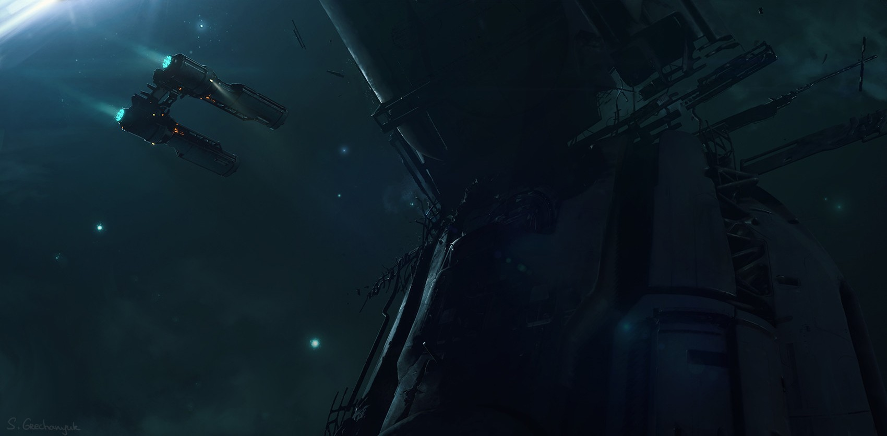
  <figcaption><a href="https://www.artstation.com/artwork/o9BZq">Abandoned Space Ship</a> de Sergey Grechanyuk</figcaption>
</figure>

|  1d6  | Débris spatiaux
|-------|-
| ~~⚀~~ | Une nacelle de sauvetage, vide, mais avec des dizaines de bâtons gravés à l'intérieur, comme pour décompter des jours...
| ~~⚁~~ | Une torpille autoguidée se réveille soudain de sa torpeur centenaire, et se dirige vers le vaisseau des PJs 
| ~~⚂~~ | Le vaisseau est heurté par une pluie de petis astéroïdes magnétiques. Alors que le vaisseau se recouvre de roches se fixant à et enfonçant la coque par magnétisme, le simulateur de gravité est HS, et le niveau d'oxygène commence à baisser dramatiquement...
| ~~⚃~~ | Un champ de glaçons. Des monticules d'eau glacée, allant du petit flocon à l'iceberg, dérivant à vitesses variables dans le vide. En cas d'impact, certains explosent et se révèlent conteni de l'hélium.
| ~~⚄~~ | Les débris d'une sonde Voyager, et plus particulièrement [son disque d'or](https://fr.wikipedia.org/wiki/Voyager_Golden_Record) d'une valeur... inestimable. Qu'est-ce que les PJs décideront d'en faire ?
| ~~⚅~~ | Des coques vides de mollusques gigantesques, par dizaines

<figure>
  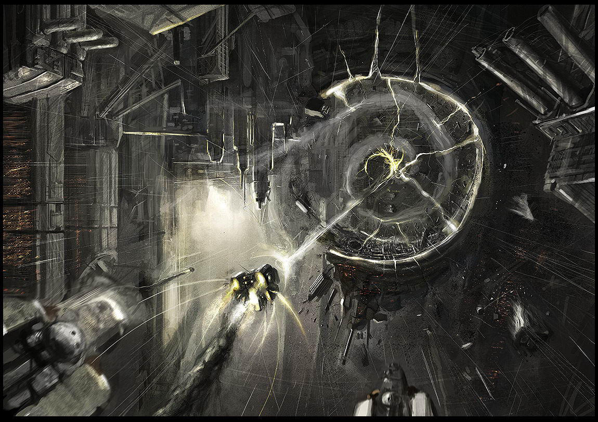
  <figcaption><a href="https://www.deviantart.com/jimhatama/art/Fireworks-81866324">Fireworks</a> de JimHatama - <a href="https://creativecommons.org/licenses/by-nc-sa/3.0/">CC BY-NC-SA 3.0</a></figcaption>
</figure>

|  1d6  | Rencontres
|-------|-
| ~~⚀~~ | Le vaisseau des PJs est assaillis de message d'appel à l'aide : un vaisseau-prison dans la zone vient d'éjecter ses centaines de capsules de survie. Dilemne : les PJs vu l'autonomie des capsules, les PJs n'auront pas le temps de tous les sauver, et leur vaisseau n'a pas de toutes façons pas assez de resources pour autant de passagers.
| ~~⚁~~ | Equipage entier en stase. Si inspecté, le mécanisme de stase se révèle disfonctionnel. Le réveil ne s'est pas déclenché comme prévu il y a plusieurs mois et la moitié de l'équipe est déjà mort.
| ~~⚂~~ | Un Scavenger appelle à l'aide car il est attaqué par des pirates. Ce n'est pas un piège, il s'agit d'un vieil homme solitaire dont le vaisseau est désormais en panne. Il prétend s'être fait enlevé par des aliens une fois. 
| ~~⚃~~ | Des transporteurs spaciaux font grève et on formé un blocus autour de Point Central
| ~~⚄~~ | Abordage ! Des pirates attaques le vaisseau des PJs pendant qu'ils explorent une épave abandonnée servant d'appat.
| ~~⚅~~ | Contrôle des douanes !

### Horreur cosmique

Voici 6 courtes amorces scénaristiques pour faire trembler vos joueurs
et faire glisser lentement le ton de vos parties vers l'horreur indicible...

#### Final feast
+ après sauvetage du navire, leur capitaine les invite à festoyer pour les remercier, et en profiter pour négocier de l'échange de marchandises
+ 2 membres de l'équipage ont l'air louche vis-à-vis des PJs. A y regarder de plus prêt, ils sont terrifiés...
+ en fait il s'agit des seuls rescapés de l'équipage initial, qui s'est fait bouloté par des canibales mystiques,
vénérant & accomplissent la volonté de dieux sanglants de l'univers via leurs rituels sacrificatoires

#### Intruders !
+ le vaisseau entre dans une zone de silence !
+ plus personne ne peut parler à haute voix des actions de son perso en jeu, tout doit être écrit sur le papier au MJ
+ de plus, les PJs ne se voient plus sous leur apparence normale, mais comme des monstres les uns vis à vis des autres !

<figure id="say-cheese">
  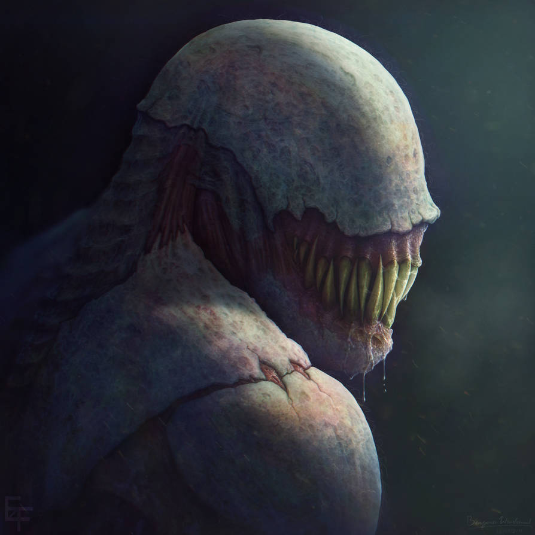
  <figcaption><a href="https://www.deviantart.com/free4fireyoutube/art/Say-Cheese-604537412">Say Cheese</a> de free4fireYouTube - <a href="https://creativecommons.org/licenses/by-nc-sa/3.0/">CC BY-NC-SA 3.0</a></figcaption>
</figure>

<!--figure>
  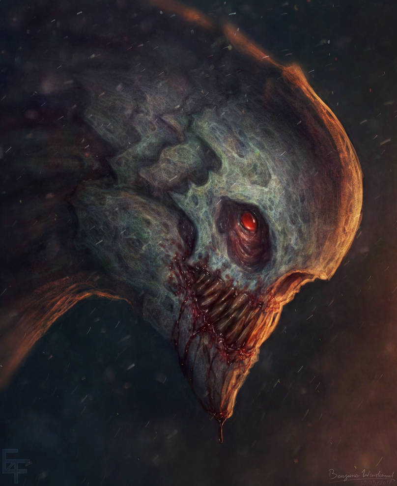
  <figcaption><a href="https://www.deviantart.com/free4fireyoutube/art/Warm-up-Doodle-Generic-monster-portrait-679888096">Generic monster portrait</a> de free4fireYouTube - <a href="https://creativecommons.org/licenses/by-nc-sa/3.0/">CC BY-NC-SA 3.0</a></figcaption>
</figure-->

#### Edge of tomorrow
+ archéologue à bord -> leur montre un artefact étrange
+ assaut de pirates -> ile meurent tous !
+ un jour sans fin

#### Space backbone
Vos radars détectent un étrange artefact : une colonne d'un mètre de large se dresse devant le vaisseau, apparement en os. Impossible de remonter à l'une ou l'autre de ses origines. 
au départ radars détecten matière organique : des tripes et des boyaux flottent dans l'espace
si les PJs s'attardent, une hélice géante s'approche à grande vitesse vers eux le long du boyaux

#### Last record
>First there's a creepy noise loop transmitted over emergency beacon frequencies or played over the intercom upon arrival.
>Then the noise is dissected and revealed to be a garbled and distorted lullaby recorded by a mother on board to put her baby to bed.
>Then more recordings are discovered, showing that mother and her baby in a panic, running, screaming silently as there is no audio,
>banging her hand against the bulkhead in desperation, there's a weird movement in the corridor behind them, and the feed cuts."

#### Salutary help
>The doors open, the first sign of properly working systems since the party came aboard
>There's a woman in an EVA suit sitting at the communications booth
>the glare visor is down
>there are no lights on. 
>She raises a hand to shield her 'face' if the party shines a light on it.
>She refuses to remove the suit, but begs for their help to escape.
>She's turned the interior of the comms center into a makeshift home and saferoom to keep her safe from the horrors prowling the ship.
>The walls or viewscreens are covered in images of Earth, Earth's colonies and of Humanity in general, all suggesting that the woman craves freedom.
>She seems genuinely nice, if just a little bit too eager to please the PCs and help them along in trying to escape, begging that they take her with them.
>The fact that she refuses to take off her suit and the soft chittering noises she sometimes makes inside are somewhat worrying, though..."

<figure>
  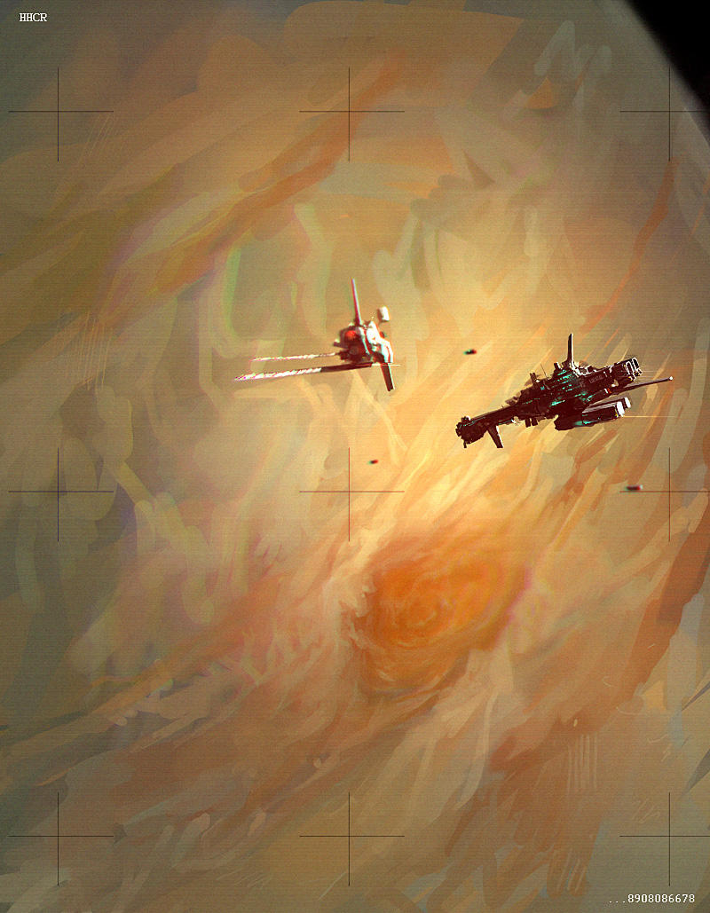
  <figcaption><a href="https://www.deviantart.com/jimhatama/art/ISS-Whitebird-200832168">ISS Whitebird</a> de JimHatama - <a href="https://creativecommons.org/licenses/by-nc-sa/3.0/">CC BY-NC-SA 3.0</a></figcaption>
</figure>

