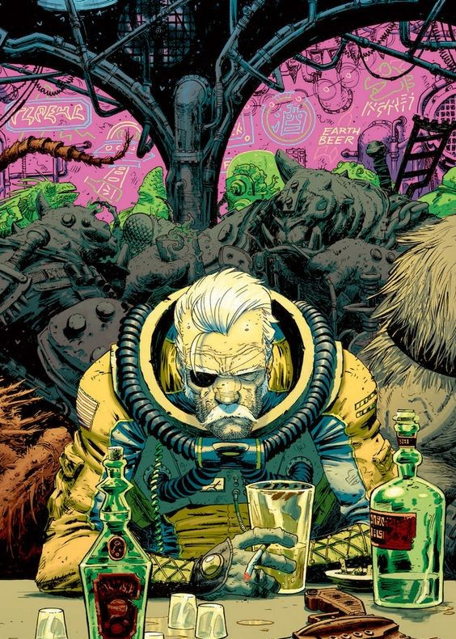

# Scenario : Avis de peremption sur magenta48

Ceci est une mission pour [Scavengers](http://awarestudios.blogspot.fr/2014/01/scavengers.html).

## Lieu

Epave: station de commerce dans un champ d'astéroïde minier
BACKGROUND: le filon de minerai - des sulféonates - des astéroïdes est épuisé et la station abandonnée depuis des années.
D'après un indic chez leur constructeur OMEGACORP - le filet de sécurité de mines entourant la station est arrivé en fin de vie la semaine dernière.

## Menaces

- anomalie: artefact xénomorphe qui change tout en glace en présence de CO2
- concurrents: déjà sur place, sont venu pour un échange → rançon d'une cargaison de boarx volés qui ne va pas bien se passer
  * d'un côté, côté docks de commerce, Damian Nyourk, propriétaire des boarx et gangster retord. Il est officiellement accompagné de 2 hommes de main, mais 4 autres se sont infiltrés dans le vaisseau
  * de l'autre, côté docks miniers, Omar Doolin et son clan, contrebandiers loyaux mais brutaux

Chacune de 2 factions est arrivée par un dock. L'échange aura lieu dans la salle du marché.

Chacune des 2 factions, si elle voit les PJs approcher, les obersevera avant de les approcher:
- Damian leur présentera la situation, jouera la victime et leur suggérera fortement d'éviter de croiser leur chemin sous peine de se prendre une balle perdue.
De plus, il mettra en douce un marqueur sur leur vaisseau.
- Omar sera à première vu hostile: sur ses gardes, il aura la détente facile et n'hésitera pas à tirer un coup de semonce avant que les PJs ne s'identifient.
Si la situation se calme, il leur expliquera qu'ils sont ici pour du busisness dont les PJs devraient se tenir à l'écart.
Il sera très curieux de savoir ce que les PJs cherchent ici. Il leur conseillera de se tenir à l'écart des hommes de Damian, et si les PJs se révèlent très diplomates,
il leur proposera éventuellement du troc, ayant en sa possession des données __digitales__ sur des technos __illégales__.

## Zones
- tour de contrôle
- docks marchands
- docks miniers
- hub central: 1d6
  1. place de marché
  2. immenses serres hydroponiques
  3. un casino-bar chic
  4. un quartier d'affaires vertical, tout en passerelles et hautes tours, et ses bas fonds
  5. une bibliothèque
  6. un bar-border
- secteur technique: 1d6
  1. salles des machines: réacteur éteind et gyromoteurs de navigation
  2. zone de traitement des déchets
  3. poste de sécurité et ses cellules
  4. atelier électrotechnique de réparations diverses
  5. un entrepôt avec de pauvres immigrants oubliés en sommeil prolongé dans leurs caissons
  6. labo d'analyses scientifiques
- zone résidentielle: 1d6
  1. une salle de gym avec une piscine
  2. un réfectoire
  3. une zone d'appartements où l'oxygène a été conservé
  4. un jardin, mort, et un terrain de sport
  5. une chappelle avec funerarium
  6. un centre médical

## Mauvaises surprises
1d6:
  1-2. pluie de petits déchets gravitant à grande vitesse
  3-4. système de sécurité enclenché => vérouillage des portes
  5-6. usure du métal => la passerelle s'écroule
  décharge électrique: ta radio est HS

## Points d'entree
- les docks (déjà occupés)
- la passerelle des nouveaux arrivants, à mis-chemin de la tour de contrôle

## Butin
- pièces de réacteur taille G4: encombrant, matériel, précieux
- artefact xéno: précieux, matériel, dangereux
- panneaux solaires en très bon état
- livres rares: scientifique

## Chronologie
- H+1: à distance, loin de la station, une mine explose
- H+2: réactivation de la gravité
- H+3: échanges de coups de feu, les boarx s'enfuient
- H+4: l'artefact xéno ayant glacifié et traversé plusieurs étages de la tour résidentielle, la station se casse en 2

## Misc.
- prévoyez une [fiche de connaissance](http://ptgptb.fr/une-sacree-bonne-idee-les-feuilles-de-savoir) sur ce modèle de station, détaillant:
  * l'architecture générale et les différentes zones
  * la spécificité des larges cultures hydroponiques
  * les panneaux solaires qui y sont utilisé et pourraient constituer un butin
  * l'ascenseur central faisant office de générateur de gravité
Selon comment le groupe des PJs, cette fiche peut servir de justification à ce que l'un d'eux ait rejoind le groupe.
- échanges radios: comme c'est devenu un détail critique lors de ma partie, j'ai considéré que les échanges radios entre spationautes avaient les caractéristiques suivantes:
  * il existe une fréquence radio "en clair" communément utilisée
  * il est possible de communiquer sur des fréquences radios "privées", au sens où il est impossible - sans matériel __scientfique sensible illégal__ - de "balayer" les fréquences radios pour les découvrir
  * pour inviter quuelqu'un à se joindre à une fréquence de communication, il est courant dans l'espace d'inscrire celle-ci sur une ardoise du type "veleda"
  * à l'intérieur d'une station comme celle de la mission, les radios ont une portée limite de quelques dizaines de mètre

# Compte-rendu de partie

## Jam #1 - "On les protonique !"

- les PJs ont eu l'info par M. Ivanov que cette station sans défense depuis une semaine:
"C'est une occasion en or !"
- ils arrivent à la station en vaisseau et choisissent de s'amarrer par l'entré des docks de commerce
- ils examinent les épaves de vaisseaux encore présentes: ils réactivent un vaisseau utilitaire qui se fait la malle, puis tombent nez à nez avec Damian et ses hommes en ouvrant la soute du 2 vaisseau
- Damian leur explique la situation en ses termes: comment il s'est fait dérobé son bétail et Omar lui réclame une rançon. Il se méfiera des PJs et leur demandera de se mêler de leurs affaires sous peine de représailles
- les PJs repartent en vaisseau, après avoir planqué un drône de surveillance dans un coin des docks, et s'ammarra cette fois à la passerelle "officielle". Le drône abandonné réussit à se coincer et ne plus pouvoir bouger.
- ils entrent dans la station en découpant la tôle au plasma, puis se dirige dans l'ascenseur. Une explosion retentit alors qu'ils s'élèvent vers la tour de contrôle
- arrivé au sommet de l'ascenseur, rejoignent le dernière étage en passant par une fenêtre puis accède à la tour de contrôle par les escaliers. Un PJ lâche un drône de reconnaissance dans cet étage.
- un PJ réussit à pirater le réseau de caméra et y rediriger le peu d'énergie restant sur la station. Il découvre ainsi la position des différents autres passagers de la station, y compris les hommes d'Omar s'affairant dans les salles des machines
- le drône abandonné à l'étage inférieur ne donne plus de nouvelles. Un autre PJ pille du matériel électronique dans la tour de contrôle
- le groupe redescend à l'étage inférieur. Le drône se révèle avoir été abattu par un tir de fusil de précision émit depuis l'ascenseur.
- les PJs décident de redescendre via les escaliers internes aux étages en direction du labo
- sur le chemin, ils découvrent les effets de l'anomalie de glace. La gravité est rétablie soudainement. Un tireur en embuscade dans l'ascenseur s'écase à son pied.
- ils font une halte au poste de sécurité, où ils récupèrent quelques armes et munitions.
- ils arrivent enfin au labo, qu'ils pillent allègrement : données xénomorphes, matériel électronique d'analyse...
- le drône abandonné dans les docks d'arrimage de commerce transmet une drôle d'image aux PJs: un sanglier au front recouvert de corne, à moitié gelé, flotte dans l'espace...
- alors qu'ils remontent vers leur vaisseau, les PJs recoivent une alerte radio : quelqu'un essaie de s'introduire dedans !

## Jam #2 - "Un cutter à plasma ça doit être impressionnant pour un cochon, non ?"

- les PJs décide de progresser par l'extérieur de la coque de la station, avec leurs semelles magnétiques, afin de contourner l'anomalie de glace
- ils détectent la présence de quelqu'un sur la passerelle où est leur vaisseau
- ils décident de s'y tracter avec un nanocâble, mais son propriétaire oublie de l'attacher avant de tirer et un autre PJ ayant attrapé le câble se retrouve projeté dans l'espace
- les PJs finissent récupérer le câble et à progresser vers la passerelle
- alors qu'ils arrivent au niveau de leur vaisseau, l'individu de l'autre côté de la passerelle jette un coup d'oeil en dessous et aperçoit les PJs. Il les met alors en joue tranquillement.
- un des PJs réussit à le toucher à l'épaule avant qu'il ne tire
- ...propulseur de gaz
- ...headshot
- ...loot fusil thermique
- ...retour aux docks
- ...grapin dans cochon
- ...tourelle
- ...porte du hangar se ferme
- ...PJs décident de s'introduire au niveau des serres
- ...chapelle
- ...coursives jusqu'au casino
- ...rebroussent chemin mais bloc de glace s'écrase
- ...fusillade
- ...descente vers les bestiaux (& glace fait de même !?)
- ...capture de cochon
- ...poursuite
- ...retour au vaisseau alors que tout se casse la gueule
- ...départ alors qu'un nexus se forme derrière eux !
- ...utilisent une mine pour s'extraire de son attraction
- ...la nuit suivante: ils entendent une chanson ("Forever Broke" de la BO de Cowboy Bebop) via leur radio
- ...elle s'avère provenir d'une combi de cosmonaute sanglé à un siège-bras-articulé de minage, dérivant dans l'espace
- ...et dedans il y a un type, plus tout jeune mais encore en vie !

## Jam #3

<figure>
  
  <figcaption>Couverture de <a href="http://coloneltonymoore.com/covers-fear-agent/">Fear Agent</a> par Tony Moore</figcaption>
</figure>

